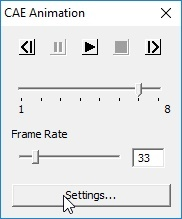
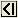
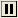
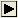
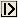
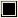

Animate
========

The animation feature in VCollab Presenter allows users to create and
share animations very easily.

Users can control

-  Speed of animation

-  Direction of animation and

-  Number of Frames per cycle using **Animation settings.**

**CAE Animation Panel**

|image0|

The various controls available in the CAE Animation panel are explained
below

+----------------------------+----------------------------------------------------------------------+
| |image1|                   | Shows previous frame in the animation                                |
+----------------------------+----------------------------------------------------------------------+
| |image2|                   | Pauses the animation.                                                |
+----------------------------+----------------------------------------------------------------------+
| |image3|                   | Plays Animation in forward direction                                 |
+----------------------------+----------------------------------------------------------------------+
| |image4|                   | Shows next frame in the animation                                    |
+----------------------------+----------------------------------------------------------------------+
| |image5|                   | Stops Animation. It is enabled once animation starts.                |
+----------------------------+----------------------------------------------------------------------+
| **Current Frame Slider**   | Slider position that indicates the current frame in the animation.   |
+----------------------------+----------------------------------------------------------------------+
| **Frame Rate**             | Allows users to control animation speed by editing frame rate.       |
+----------------------------+----------------------------------------------------------------------+
| **Settings button**        | Link to CAE Animation Settings panel                                 |
+----------------------------+----------------------------------------------------------------------+

