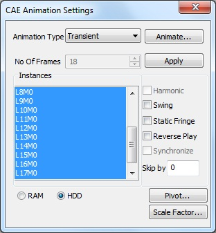
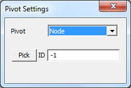
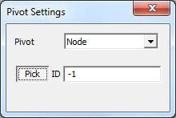
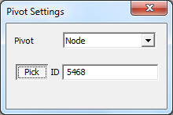

Animation
=========

Animation is makes a 3D visualization tool, a complete one. VCollab animation functions makes user to feel 3D environment virtually.

**Settings Panel**

 |image0|

**Types of Animations:**

-  **Linear Animation**

   It starts with original position of structure and ends with deformed position of structure. Number of frames provided by user are linearly interpolated between initial and deformed positions.

-  **Transient Animation**

   This is to animate the structure with time step positions computed by a solver.

   It is extracting all instances into frames and animates them. User is not allowed to change number of frames.

   Each frame refers to one instance or one time step.
   
-  **Animation of Results**

   Animates the frames in which, each frame refers to each result.

-  Eigenvector

   Animating eigenvector results (complex eigen as well as mode case data).

-  Dataset

   Animates all the datasets, if more than one dataset exists. Each frame in the animation refers to one dataset result.

VCollab supports harmonic motion and swing motion in additional.

**CAE Animation**

CAE Animation is computing and simulating of CAE data with finite number of frames. For example, Let CAE data have 4 frames for animation. Animation of this data is to display frames in the order of **1, 2,3, 4**. Animation starts with frame 1 and ends with frame 4.

**Swing Motion**

To display the frames in the order **1,2,3,4,3,2,1**. Animation starts and ends with initial frame.

    

**Static Fringe**

Static Fringe option helps to display an overall Legend Palette for animation. Legend Palette is changing its values according to frame results. Static Fringe option computes an overall min and max of all frames CAE results and displays a static color palette.

**Reverse Play**

To display the frames in the order 4,3,2,1. Animation starts from last frame and ends with first frame.

**Harmonic** **Motion**

To display equivalent mirror frames of all these 4 frames and displaying frames in the order **-4,-3,-2,-1,1,2,3,4**.

This motion is applicable for static analysis only (i.e., Linear Animation).

**Harmonic** **with swing motion**

To display frames in the order **-4,-3,-2,-1, 1,2,3, 4, 3,2,1, -1,-2,-3,-4**.

As harmonic motion involves, this type of motion is applicable only for Linear Animation.

**Synchronize**

    This option is enabled if two or more dataset exists. It synchronizes similar types of animations of more than one datasets.

**Skip By**

This option helps user to skip number of frames. If the model contains huge number of instances, it may take much time for a cycle.

This can be sped up by skipping some number of frames.

    

**RAM / HDD**

User has two option to store animation frame data either into RAM and HDD.

-  RAM - this option provides an improved performance during animation. This performance will reduce and hang if RAM free space is less or nearly null.

-  HDD - this option stores frame data into hard disk and revoke it whenever necessary. If memory is nearly full in RAM, user can use this option for a better improved cycle.

**How to animate model relative to a position or point or node?**

-  Click 'Pivot...' option in CAE Animation Settings dialog.
-  It pops up 'Pivot Settings' dialog.

 |image1|

-  Select 'Node' in the Pivot combo box.

 |image2|

-  Click 'Pick' button to select the node in the model.

 |image3|

-  Click a node on the model.
-  Node number is displayed in the ID text. i.e., Picked ID will be considered as Pivot point.
-  The deformation at the pivot point is fixed.
-  Now animate the model and notice that simulation changed relatively to pivot point.

