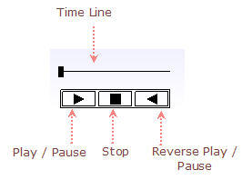
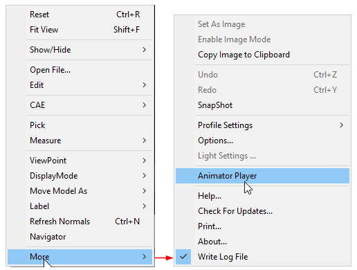

Animator Player
================

The **Animator Player** option is enabled and displayed by default, if
the file contains animation or sequence data.

**Animator Player Panel**

|image0|

**Location**

The Animator Player panel is located at the bottom center of the viewer
window.

**Steps**

-  Move the mouse over any player control to highlight it.

-  Click the highlighted control.

-  Click the **Play** icon to play the animation and notice that icon is
   changed to pause icon during animation.

-  Click the **Pause** icon to pause.

-  Click the **Reverse** play icon to play in reverse.

-  Click the **Stop** icon to stop the animation.

-  Click and drag the slider caret to view animation steps manually.

**Steps to hide the Animator Player panel**

-  Right Click inside the viewer window to open the viewer context menu.

-  Click **More \|** **Animator Player** option to hide or show.

|image1|

