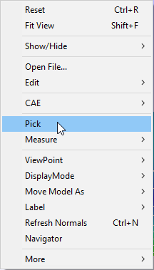
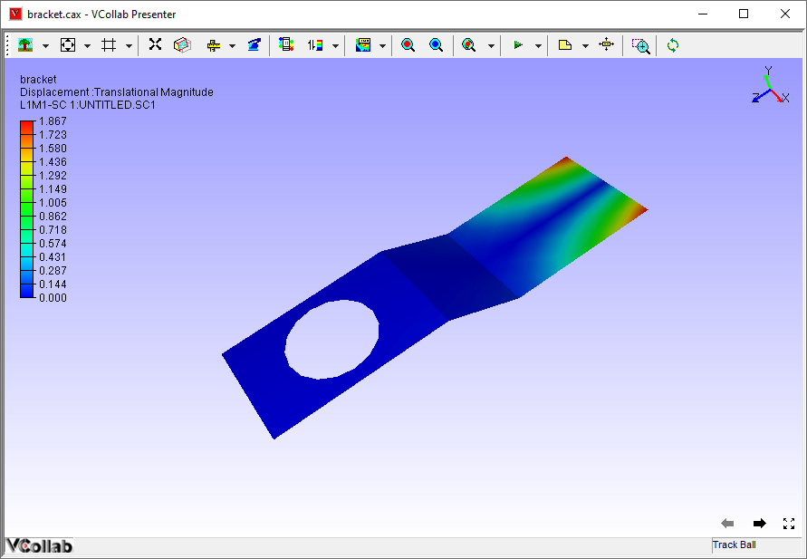
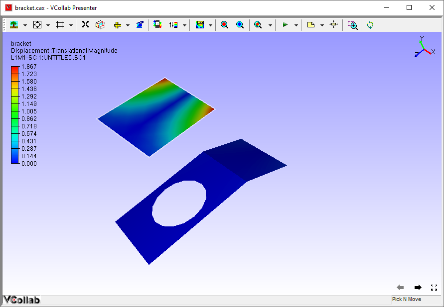
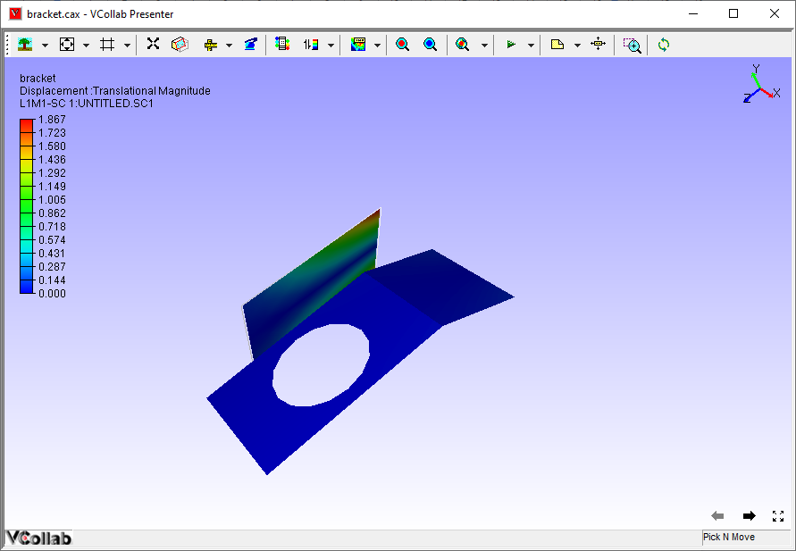

Pick
======

Users of VCollab Presenter can disassemble parts and apply
transformations to individual parts using the **Pick** command.

**Steps to pick a part**

-  Load a model

-  Right click in the viewer window to open the Context menu

-  Select the **Pick** option

|image0|

|image1|

-  Click on a part.

-  Apply transformations like rotation, translation and zoom in or out.

-  Notice that transformations are applied to the picked part only

|image2|

**Steps to drop the part picked**

-  Select **Pick & Move** option in the right click Context menu as
   below

-  Right click on the part and drag the mouse to move.

-  Release the mouse wherever you want to drop or place it.

|image3|

