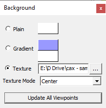
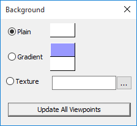
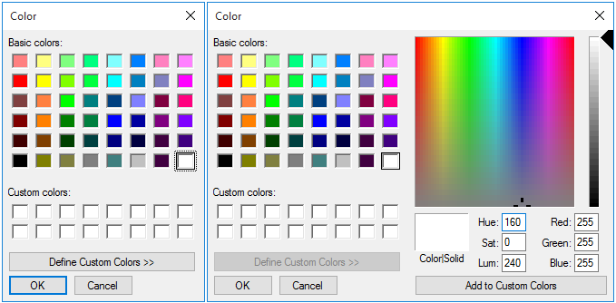
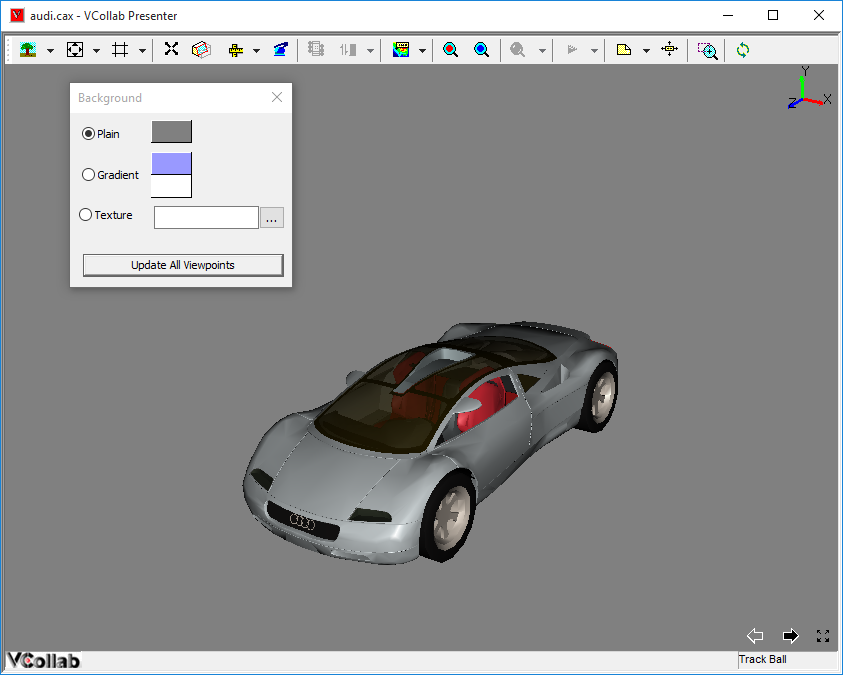
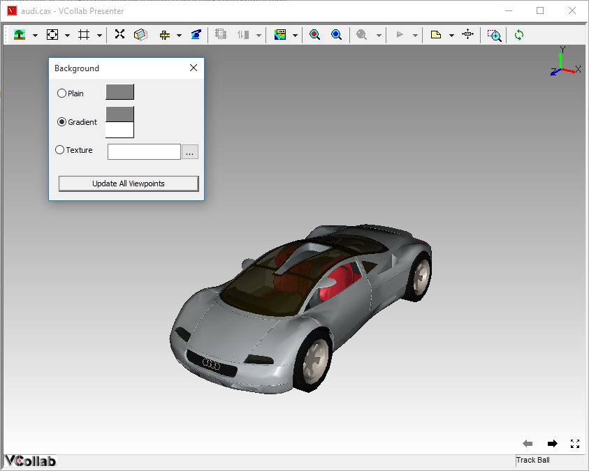
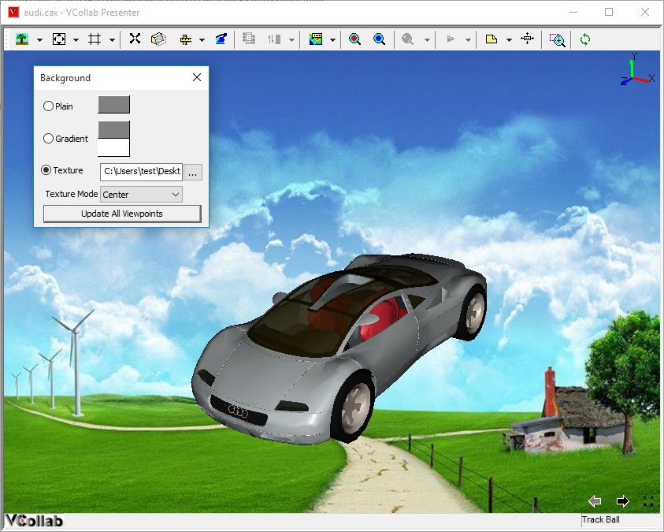

Background
===========

The users of VCollab Presenter can change the type and colour of the
background of the viewer window.

**Background Types**

-  Plain

-  Gradient (of two colors)

**Default **

    Type - Gradient

    Colors - Blue and White

**Note:** If the CAX file contains any viewpoint with texture image,
VCollab Presenter allows users to change texture positioning and style.
i.e, centered, stretch and tiled texture.

If the texture image exists as background, then the panel shows texture
mode options.

Background panel

|image0|

The various options in the Background panel are explained below

+-----------------------------+-----------------------------------------------+
| **Plain**                   | Single Background color                       |
+-----------------------------+-----------------------------------------------+
| **Gradient**                | Gradient of two colors                        |
+-----------------------------+-----------------------------------------------+
| **Texture**                 | User picked Image                             |
+-----------------------------+-----------------------------------------------+
| **Update All Viewpoints**   | Updates all viewpoints with set background.   |
+-----------------------------+-----------------------------------------------+

**Plain**

Selecting this type sets a single color as background. Users can change
into any basic color or custom defined color.

**Steps for changing background into a basic color**

To change the color into any basic color,

-  Right click in the viewer window to open the context menu

-  Click **Background** To open the background panel

-  Select **Plain**

|image1|

-  Click the color box to open the color dialog box.

|image2|

-  Select a color or Define a custom color and click OK.

|image3|

**Gradient Type**

Users can choose the Gradient type background by selecting two different
colors.

**Steps for setting the background with Gradient type**

-  Click **Gradient** in the background panel

-  Select two colors from the two color boxes on the right.

-  A Gradient background with the two selected colors will be applied in
   the viewer.

|image4|

**Texture Image Background**

Users can opt for texture type background by selecting an image

**Steps for setting the background with Texture type**

-  Click Texture in the background panel.

-  Click the browser button to select the image.

-  Select a texture mode, from the options **Center, Stretch, Tile** and
   **Fit View**. **Center** is the default option.

   -  Center - Image center and Viewport center are the same.

   -  Stretch - Image is stretched to fit the viewport window.

   -  Tile - Image is tiled to the viewport.

   -  Fit View - Stretching the image to fit the window without changing
      image aspect ratio.

|image5|

