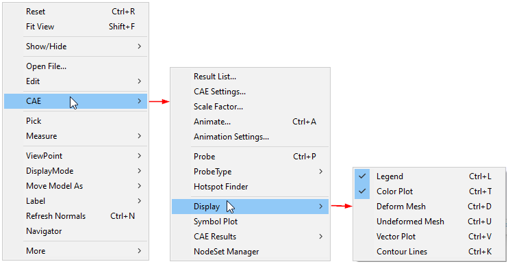

CAE Display
============

The Display command helps users to view CAE Information with different
show hide options.

**Context Menu\| CAE \| Display**

|image0|

The various options available in the Display menu are explained below

.. toctree::
   :maxdepth: 2
   :caption: Contents
   
   CAEDisplay_Legend
   CAEDisplay_ColorPlot
   CAEDisplay_DeformMesh
   CAEDisplay_UndeformMesh
   CAEDisplay_VectorPlot
   CAEDisplay_ContourLines

