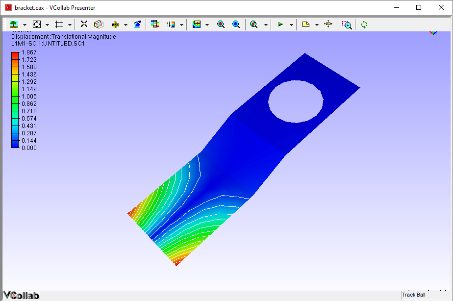

Display - Contour Lines
========================

The **Contour Lines** option in the Display sub menu helps to visualize
CAE result variations as contour lines.

**Steps for Displaying** Contour **Lines**

-  Load a model.

-  Select **CAE \| CAE Display \| Contour Lines** option in the context
   menu.

|image0|

-  To change line color, open **CAE Settings** dialog.

-  Select **Edit Legend** tab.

-  Select **Palette color** or **User color** under Contour Lines group.

-  For the user color option, the color window will be displayed against
   it. Users can select any color from the window.

