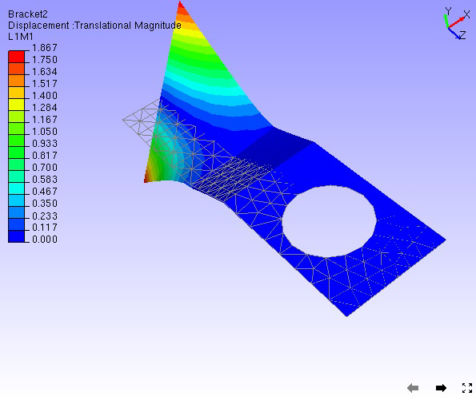
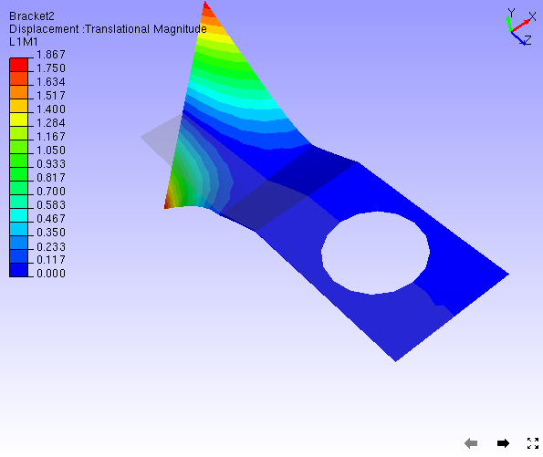
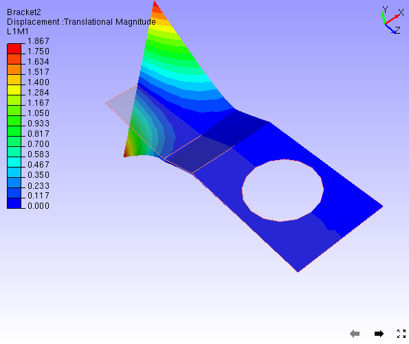

CAE Undeformed Mesh
===================

The **Undeformed Mesh** option displays or hides undeformed mesh in
addition to original mesh.

Undeformed mesh is displayed in different modes

-  Wire frame.

-  Transparent

-  Feature Edges

-  Transparent with Edges

**Wire Frame mode**

|image0|

**Transparent mode**

|image1|

**Feature Edges mode**

|image2|

**Transparent Edges mode**

|image3|

