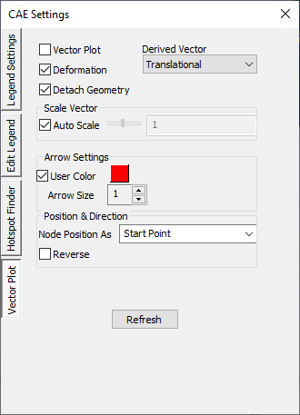
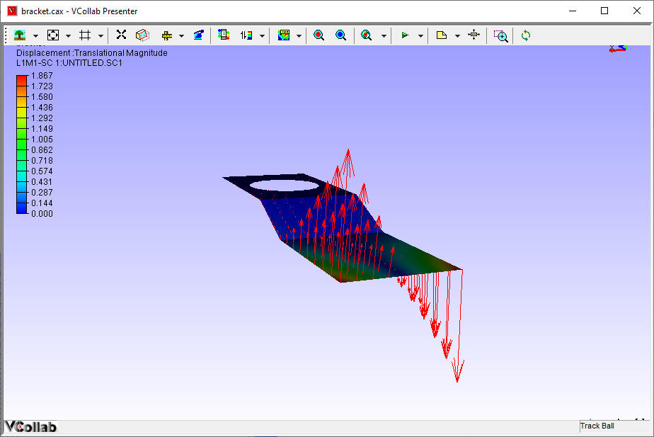
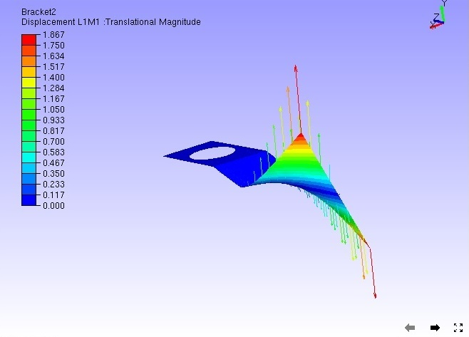
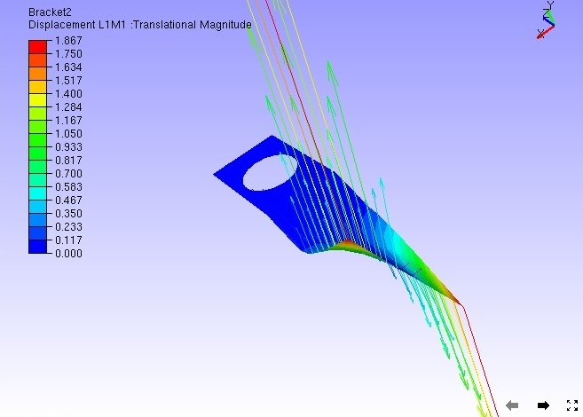
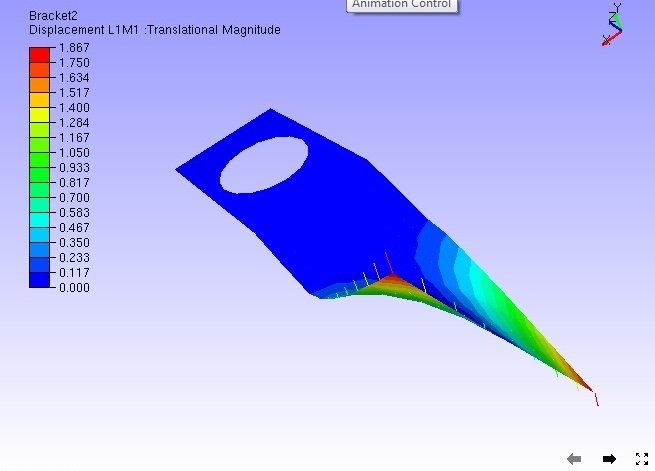
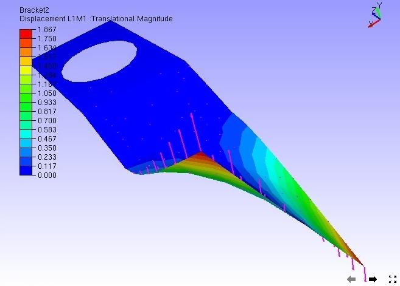
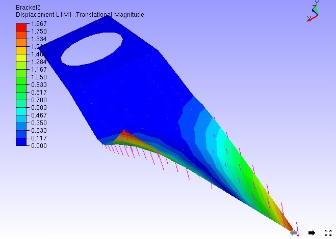
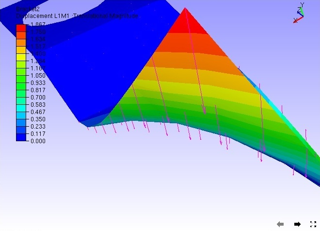
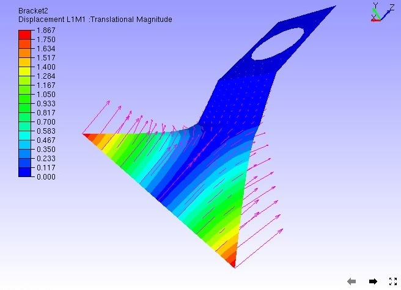
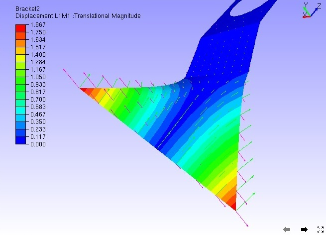

Display Vector Plot
=====================

The Vector Plot display option plots vectors for CAE vector type
results.

-  VCollab saves one user color for vector plot in view point as well as
   in CAX. Full tensor derived type may require 3 user colors at
   most.

**Steps to view and set up Vector Plot**

-  Click **CAE \| Display \| Vector Plot**

    Or

   Click **CAE Settings \| Vector Plot**.

|image0|

|image1|

    Auto scale helps users to view very huge vectors as well as very
    small ignorable changes inside the viewer.

-  Click **CAE \| CAE Settings\| Vector Plot** to modify vector plot
   setup.

-  By default, **Auto Scale** is enabled.

-  Uncheck **Auto Scale** to scale manually using slider control.

-  Click the **Deformation** option to plot the vector with instance and
   motion of model.

|image2|

-  Slider bar is always positioned at the center of the slider unless
   the user moves.

-  To scale up, move the slider right side. Slider bar comes to the
   center once the user releases the mouse button.

|image3|

-  To scale down, move the slider to the left.

|image4|

-  Users have no constraints to scale up or down. They can enter an
   exact scale value in the edit box at the end of the slider and
   apply the same.

-  Use the **Arrow Size** option to increase the size of the arrow.

|image5|

-  Click **User Color** to enable the color box

-  Click the color box with default white color to open up the color
   palette.

-  Choose a color and click **Ok** to apply the color on to the vector
   plot.

|image6|

-  By default vectors are starting from nodal positions. If necessary,
   make the vectors end at nodal positions by selecting **Nodal
   Position As** option as End point.

|image7|

-  Check **Reverse** option to reverse the direction of vectors if
   necessary.

|image8|

-  Select **Rotational** option in the derived vector type

|image9|

-  Select **Both** option in derived vector type which shows rotational
   as well as translational.

|image10|

