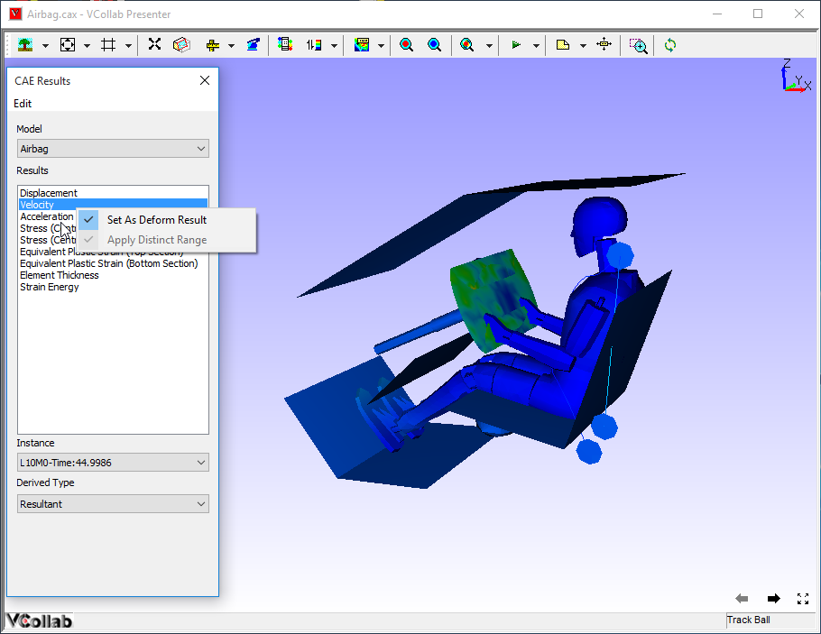

CAE Results
============

VCollab Presenter’s users can select a CAE result or a derived type and
load and model them using the CAE results panel.

**What is CAE Model?**

A CAE model refers to a set of information belonging to one CAE
geometry.

In other words, a CAE model refers to a CAE file.

**CAE Results Panel**

|image0|

The various fields and options available in the CAE Results panel are
explained below:

**Model :** Lists all the CAE models in the scene. It will contain more
than one model if multiple models are merged into the scene.

**Palette Options:**

-  **Active Model**
   Only the current model will be active. A single color
   palette for the active model will be displayed. The active model
   will be displayed with color plot and all other models will be
   displayed in part color. This is the default option selected.

-  **Multiple**
   Multiple models will be active. Each model will be displayed
   with its own color palette and result.

-  **Combined**
   In this mode all models are displayed using a current model
   palette and results. Only the combined palette is displayed. The
   result list will display only common results. The changes to
   palette/legend parameters are applied to all models.

   The Combined option:

   -  Responds to both models for 'CAE Results' dialog events, usually not.

   -  Applies current model palette on the existing models.

   -  Applies No-Result value, if user clicked result is not available for
      other models.

   -  Animates both models for common result selected.

   -  If any model does not contain user selected result, no linear
      animation exists for the model.
   
   -  Allows users to probe all models.

   -  Allows users to save this state into viewpoint states.

   Benefits

   -  Users can merge two models with similar geometry and compare the CAE
      results.

   -  Visualize the differences on CAE design through linear and transient
      animations.

   -  Users can probe both models and compare nodal results.

   -  Users can save the compared results into cax as viewpoint states.

-  **Multiple Models: Common Legend**

   A single legend is used across multiple models. Result
   considered for this legend may not be the same for all models.
   However, it is the same in the case of Combined palette.

**Hide Other Model(s):** Hides all other models existing in the scene.

**Results List Box:** lists all the results for the user to select. By default, the first result in the list is selected.

**Instance** Drop down list of  load cases and mode cases. "L1M1" is referred to as Load Case 1 and Mode Case 1. Default Selection is L1M1.

**Derived Type** drop down lists all possible derived types based on the result type selected in the Result List Box. 
Default selection  is,

   - Translational Magnitude for vectors

   - Von Mises Stress for Tensors and 

   - None for Scalar result.

**Complex Type** is enabled only for complex eigen data and lists the following complex components.

   - Real

   - Imaginary

   - Magnitude

   - Phase

   - Angle (User has to enter phase angle value).

**Angle in Degrees** refers to user defined phase angle value. This is applicable for complex eigen result. Default angle is zero.

The following three options will be enabled and visible if two or more models exist or merged.

**Results List Box** : lists all the results for the user to select. By
default, the first result in the list is selected.

**Instance:** Drop down list of load cases and mode cases. "L1M1" is
referred to as Load Case 1 and Mode Case 1. Default Selection is L1M1.

**Derived Type:** Drop down list of all possible derived types based on
the result type selected in the Result List Box.

Default selection is,

  -  Translational Magnitude for vectors

  -  Von Mises Stress for Tensors and

  -  None for Scalar result.

**Complex Type** is enabled only for complex eigen data and lists the
following complex components.

  -  Real

  -  Imaginary

  -  Magnitude

  -  Phase

  -  Angle (User has to enter phase angle value).

**Angle in Degrees** refers to user defined phase angle value. This is
applicable for complex eigen results. Default angle is zero.

|image1|

**Edit Menu in CAE Results Panel**

|image2|

**Options:** Allows users to set result display names and attributes.

**Apply Distinct Range:** Changes current result legend into distinct
legend.

**Set As Deform Result: S**\ ets selected result as deformation result.

**Context menu**

Right click in Results list to open the context menu

**Set as Deform Result:** Sets the selected result as Deform result.
Displacement, Displacement - Vibration Mode and Deformation results
become deform results automatically when selected.

**Apply Distinct Range:** <need explanation>

|image3|

**Selection of results and Its effects on Legend and model contour**

  -  Application computes CAE result values for visible parts only, while
     changing the result.

  -  If the user hides one part and applies a new result to the model,
     Legend is computed for visible parts alone.

  -  Computed color information is applied to the model for contour
     values.

**Steps to select a result**

  -  Open the CAE Results panel by clicking **CAE Results** from viewer
     context menu or |image4| icon

|image5|

  -  Select a result, say **Displacement**.

  -  Select an Instance, say **L1M1**.

  -  Select a Derived type, say **Translational Magnitude**.

  -  Notice that CAE result defined is applied on the viewer model as
     below.

|image6|

**Steps to set and view deform result for vector types**

  -  Load a CAX file

  -  Click **CAE \| Result List** from the context menu

  -  Current deform result is mentioned in the bottom left corner of the viewer.

|image7|

  -  Select any other vector type result.

|image8|

  -  Observe that deform result is still **Displacement**, even though a
     different result is selected.

  -  Select **Set As Deform Result** from the context for current
     selection.

|image9|

  -  View **Deformation Result** in the viewer as selected type.

**Steps to utilize the Combined Palette option**

  -  Load a CAX file, which contains CAE model.

  -  Merge another CAX file, which contains the same geometry but
     different CAE model results.

  -  If both model geometry coincides in scene, move one of them away
     using the **Transform** option in the product tree context menu.

  -  Click **CAE \| Result List** from context menu,

  -  Select **Combined Palette** option to apply current palette for both
     the models.

The user can now do all CAE operations on both the models to compare CAE
results. For example, probe the same node in both the models and compare
the nodal results.

.. |image2| image:: Images/CAE_result_edit.png

.. |image3| image:: Images/CAE_result_set_deform_result.png

.. |image4| image:: Images/CAE_result_icon.jpg

.. |image5| image:: Images/CAE_result_active_palette.png

.. |image6| image:: Images/Presenter_selected_result.png

