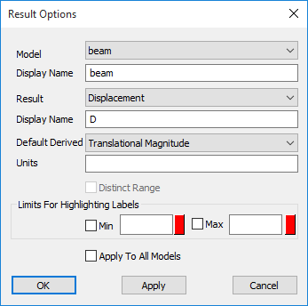
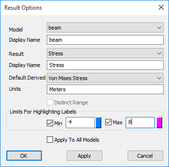
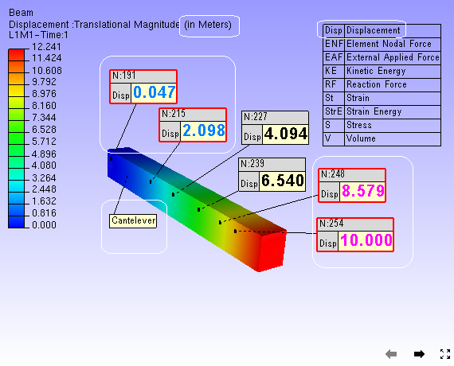

CAE Result Options
===================

The CAE Result Options panel allows users of VCollab Presenter to set
and modify CAE models and result display names, result units and result
legend type.

**Result Options Panel**

|image0|

The various fields and options available in the Result options panel are
explained below

+--------------------------------------+------------------------------------------------------------------------------------------------------------------------------------------------------------------------------------------------------------------------------------------------------------+
| **Model**                            | Lists all CAE model names.                                                                                                                                                                                                                                 |
+--------------------------------------+------------------------------------------------------------------------------------------------------------------------------------------------------------------------------------------------------------------------------------------------------------+
| **Display Name**                     | Allows users to modify model display names.                                                                                                                                                                                                                |
+--------------------------------------+------------------------------------------------------------------------------------------------------------------------------------------------------------------------------------------------------------------------------------------------------------+
| **Result**                           | Lists all results of selected CAE model.                                                                                                                                                                                                                   |
+--------------------------------------+------------------------------------------------------------------------------------------------------------------------------------------------------------------------------------------------------------------------------------------------------------+
| **Display Name**                     | Allows users to modify the result display name.                                                                                                                                                                                                            |
+--------------------------------------+------------------------------------------------------------------------------------------------------------------------------------------------------------------------------------------------------------------------------------------------------------+
| **Default Derived**                  | Allows users to select and set default derived names for the selected result.                                                                                                                                                                              |
+--------------------------------------+------------------------------------------------------------------------------------------------------------------------------------------------------------------------------------------------------------------------------------------------------------+
| **Units**                            | Allows users to edit selected result units.                                                                                                                                                                                                                |
+--------------------------------------+------------------------------------------------------------------------------------------------------------------------------------------------------------------------------------------------------------------------------------------------------------+
| **Distinct Range**                   | Allows users to set the result contour to distinct type. If the number of unique result values are less than 32, then the result is a valid distinct result. Contour and legend can be mapped to unique colors. i.e., One color is to one contour value.   |
+--------------------------------------+------------------------------------------------------------------------------------------------------------------------------------------------------------------------------------------------------------------------------------------------------------+
| **Limits for Highlighting Labels**   | Allows users to min and max range values for the selected result to highlight labels beyond this range.                                                                                                                                                    |
+--------------------------------------+------------------------------------------------------------------------------------------------------------------------------------------------------------------------------------------------------------------------------------------------------------+
| **Apply To All Models**              | Enable to apply the above options to all CAE models.                                                                                                                                                                                                       |
+--------------------------------------+------------------------------------------------------------------------------------------------------------------------------------------------------------------------------------------------------------------------------------------------------------+
| **Apply**                            | Applies the modifications.                                                                                                                                                                                                                                 |
+--------------------------------------+------------------------------------------------------------------------------------------------------------------------------------------------------------------------------------------------------------------------------------------------------------+

**Steps to modify and set the options**

-  Select a CAE **model name from** the drop down list.

-  Modify the model **display name** to be used in probe labels.

-  Select a **result** of interest from the result drop down list.

-  Modify the result **display name** to be used in probe labels.

-  Select a derived type of result name to set it as default.

-  Enter the **units**.

-  Check the **distinct range** option if the result is a valid distinct
   result.

-  Set **min** and **max** values for the result to highlight the labels
   beyond the range by **text** **color**.

-  Check **Apply To All Models** option to carry all modifications done
   to all CAE models.

-  Click **Apply** and notice the changes in CAE legend and probe
   labels.

|image1|

Corresponding changes in viewer. (Legend and Probe/Hotspot labels)

|image2|

