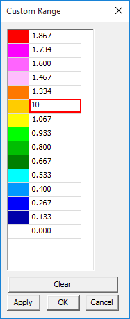
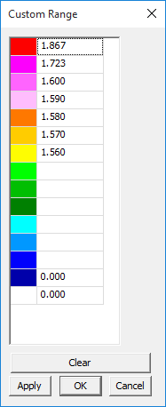

CAE Settings
=============

CAE settings found in the context menu have four different tabs to help
users edit legend settings, find hotspots and modify settings for vector
plot.

The four tabs found in CAE settings panel are:

-  **Legend Settings :** Users can edit min and max of Legend values and
   to apply for current or all frames.

-  **Edit Legend:** Users can modify the number of colors, precision
   values and display format.

-  **Hotspot Finder:** Users can set up hotspot finder constraints.

-  **Vector Plot Settings:** Users can modify settings for Vector Plot

Note: Vector Plot features are available from 2010 R1 Version on wards
and requires license.

    Contact **sales@vcollab.com** to upgrade these features.

Legend Settings
---------------

|image0|

The various fields and options found under the Legend Settings tab are
explained below

+--------------------------------------------+------------------------------------------------------------------------------------------------------------------------------+
| **Min **                                   | Specify/Change the min value in the range.                                                                                   |
+--------------------------------------------+------------------------------------------------------------------------------------------------------------------------------+
| **Max **                                   | Specify/Change the max value in the range.                                                                                   |
+--------------------------------------------+------------------------------------------------------------------------------------------------------------------------------+
| **Filter Color**                           | Applies the palette colors only for the values within the min max range. Out of bound values are applied with filter color   |
+--------------------------------------------+------------------------------------------------------------------------------------------------------------------------------+
| **Filter Parts**                           | If true, parts beyond result range will be hidden                                                                            |
+--------------------------------------------+------------------------------------------------------------------------------------------------------------------------------+
| **All Instances**                          | Applies the min/max changes to all instances.                                                                                |
+--------------------------------------------+------------------------------------------------------------------------------------------------------------------------------+
| **Color Plot**                             | Applies/Removes color plot. The Model will be shown in material color if this option is off.                                 |
+--------------------------------------------+------------------------------------------------------------------------------------------------------------------------------+
| **Min&Max**                                | Shows Min and Max value labels attached to corresponding nodes.                                                              |
+--------------------------------------------+------------------------------------------------------------------------------------------------------------------------------+
| **Update Color Plot on Show/Hide Parts**   | Updates color palette and its values while hiding / showing parts.                                                           |
+--------------------------------------------+------------------------------------------------------------------------------------------------------------------------------+
| **Legend Headers**                         |  Show / Hides Legend Headers, Model Name, Result Name and Instance Name.                                                     |
+--------------------------------------------+------------------------------------------------------------------------------------------------------------------------------+
| **Apply**                                  | Applies the modifications.                                                                                                   |
+--------------------------------------------+------------------------------------------------------------------------------------------------------------------------------+

**Steps to Change Legend Settings **

-  Select the **CAE Settings** option from the viewer context menu or
   click |image1| or

    Double click either on the viewer color palette or on the result
    color box in the viewer to open up this dialog.

-  Select **Legend Settings** tab.

-  Select the Min and **Max** option and change the range if necessary.

-  Select **Filter** color option to differentiate user defined range.

-  Select a filter color which is different from colors in the palette.

-  Select **Filter Parts** to hide parts which are beyond user range.

-  Select **All Instances** option to update the changes to all
   instances.

-  Select **Min & Max** option to display min and max value of current
   result as labels.

-  Select **Color Plot** option to apply or remove color plot on the
   model.

-  Select **Update Visible Parts Color Plot** to update the color
   palette and contour when modifying part visibility.

-  

Edit Legend
-----------

|image2|

The various fields and options available in the Edit Legend tab are
explained below

 +---------------------------+-----------------------------------------+
 | **Palette**               | Choose the colors to be applied on the  |
 |                           | model.                                  |
 +---------------------------+-----------------------------------------+
 | **Auto**                  | Allows the application to compute text  |
 |                           | format precision and scientific values. |
 |                           | Precision and scientific options are    |
 |                           | disabled when 'Auto' option is enabled. |
 +---------------------------+-----------------------------------------+
 | **Scientific**            | Displays the legend values in           |
 |                           | scientific format.                      |
 +---------------------------+-----------------------------------------+
 | **Precision**             | Select the decimal places for contour   |
 |                           | values                                  |
 +---------------------------+-----------------------------------------+
 | **Font Size**             | Change the font size.                   |
 +---------------------------+-----------------------------------------+
 | **No Result Color**       | Select a color to denote no result      |
 |                           | data. Default color is grey.            |
 +---------------------------+-----------------------------------------+
 | **Transparency**          | Allows user to invert the transparency  |
 |                           | and to clear the transparency.          |
 +---------------------------+-----------------------------------------+
 | **Background**            | Enable and set background color.        |
 +---------------------------+-----------------------------------------+
 | **Frame Info**            | Display/Hide frame information          |
 +---------------------------+-----------------------------------------+
 | **Orientation**           | Choose the orientation of the legend -  |
 |                           | left, right, top or bottom of the view  |
 |                           | port.                                   |
 +---------------------------+-----------------------------------------+
 | **Undeformed Mesh Mode**  | Change Undeformed Mesh Mode and its     |
 |                           | color.                                  |
 +---------------------------+-----------------------------------------+
 | **Contour Lines**         | Select contour lines color.             |
 +---------------------------+-----------------------------------------+
 | **Show**                  | Show/Hide Legend palette.               |
 +---------------------------+-----------------------------------------+
 | **Reverse**               | Reverse the legend values against the   |
 |                           | color palette.                          |
 +---------------------------+-----------------------------------------+
 | **Discrete**              | Switch to discrete fringe bands in      |
 |                           | color plot.                             |
 +---------------------------+-----------------------------------------+
 | **Update All Viewpoints** | Update the changes to all available     |
 |                           | viewpoints.                             |
 +---------------------------+-----------------------------------------+
 | **Custom Range**          | Switch to customized range palette and  |
 |                           | color plot.                             |
 +---------------------------+-----------------------------------------+
 | **Apply**                 | Apply the changes to the viewer.        |
 +---------------------------+-----------------------------------------+

**Steps to edit legend using Edit Legend tab**

-  Select CAE Settings from the viewer context menu or click |image3| .

-  Select **Edit Legend** tab.

-  Select the number of colors from the **Palette** drop down

-  Users can select predefined sets of color to view CAE results as
   viewed in native CAE software.

-  Click any color in the palette to change.

-  Check **Scientific** option to toggle display format between
   scientific and standard decimal mode. Default is Standard display
   format.

-  Increase or decrease precision values for both scientific and
   standard display format.

-  No Result color is grey by default. Users can change it too.

-  Click the **Frame Info** option to toggle displaying frame
   information in the left bottom of the viewer.

-  Select left or right or top or bottom under placement dropdown to
   place the legend.

Select **Wire Frame** to view Undeformed mesh in Wireframe mode or
select 'Transparent' to view Undeformed mesh in transparent mode.

-  Select **User Color** or **Palette Color** option for contour lines.

-  Click **Discrete** to toggle between continuous or discrete color
   plot.

-  Click the **Apply** button to apply the above changes.

**Note:**

    Palette has predefined color sets for CAE files, which are supported
    by VMoveCAE as in native CAE software.

    This helps users to view results of CAE files in VCollab Pro in the
    same way as viewed in the native software.

    Double Clicking on the legend color palette (including No Result
    color box) inside the viewer opens up CAE Settings Dialog with
    **Edit Legend** tab.

**What is a custom range and how to use it?**

Legend palette values are divided evenly by ***n*** number of colors.
Here length of any two consecutive ranges is constant and interpolated
linearly.

Custom range allows users to define any length for any range but with
certain limitations.

-  Length of any range should be less than length of min and max.

-  Users are not allowed to edit extreme values as is possible in Legend
   settings.

-  The value as modified by the user should be between predecessor and
   successor values.

-  If there are blanks in the palette values, it will be interpolated
   linearly by default.

**Steps for Custom Range usage:**

-  Click **Custom Range** in the Edit Legend tab to enable.

   |image4|

-  Click the browse button next to **Custom Range** to open the custom
   range dialog box

   |image5|

   Change any value out of extreme values.

   |image6|

-  Click **Apply**.

-  A warning message is displayed saying “Values should be in descending
   order”.

   |image7|

   Change some values and leave some blanks in the palette.

   |image8|

-  Click **Apply** and notice that blanks are filled by interpolation.

   |image9|

-  Click **OK**

-  Click **Apply**.

-  Notice the changes in the color plot of the model according to the
   new custom range palette.

   |image10|

Hotspot Finder Panel
--------------------

|image11|

The various fields and options available in the Hotspot finder panel are
explained below

+----------------------------+----------------------------------------------------------------------------------------------------------------------------+
| **Find**                   | Allows users to select a mechanism either Hotspots or Min/Max                                                              |
+----------------------------+----------------------------------------------------------------------------------------------------------------------------+
| **Min**                    | Set minimum of the range.                                                                                                  |
+----------------------------+----------------------------------------------------------------------------------------------------------------------------+
| **Max**                    | Setmaximum of the range.                                                                                                   |
+----------------------------+----------------------------------------------------------------------------------------------------------------------------+
| **Top**                    | Find top ‘n’ result values.                                                                                                |
+----------------------------+----------------------------------------------------------------------------------------------------------------------------+
| **Bottom**                 | Find bottom ‘n’ result values.                                                                                             |
+----------------------------+----------------------------------------------------------------------------------------------------------------------------+
| **All Top**                | Includes all same top values and its IDs.                                                                                  |
+----------------------------+----------------------------------------------------------------------------------------------------------------------------+
| **All Bottom**             | Includes all same bottom values and its IDs.                                                                               |
+----------------------------+----------------------------------------------------------------------------------------------------------------------------+
| **Zone Radius**            | Skip an area around already found hotspots.                                                                                |
+----------------------------+----------------------------------------------------------------------------------------------------------------------------+
| **Visible Surfaces**       | Consider visible labels only.                                                                                              |
+----------------------------+----------------------------------------------------------------------------------------------------------------------------+
| **Probe Label Settings**   | Modify probe label settings.                                                                                               |
+----------------------------+----------------------------------------------------------------------------------------------------------------------------+
| **Compare Options**        | This option is visible if at least one file is merged with existing one. It will open a dialog box with compare options.   |
+----------------------------+----------------------------------------------------------------------------------------------------------------------------+
| **Add Viewpoints**         | Generates viewpoints according to viewpoint options if enabled.                                                            |
+----------------------------+----------------------------------------------------------------------------------------------------------------------------+
| **Export**                 | Exports the viewpoints into either VPT file or Microsoft PPT file                                                          |
+----------------------------+----------------------------------------------------------------------------------------------------------------------------+
| **View Point Options**     | Provides various options to include or exclude different type of viewpoints                                                |
+----------------------------+----------------------------------------------------------------------------------------------------------------------------+
| **Find Hotspots**          | Generates viewpoints for the model according to above information                                                          |
+----------------------------+----------------------------------------------------------------------------------------------------------------------------+

Vector Plot
-----------

|image12|

The various fields and options available int he Vector Plot tab are
explained below.

+----------------------------+----------------------------------------------------------------------------------------+
| **Vector Plot**            | On/Off switch to plot vectors.                                                         |
+----------------------------+----------------------------------------------------------------------------------------+
| **Derived Vector**         | Default derived vector for vector result is Translational and for tensor is Normals.   |
+----------------------------+----------------------------------------------------------------------------------------+
| **Deformation**            | Sets deformed nodal position as starting point of vector.                              |
+----------------------------+----------------------------------------------------------------------------------------+
| **Detach Geometry**        | Displays vector plot of a part, even if the geometry is hidden.                        |
+----------------------------+----------------------------------------------------------------------------------------+
| **Auto Scale**             | Enables Auto Scale for vector plot                                                     |
+----------------------------+----------------------------------------------------------------------------------------+
| **Scale Slider Control**   | Allows r unconstrained scaling up or down                                              |
+----------------------------+----------------------------------------------------------------------------------------+
| **User Color**             | Choose a color from the palette for vector.                                            |
+----------------------------+----------------------------------------------------------------------------------------+
| **Arrow Size**             | Choose any one size out of three.                                                      |
+----------------------------+----------------------------------------------------------------------------------------+
| **Nodal Position As**      | Set nodal position as either start point or end point                                  |
+----------------------------+----------------------------------------------------------------------------------------+
| **Reverse**                | Change the direction of vector                                                         |
+----------------------------+----------------------------------------------------------------------------------------+
| **Refresh**                | Re-computes vector plot.                                                               |
+----------------------------+----------------------------------------------------------------------------------------+

.. |image0| image:: Images/CAE_legend_settings_dialog.png

.. |image1| image:: Images/CAE_icon.jpg

.. |image2| image:: Images/Presenter_edit_legend.png

.. |image3| image:: Images/CAE_icon.jpg

.. |image4| image:: Images/Legend_custom_range.png

.. |image7| image:: Images/Custom_range_error_box.png

.. |image9| image:: Images/Custom_range_interpolated.png

.. |image10| image:: Images/Custom_range_default_color_plot.jpg

.. |image12| image:: Images/Vector_plot_panel.png

