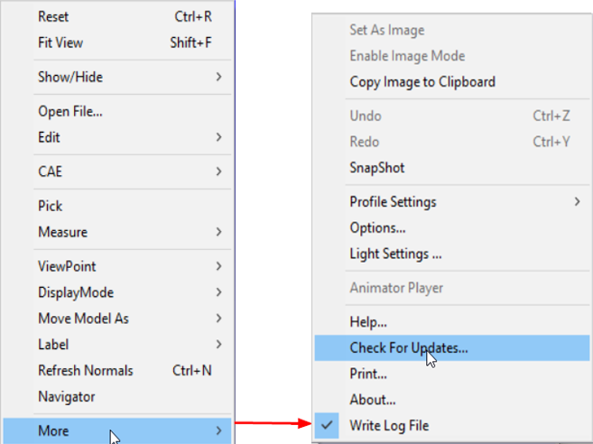
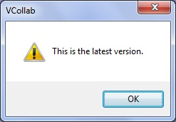
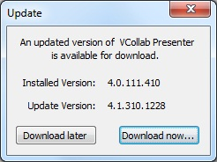

Check for Updates
===================

This option helps users to know the version of this application and
availability of any latest version.

**Context Menu**

|image0|

If the version is latest, then the following message is displayed.

|image1|

If the version is old, then it gives the latest version number and link
for downloading.

|image2|

Click **Download now...** to download the latest version.

Click **Download later** to continue your work with current version

