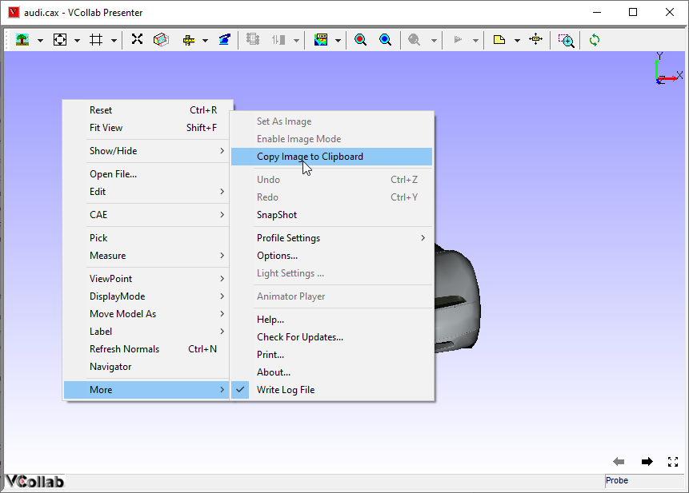
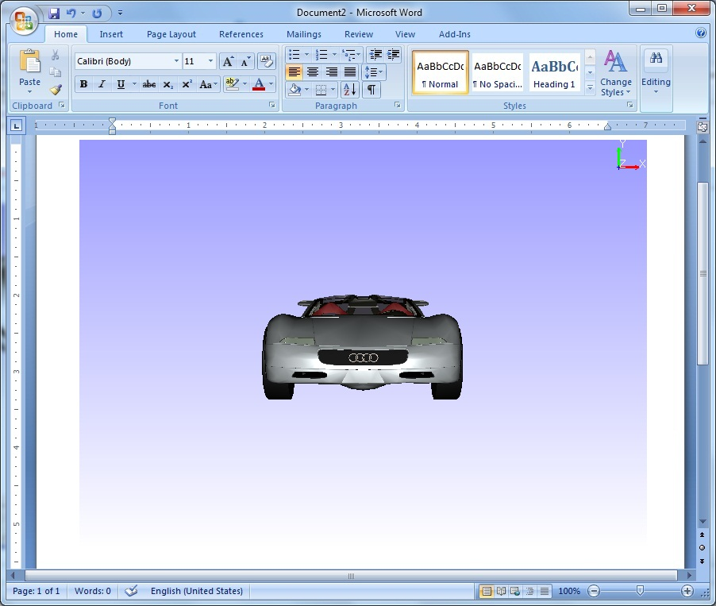

Copy Image to Clipboard
========================

Users of VCollab Presenter can store the current view as an image buffer
in the active clipboard using the Copy **Image to Clipboard** option.

They can paste this image wherever pasting an image is applicable.

**Steps for copying an image to clipboard**

-  Load a CAX model.

-  Do the necessary transformations to get the required view.

-  Select **Copy Image To Clipboard** option from the context menu.

|image0|

-  Open any Microsoft office tools or any image tools.

-  Click or enable paste event.

-  Copied view will be pasted.

|image1|

