Cut Section
============

The users of VCollab Presenter can create and view cut section planes

Cut Section includes 3 steps:

-  Section Plane Definition

   -  Coordinate plane.

   -  Custom plane.

-  Clipping and visualization

   -  Users can use the **Show Planes** option to visualize the plane.

   -  Users can invert the clipping side about the section plane.

   -  Users can visualize the intersection lines of the model on the
      section plane.

   -  Users can visualize an offset section plane in addition to the
      prime section plane.

-  Section Plane translation and rotation.

   -  Users can translate and rotate the plane in parametric axes using
      slider controls.

   -  Users can get the plane location by X, Y, Z axes intercepted with
      the section plane.

**Section Panel**

Right click in the viewer window to open the context menu. Select Cut
Section

|image0|

The various fields and options available in the Section manager dialog
are explained below

+----------------------------------+--------------------------------------------------------------------------------------------+
| **Section ON**                   | Shows/Hides section plane.                                                                 |
+----------------------------------+--------------------------------------------------------------------------------------------+
| **Section Location**             | Displays primary cut section plane data and allows to edit and apply.                      |
+----------------------------------+--------------------------------------------------------------------------------------------+
| **XY**                           | Displays plane parallel to XY Plane                                                        |
+----------------------------------+--------------------------------------------------------------------------------------------+
| **YZ**                           | Displays plane parallel to YZ Plane                                                        |
+----------------------------------+--------------------------------------------------------------------------------------------+
| **XZ**                           | Displays plane parallel to XZ Plane                                                        |
+----------------------------------+--------------------------------------------------------------------------------------------+
| **Custom**                       | Enables custom options like 3 Points.                                                      |
+----------------------------------+--------------------------------------------------------------------------------------------+
| **3 Points**                     | Enables mouse mode to select 3 points to define and display planes.                        |
+----------------------------------+--------------------------------------------------------------------------------------------+
| **Snap Vertex**                  | Allows users to select a vertex nearest to the mouse hit.                                  |
+----------------------------------+--------------------------------------------------------------------------------------------+
| **Keep Feature Edges**           | Allows users to skip Feature Edges from clipping.                                          |
+----------------------------------+--------------------------------------------------------------------------------------------+
| **Show Planes**                  | Shows/Hides section plane.                                                                 |
+----------------------------------+--------------------------------------------------------------------------------------------+
| **Invert**                       | Toggles in clipping sides of section plane                                                 |
+----------------------------------+--------------------------------------------------------------------------------------------+
| **Slice**                        | Allows users to create a secondary section plane which cuts the model on the other side.   |
+----------------------------------+--------------------------------------------------------------------------------------------+
| **Edges**                        | Displays intersection lines of the model with the section plane.                           |
+----------------------------------+--------------------------------------------------------------------------------------------+
| **Cap**                          | This option helps to fill the hollow closed region to appear as solid. In general capping  |
|                                  | works for solid parts only (set closed part option on). If multiple open parts form a      |
|                                  | closed part then also capping will work (set closed part option off).  When parts are open |
|                                  | (holes are present in body) capping may not work properly. Section capping is not          |
|                                  | supported in OPENGL mode (OpenGL version < 1.2);                                           |
+----------------------------------+--------------------------------------------------------------------------------------------+
| **Translation Slider Control**   | Controls the translation of section planes.                                                |
+----------------------------------+--------------------------------------------------------------------------------------------+
| **About U parametric axes**      | Rotates section planes about the U parametric axis.                                        |
+----------------------------------+--------------------------------------------------------------------------------------------+
| **About V parametric axes**      | Rotates section planes about the U parametric axis.                                        |
+----------------------------------+--------------------------------------------------------------------------------------------+

**Note:**

-  Section Cap may not work in some of the display modes.

-  Users can use Section Cap in shaded mode only.

-  Picking / Probing will not work properly in Section Cap mode

-  Section Cap does not work in Remote Desktop or OpenGL Mode.

**Section Plane Location Panel**

|image1|

The various fields seen in the Section plane location panel are
explained below

+-----------------------------+------------------------------------------------------------------------------------------------------------------------------------------------------------------------------------------------------------------------------------------------------------------------------+
| **Section Equation**        | Displays the current section plane equation. Users can edit the equation and apply.                                                                                                                                                                                          |
+-----------------------------+------------------------------------------------------------------------------------------------------------------------------------------------------------------------------------------------------------------------------------------------------------------------------+
| **Pass Through**            | Allows users to provide point coordinates through which the plane passes through. Users can either pick a vertex in the model or specify it in the text box. (coordinates separated by comma). This point coordinates will be cleared when the user modifies the equation.   |
+-----------------------------+------------------------------------------------------------------------------------------------------------------------------------------------------------------------------------------------------------------------------------------------------------------------------+
| **Pick**                    | Allows users to set mouse mode to pick a vertex in the model.                                                                                                                                                                                                                |
+-----------------------------+------------------------------------------------------------------------------------------------------------------------------------------------------------------------------------------------------------------------------------------------------------------------------+
| **Translation step size**   | By default it is 1 and means the slider has 100 tick marks. If the step size is 2 , then the slider will have 50 tick marks. Users can change between 0 to 100.                                                                                                              |
+-----------------------------+------------------------------------------------------------------------------------------------------------------------------------------------------------------------------------------------------------------------------------------------------------------------------+
| **Rotation step size**      | By default it is 1 and it means one degree. Users can change between 0 to 180.                                                                                                                                                                                               |
+-----------------------------+------------------------------------------------------------------------------------------------------------------------------------------------------------------------------------------------------------------------------------------------------------------------------+
| **Apply**                   | Applies the step sizes to the controls.                                                                                                                                                                                                                                      |
+-----------------------------+------------------------------------------------------------------------------------------------------------------------------------------------------------------------------------------------------------------------------------------------------------------------------+

**Steps to view the cut section**

-  Load any CAX model in VCollab Presenter.

-  Click **Cut Section** in the context menu to open the Section Manager
   dialog

-  Click XY, YZ, XZ options to view section planes parallel to
   coordinate planes and passing through the model center.

|image2|

-  Model is clipped with respect to the section plane defined.

-  Click **Show Planes** to view a semi transparent section plane.

|image3|

-  Click **Invert** to invert clipping side.

|image4|

-  Click **Edges** to view the intersection on model to the plane.

|image5|

-  Use **Translation** slider control or scroll button near the slider
   control to translate section plane in normal direction.

|image6|

-  Use **Rotation** slider controls or scroll buttons near slider
   controls to rotate section planes in either U or V Parametric
   Axes of the plane.

|image7|

|image8|

-  Click **Slice** to add one more cut section plane in the opposite
   clipping direction.

|image9|

-  Click **Custom** to create a user defined section plane.

**Steps to set user defined section plane**

-  Click **Custom** in the Section Manager dialog.

-  Click the 3 Points option which is now enabled.

-  Click any three points on the model.

-  Section plane, passing through the points selected, is thus defined.

|image10|

-  Use **Snap Vertex** to select the nearest vertices of the model.

**Steps to get and edit section plane data**

-  Click **Section Plane location** in the Section Manager dialog to
   open\ **Section Plane Location** dialog.

-  It displays the current primary section plane equation in the form of
   aX+bY+cZ+d=0. where (a,b,c) is unit normal of the plane and d
   refers to the perpendicular distance of the plane from origin.

|image11|

-  Users can enter any point coordinates or pick a vertex using the
   **Pick** button to move the plane to a particular point.

**Steps to set unit increment for the slider controls**

-  Click **Section Plane Location** in the Section Manager dialog to
   open the Section Plane Location dialog.

-  Change **Translation** and **Rotation** step sizes provided.

-  Click **Apply** to set values and reset the slider positions.

-  By default, the translation slider is split into 100 ticks.

-  Users can change the translation step size from 1 to 100.

-  By default, rotation sliders are split into 180 ticks, which means
   each tick refers to one degree.

-  Users can change the rotation step size from 1 to 180.

|image12|

-  Notice the changes made to the number of tick marks and position of
   sliders.

**Section Cap**

The **Section Cap** option helps to fill the hollow closed region to
appear as solid. Closed parts option makes this cap work only for solid
parts, not for shell models.

|image13|

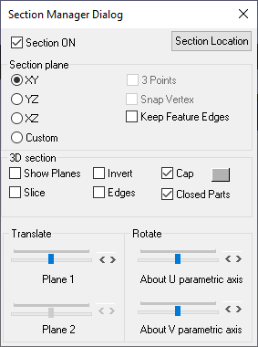

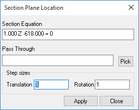

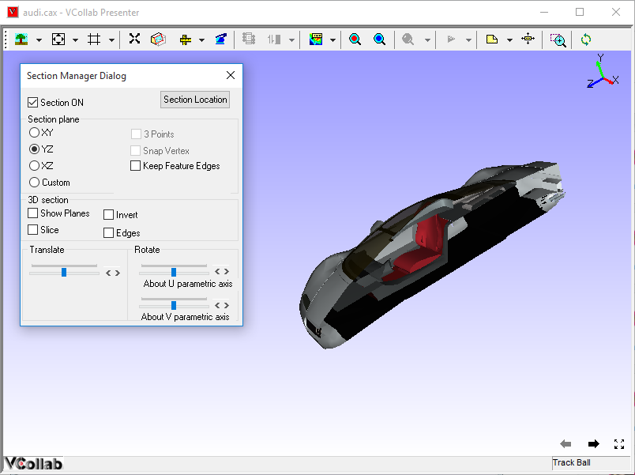

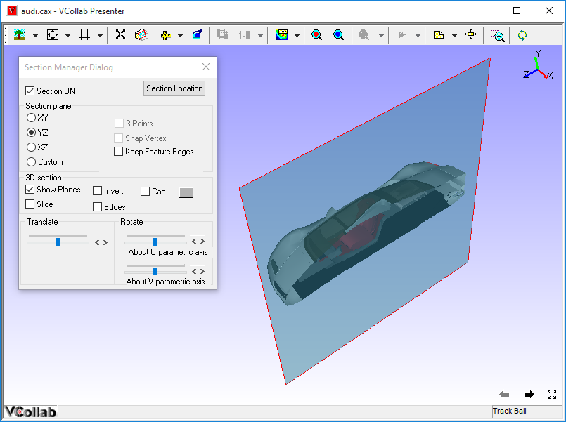

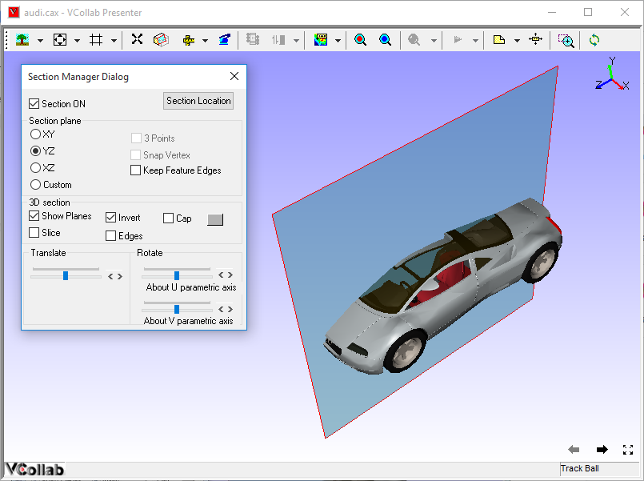

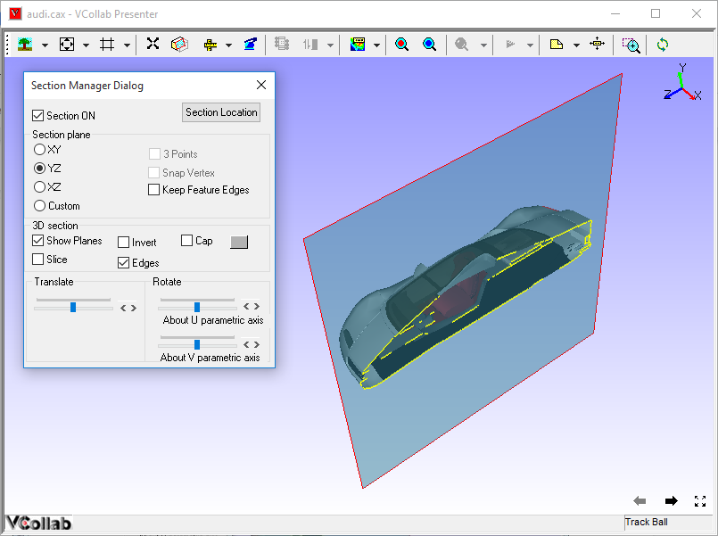

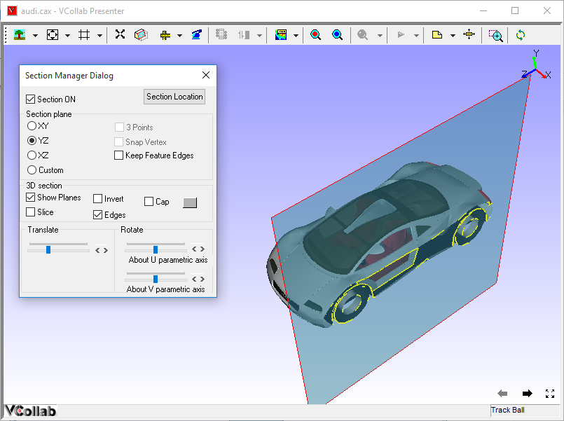

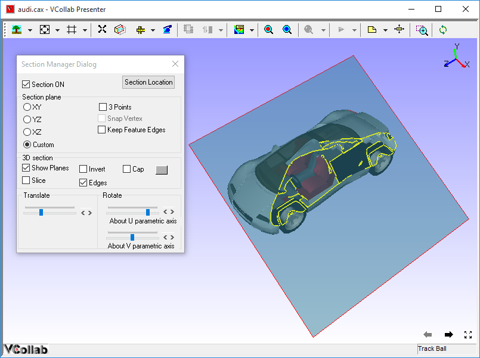

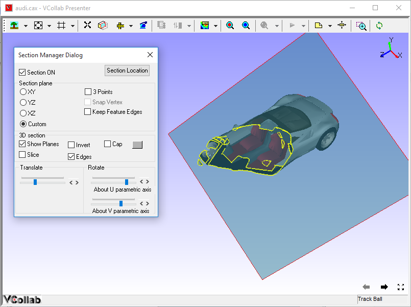

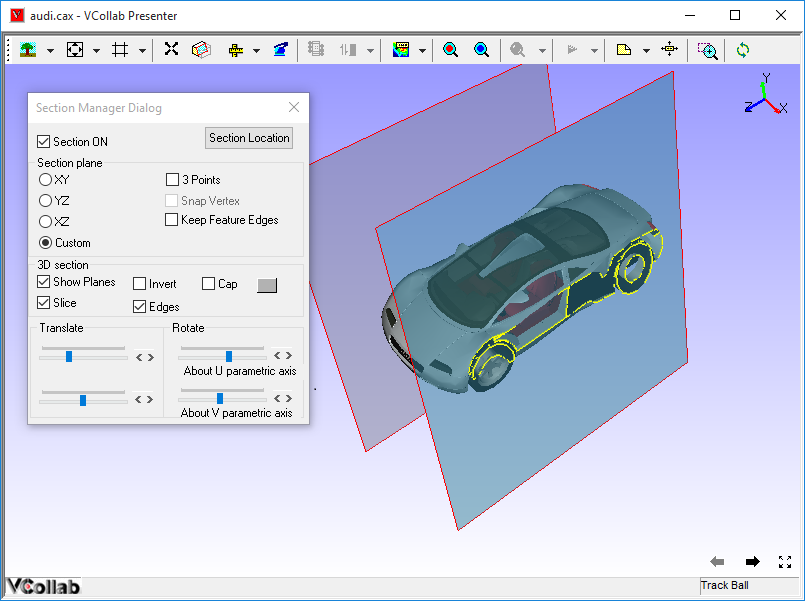

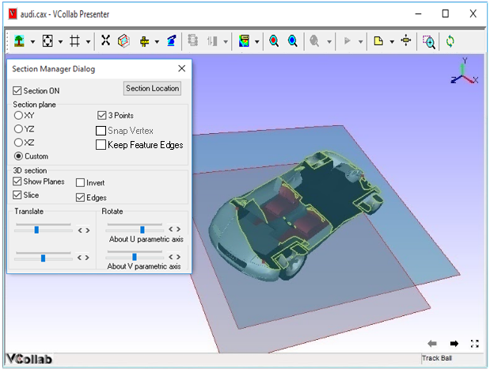

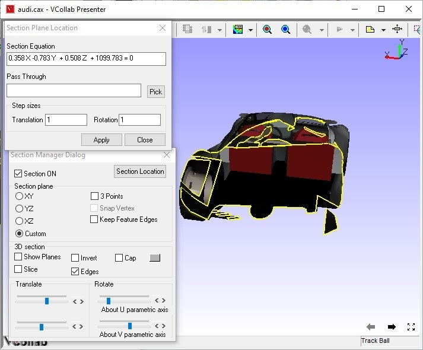

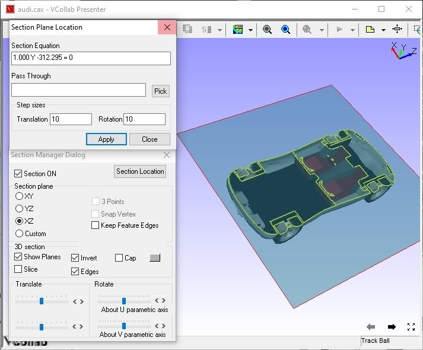

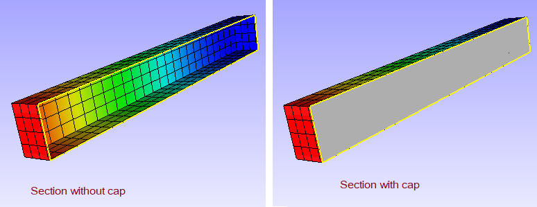

