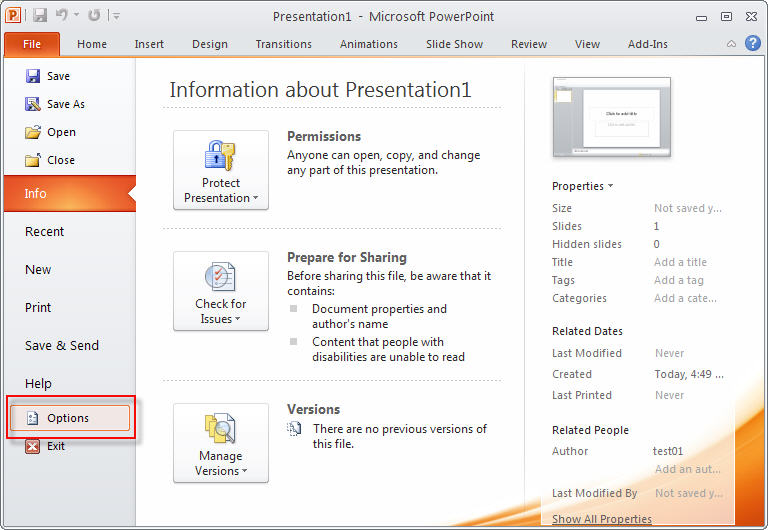
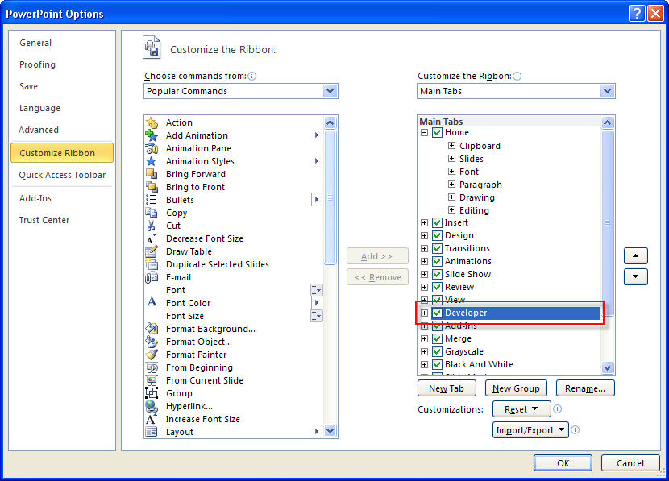
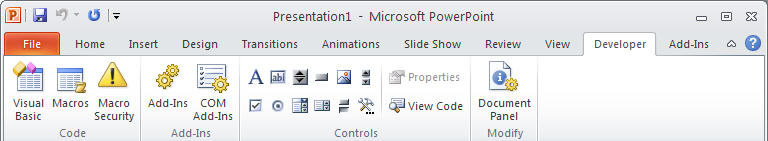
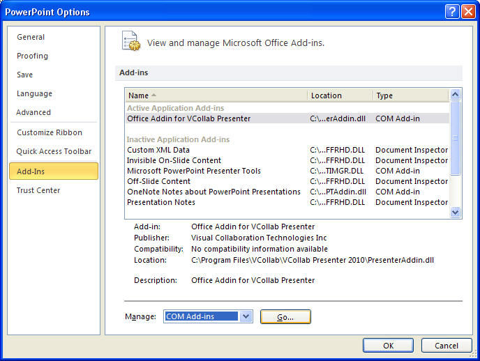
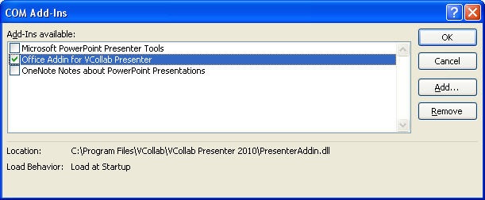
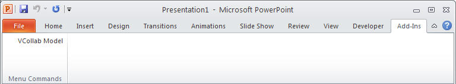

Enabling Developer and Add-Ins tab in Microsoft Office 2010
===========================================================

 This section explains, how  Add-Ins and Developer tabs are enabled in Microsoft Office 2010 tools MS Word, Excel and PowerPoint.

**To enable the Developer tab on the Ribbon**

-   Choose File \| Options, as shown in **figure below.**

    |image0|

-   This opens a dialog box of the same name, as shown in **the
    following figure**.

    |image1|

-   Choose the **Customize Ribbon** tab on the left list so that the
    relevant options are available in the right side of this dialog box.
-  On the right side of the window check the option **Developer **\ (see
   **figure above**).
-  Press OK when you are done to get back to the PowerPoint interface.
-  Figure below  shows the Developer Tab added to the Ribbon.

    |image2|

To Enable the Add-Ins tab **of the Ribbon**

-   Choose File \| Options, as shown in **figure below.**

    |image3|

-   This opens a dialog box of the same name, as shown in **the
    following figure**.
-   Choose the **Add-Ins** tab on the left list so that the relevant
    options are available in the right side of this dialog box.

    |image4|

-  On the right side of the window, select COM Add-Ins under **Manage**
   option and Click **Go** button.
-  It pops up COM Add-Ins dialog as below.

    |image5|

-  Check '**Office Addin for VCollab Presenter**' option and click OK.
-  Figure below\  shows the Add Ins Tab added to the Ribbon.

     |image6|
    

