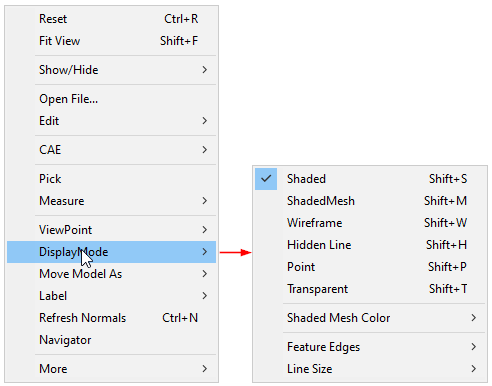
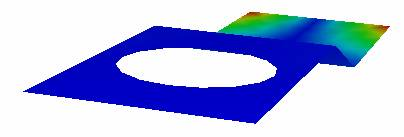
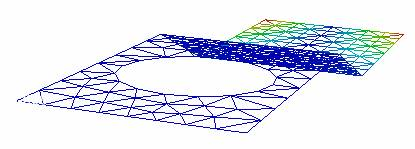
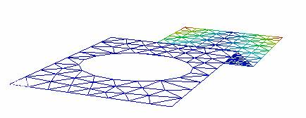
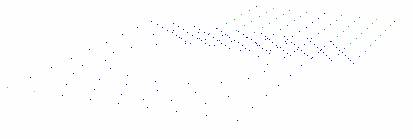
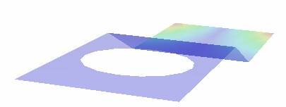
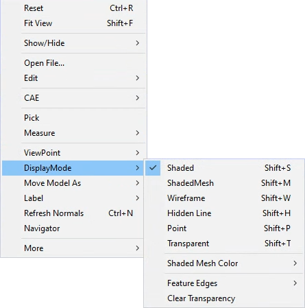

Display Modes
=============

VCollab Presenter offers different types of display modes for viewing a
model..

DisplayMode in Context Menu
---------------------------

|image0|

The various Display options available are explained below

+--------------------+------------------------------------------------------------------------------------------------------+
| Shaded (default)   | Smoothly shaded surfaces.                                                                            |
+--------------------+------------------------------------------------------------------------------------------------------+
| Shaded Mesh        | Smoothly shaded surfaces and Mesh.                                                                   |
+--------------------+------------------------------------------------------------------------------------------------------+
| Wire Frame         | Pure wireframe model with line sets.                                                                 |
+--------------------+------------------------------------------------------------------------------------------------------+
| Hidden Line        | Wireframe model with hidden line removal.                                                            |
+--------------------+------------------------------------------------------------------------------------------------------+
| Points             | Model with the set of colored point sets.                                                            |
+--------------------+------------------------------------------------------------------------------------------------------+
| Transparent        | Users can edit transparency percentage using **Transparency** option in **Edit \| Options dialog**   |
+--------------------+------------------------------------------------------------------------------------------------------+

Shaded Mesh Color
*****************

-  Default mesh color is black. Users can modify it using **Shaded Mesh Color \| User Color**.

-  **Shaded Mesh Color \| Palette Color** option sets contour color to
   the mesh.

|image1|

Feature Edges
*************

|image8|

|image9|

The various Feature Edge options available are explained below.

+-----------------+----------------------------------------------------------+
| **Show Edges**  | Shows Feature Edges                                      |
+-----------------+----------------------------------------------------------+
| **Edge Only**   | Displays model only with feature edges.                  |
+-----------------+----------------------------------------------------------+
| **Color**       | Allows user to set edge color with either palette        |
|                 | color or with user color.                                |
|                 | User can display the edges with transparency too.        |
+-----------------+----------------------------------------------------------+
| **Line Size**   | Allows user to select the edge pixel size from 1 to 5.   |
+-----------------+----------------------------------------------------------+
| **Regenerate**  | Allows user to change crease angle and                   |
|                 | regenerate feature edges.                                |
+-----------------+----------------------------------------------------------+
| **Shared Edges**| Allows user to show or hide the edges                    |
|                 | which are shared between parts.                          |
+-----------------+----------------------------------------------------------+

**Steps to change display mode**

-  Go to **Display Mode** submenu from the Viewer Context menu.

-  Click the appropriate mode to change.

-  Enable **Axis** option to show Axis or Triad.

-  Enable **Full Screen** option to view in Full Screen mode.

-  **Line Size** option is applicable for Line Set data only.

-  If the model contains any line set data, users can use Line Size
   option to view them in different sizes.

+-------------------------------------------------------+------------+
| **Smoothly shaded with contour surfaces**             | |image2|   |
+-------------------------------------------------------+------------+
| **Shaded Mesh**                                       | |image3|   |
+-------------------------------------------------------+------------+
| **Wireframe model with line sets**                    | |image4|   |
+-------------------------------------------------------+------------+
|                                                       | |image5|   |
| **Wire Frame Model with hidden line removal**         |            |
|                                                       |            |
|                                                       |            |
|                                                       |            |
+-------------------------------------------------------+------------+
| **Model with set of point sets**                      | |image6|   |
+-------------------------------------------------------+------------+
| **Smoothly shaded surfaces with 50% transparency**    | |image7|   |
+-------------------------------------------------------+------------+

.. |image1| image:: Images/Shadedmesh_color_menu.png

.. |image3| image:: Images/Shaded_mesh_displaymode.jpg

.. |image9| image:: Images/feature_edges_context_menu.png

