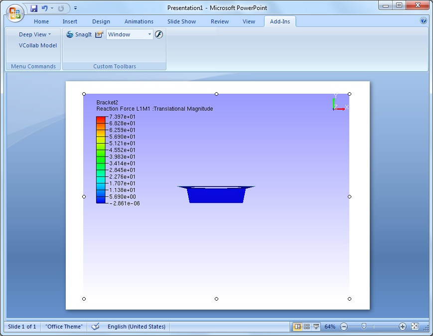
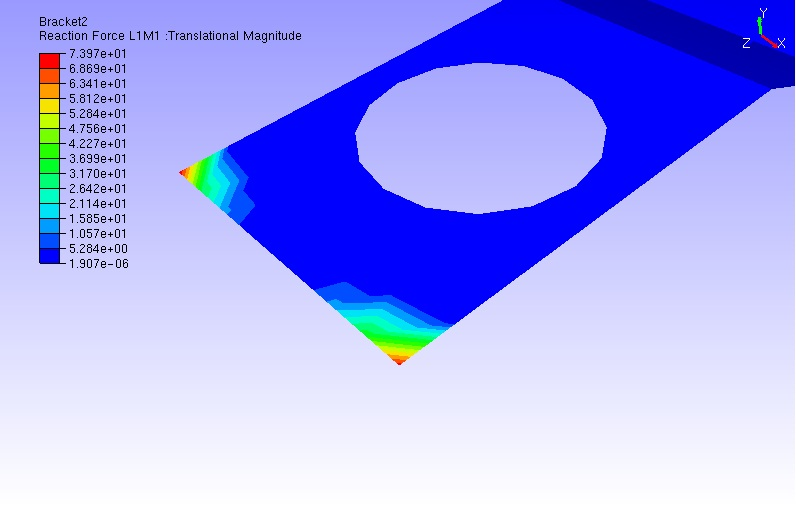
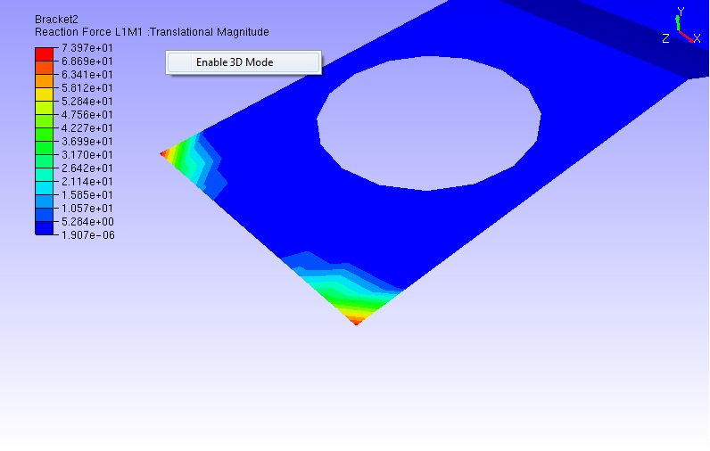
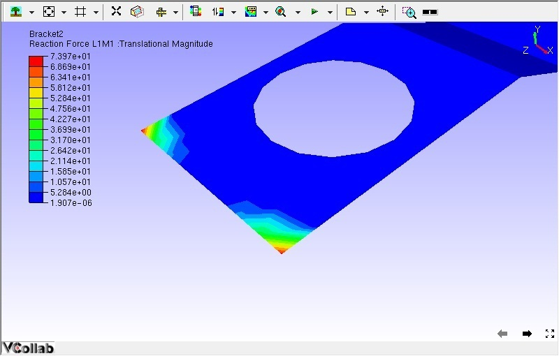

Enable Image Mode
==================

VCollab Control embedded powerpoint slides take significant time to
load. The Enable Image Mode is a useful option to avoid loading the
heavy .cax file by default while using MS Office Products. For e.g., if
the user saves the ppt when the presenter is in Image Mode, next time
while opening it will not load the linked .cax data automatically. The
user has the option to load the 3D model when needed. Thus presentation
slides can load quickly using the Image mode option.

**Steps to use the Enable Image Mode feature**

-  Embed VCollab Presenter control into Microsoft PowerPoint
   presentation tool.

-  Load any **CAX** model.

|image0|

-  Run presentation.

-  Do the necessary transformations to get the required view..

-  Select **Set As Image** option from the context menu to capture
   current view as image.

|image1|

-  Select **Enable Image Mode** from the context menu.

|image2|

-  The latest captured image will be set as display image for image
   mode.

|image3|

-  Repeat the same for other pages which contain VCollab Presenter
   control.

-  Save the presentation.

-  Open the same presentation file now

-  The slides load faster with the images embedded.

-  Select **Enable 3D Mode** option to toggle to 3D mode whenever it is
   necessary during presentation.

|image4|

-  The above step resumes the presenter control to 3D Mode as below.

|image5|

Note:

For image clarity in image mode, use the **Set As Image** option in
**Slide show mode** of MS PowerPoint.

.. |image1| image:: Images/More_contextmenu.png

.. |image2| image:: Images/Enable_image_mode_contextmenu.png

