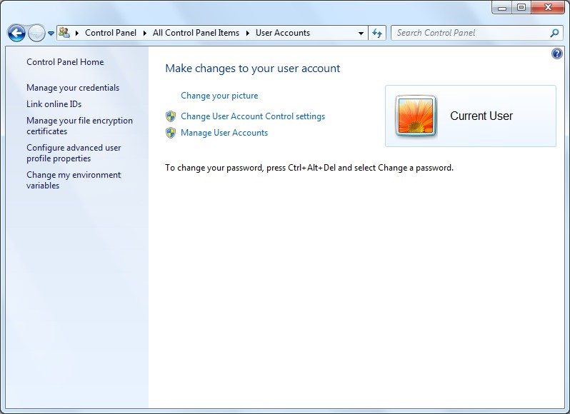
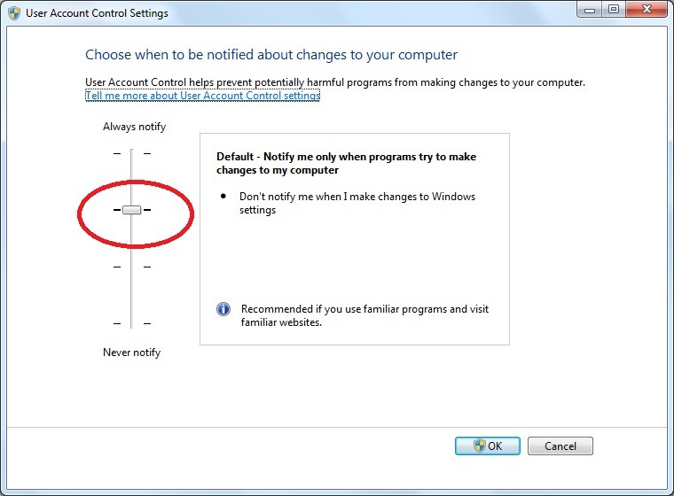
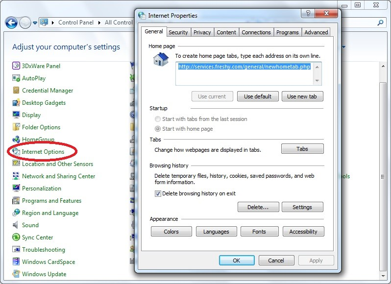
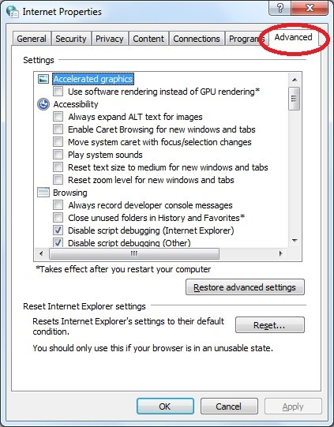
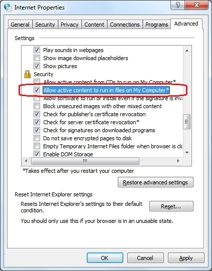
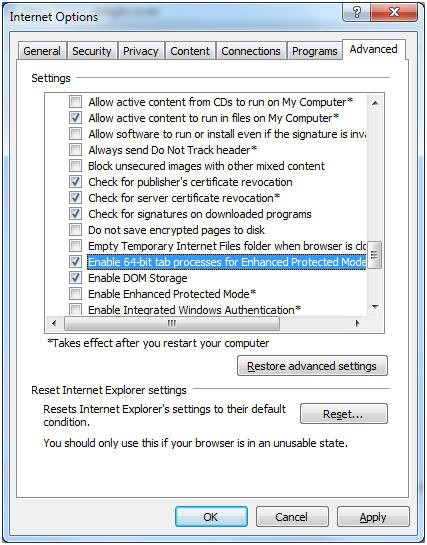
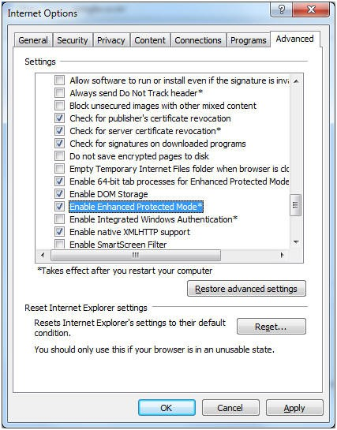

Enabling 64 Bit Internet Explorer                    
======================================================
Steps for enabling 64 bit Internet Explorer          
                                                      
1. Go to **Control Panel \| User Accounts.**         
                                                      
 |image0|                                             
                                                      
2. Click **Change User Account Control Settings.**   

 |image1|

3. Keep **Default settings.**

4. Go to **Control Panel \| Internet Options** which opens the Internet
   Properties panel.

  |image2|

5. Select **Advanced** tab.

  |image3|

6. Select **Allow active content to run in files on My Computer\***
   under Security\ **.**

  |image4|

7. Select **Enable 64-bit tab processes for Enhanced Protected Mode\*.**

|image5|

8. Select **Enable Enhanced Protected Mode\*.**

|image6|

9. Click **OK.**

