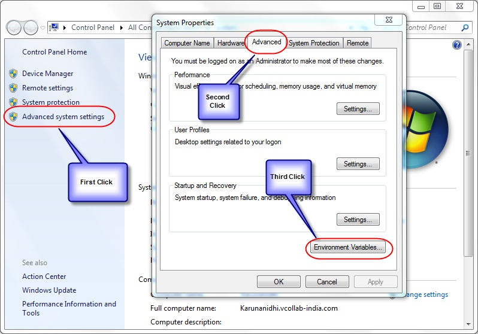

Environment Variables
=======================

+---------------------------------------------------------------------------------------------------------------------------------------------------------------------------------------------------------------------------------------------------------------------------------------------------------------------------------------------------------------------------------------------------------------------------------------------------------------------------------------------------------------------------------------------------------+----+
| VCollab Suite creates 3 Environment Variables during installation.                                                                                                                                                                                                                                                                                                                                                                                                                                                                                      |    |
|                                                                                                                                                                                                                                                                                                                                                                                                                                                                                                                                                         |    |
| +-----------------------+---------------------------------------------------------------------------------------------------------------------------------+                                                                                                                                                                                                                                                                                                                                                                                             |    |
| | Variables             | Values                                                                                                                          |                                                                                                                                                                                                                                                                                                                                                                                             |    |
| +-----------------------+---------------------------------------------------------------------------------------------------------------------------------+                                                                                                                                                                                                                                                                                                                                                                                             |    |
| | VCOLLAB\_DIR          | Installation\_Directory                                                                                                         |                                                                                                                                                                                                                                                                                                                                                                                             |    |
| +-----------------------+---------------------------------------------------------------------------------------------------------------------------------+                                                                                                                                                                                                                                                                                                                                                                                             |    |
| | PATH                  | Installation\_Directory\\VCollabPro64;Installation\_Directory\\VCollabPresenter32;Installation\_Directory\\VCollabPresenter64   |                                                                                                                                                                                                                                                                                                                                                                                             |    |
| +-----------------------+---------------------------------------------------------------------------------------------------------------------------------+                                                                                                                                                                                                                                                                                                                                                                                             |    |
| | VE3D\_LICENSE\_FILE   | Installation\_Directory\\License                                                                                                |                                                                                                                                                                                                                                                                                                                                                                                             |    |
| +-----------------------+---------------------------------------------------------------------------------------------------------------------------------+                                                                                                                                                                                                                                                                                                                                                                                             |    |
|                                                                                                                                                                                                                                                                                                                                                                                                                                                                                                                                                         |    |
| If any of the above Environment variables is deleted, VCollab may not work.                                                                                                                                                                                                                                                                                                                                                                                                                                                                             |    |
|                                                                                                                                                                                                                                                                                                                                                                                                                                                                                                                                                         |    |
| In addition to the above variables, the Environment variable, VCOLLAB\_TEMP\_PATH can manually be set, if required. It can be any temporary directory which will be used by VCollab Pro for temporary files. The "Current User Profile Directory" is used as the default temporary directory by VCollab, if this variable is not set. This Environment variable can be defined in User Environment Variables. Users need to make sure they have both read and write permission to the path specified here else VCOllab Pro may not function properly.   |    |
+---------------------------------------------------------------------------------------------------------------------------------------------------------------------------------------------------------------------------------------------------------------------------------------------------------------------------------------------------------------------------------------------------------------------------------------------------------------------------------------------------------------------------------------------------------+----+
| Steps to Set Environment Variables in Windows                                                                                                                                                                                                                                                                                                                                                                                                                                                                                                           |    |
|                                                                                                                                                                                                                                                                                                                                                                                                                                                                                                                                                         |    |
| -  Go to the **Start** menu → **Settings**-->. Control Panel to open the Control Panel window.                                                                                                                                                                                                                                                                                                                                                                                                                                                          |    |
|                                                                                                                                                                                                                                                                                                                                                                                                                                                                                                                                                         |    |
| -  Click **Advanced system settings** to open System Properties dialog box                                                                                                                                                                                                                                                                                                                                                                                                                                                                              |    |
|                                                                                                                                                                                                                                                                                                                                                                                                                                                                                                                                                         |    |
| -  Click the **Advanced** tab.                                                                                                                                                                                                                                                                                                                                                                                                                                                                                                                          |    |
+---------------------------------------------------------------------------------------------------------------------------------------------------------------------------------------------------------------------------------------------------------------------------------------------------------------------------------------------------------------------------------------------------------------------------------------------------------------------------------------------------------------------------------------------------------+----+

|image0|

-  Click the **Environment Variables** button to open the Environment
   Variables window.

|image1|

-  Click New which opens the New System Variable window as below.

-  Enter VCOLLAB\_TEMP\_PATH as variable name and the temporary VCollab
   path as Variable value and click OK.

|image2|

**License File Setup**

The Environment Variable **VE3D\_LICENSE\_FILE** is set along with
System Variables at the time of installation as follows

    VE3D\_LICENSE\_FILE Installation\_Directory\\License

The Node Lock licensed products of VCollab will run automatically, if
the license file is copied to the Installation\_Directory\\License
folder. If the user wants to keep the license file in some other folder,
then the Environment variable (VE3D\_LICENSE\_FILE) should be changed to
reflect the correct file path.

    Eg: VE3D\_LICENSE\_FILE License\_File\_Path

For a Floating license, the Environment variable should point to the
path where the License Server is running.

    Eg: VE3D\_LICENSE\_FILE @License\_Server\_Machine\_name

As a special case, if the user wants to run Node lock and floating
applications of VCollab products in the same machine, then the
environment variable should be set with both the paths. By default, the
variable contains the node lock license file path as specified above.
For specifying the floating license server path, the user should select
the existing VE3D\_LICENSE\_FILE variable and append the license server
path

    Eg: VE3D\_LICENSE\_FILE
    NodeLock\_License\_FilePath;@License\_Server\_Machine\_name

If the user doesn't have privileges to change the System Variable for
licensing, then the user can create a variable VE3D\_LICENSE\_FILE under
User variables and set the value for the floating license as follows.

    Eg: VE3D\_LICENSE\_FILE @License\_Server\_Machine\_name

**Setting up the Environment Variables manually**

If the user doesn't have installation permission, then the user can copy
VCollab files from some other machine, where VCollab products are
installed. In that case, the above mentioned Environment Variables need
to be set manually.

Eg: If the VCollab files are copied into D:\\VCollab, then the
environment variables should be manually set as follows

    1. VCOLLAB\_DIR - D:\\VCollab

    2. PATH -
       D:\\VCollab\\VCollabPro32;D:\\VCollab\\VCollabPresenter32;D:\\VCollab\\VCollabPresenter64

    3. VE3D\_LICENSE\_FILE- D:\\VCollab\\License

    4. VCOLLAB\_TEMP\_PATH can be any temporary directory which will be
       used by VCollab. The "Current User Profile Directory" will be set as
       default temporary directory by VCollab, if this variable is not set.

    **Environment Variables for Visualization**

+-------------+----------------------------------+----------------------------------------------------------------------------------------------------------------------------------------------------------------------------------------------------------------+-----------------------------------+
| **S.No.**   | **Environment Variable**         | **Description**                                                                                                                                                                                                | **Value**                         |
+-------------+----------------------------------+----------------------------------------------------------------------------------------------------------------------------------------------------------------------------------------------------------------+-----------------------------------+
| 1           | **VCOLLAB\_FORCE\_OGL**          | This variable sets OpenGL 1.1 as scene renderer.                                                                                                                                                               | 1                                 |
+-------------+----------------------------------+----------------------------------------------------------------------------------------------------------------------------------------------------------------------------------------------------------------+-----------------------------------+
| 2.          | **VCT\_COLORPLOT\_OFF**          | This variable commands the loader not to load results by default. Results can, however, be loaded on demand.                                                                                                   | 1                                 |
+-------------+----------------------------------+----------------------------------------------------------------------------------------------------------------------------------------------------------------------------------------------------------------+-----------------------------------+
| 3.          | **VCOLLAB\_CAPTURE\_IMAGE**      | This variable captures an image and uses it for Microsoft PPT embed preview.                                                                                                                                   | 1                                 |
+-------------+----------------------------------+----------------------------------------------------------------------------------------------------------------------------------------------------------------------------------------------------------------+-----------------------------------+
| 4.          | **VCOLLAB\_USE\_OGL\_AMBIENT**   |     There is an ambient color issue in case of openGL mode for some models as shown below.                                                                                                                     | 1                                 |
|             |                                  |                                                                                                                                                                                                                |                                   |
|             |                                  |     |image3|                                                                                                                                                                                                   |                                   |
|             |                                  |                                                                                                                                                                                                                |                                   |
|             |                                  |     This can be fixed by setting this environment variable.                                                                                                                                                    |                                   |
|             |                                  |                                                                                                                                                                                                                |                                   |
|             |                                  |     |image4|                                                                                                                                                                                                   |                                   |
+-------------+----------------------------------+----------------------------------------------------------------------------------------------------------------------------------------------------------------------------------------------------------------+-----------------------------------+
| 5.          | **VCOLLAB\_FORCE\_OGLIMAGE**     |     If the application is consuming more than 2GB memory, saving an image file can sometimes cause the application to crash. This can be fixed by setting the environment variable VCOLLAB\_FORCE\_OGLIMAGE.   | 1                                 |
|             |                                  |                                                                                                                                                                                                                |                                   |
|             |                                  |     Note:                                                                                                                                                                                                      |                                   |
|             |                                  |                                                                                                                                                                                                                |                                   |
|             |                                  |     When running VCollabImageGenerator.exe, if VCOLLAB\_FORCE\_OGLIMAGE is set, the background color cannot be changed. Only the default color is used.                                                        |                                   |
+-------------+----------------------------------+----------------------------------------------------------------------------------------------------------------------------------------------------------------------------------------------------------------+-----------------------------------+
| 6.          | **VCOLLAB\_PROFILE\_PATH**       | If the user profile folder path contains Unicode characters, the Profile cannot be saved. This can be fixed by setting this environment variable with ascii folder path.                                       | User defined ascii folder path.   |
+-------------+----------------------------------+----------------------------------------------------------------------------------------------------------------------------------------------------------------------------------------------------------------+-----------------------------------+

.. |image1| image:: Images/Enviromental_variables_GUI.jpg

.. |image2| image:: Images/New_system_varaiable_GUI.png

.. |image3| image:: Images/VCollab_variable1.gif

.. |image4| image:: Images/VCollab_variable2.gif

