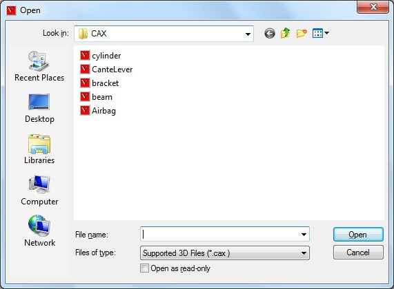
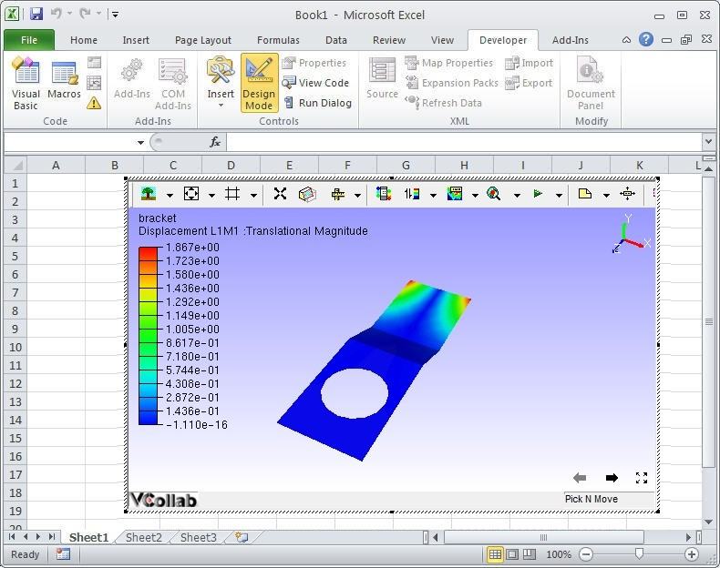

Embedding VCollab Presenter in Microsoft Excel 2007/2010
=========================================================

VCollab Presenter control can be embedded into MS Excel 2007/2010 in two
ways

-  Using the **Add-Ins** tab

-  Using the **Developer** tab.

**Steps to embed Presenter control using the Add-Ins tab**

-  Open Microsoft Excel 2007/2010

-  Go to **Add-Ins** tab and click **VCollab Model** (This is available
   only if VCollab suite is installed)

    If there is no Add-Ins tab, click here to know how to enable it.

    |image0|

-  Select the CAX file to load from the file open dialog box that opens
   up.

    |image1|

-  VCollab Control is thus embedded as below.

    |image2|

**Steps to embed Presenter using Developer tab**

-  Open Microsoft Excel 2007/2010

-   Go to the Developer tab and Click Control Toolbox as highlighted
    below.
    If there is no Developer tab, click here to know how to enable
    it.

    |image3|

-  Browse and select **VCollab Control** from the **More Controls** list
   as shown below.

    |image4|

-  Click Ok and observe that VCollab presenter is embedded as shown
   below.

**Loading CAX file in Excel 2007/2010 WIth Embedded VCollab Presenter**

-  Right click and select **VCollab Control Object \| Edit** in the drop
   down menu items as below.

|image5|

|image6|

-  A CAX Model is shown loaded in VCollab Presenter embedded in
   Microsoft Excel 2007/2010.

|image7|

.. |image4| image:: Images/Vcollab_control_more_control_excel.jpg

