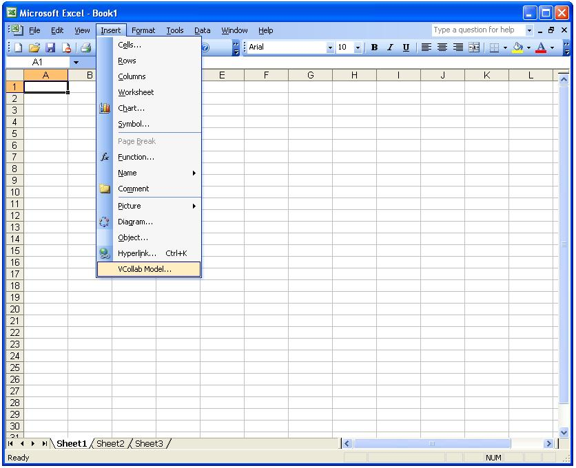
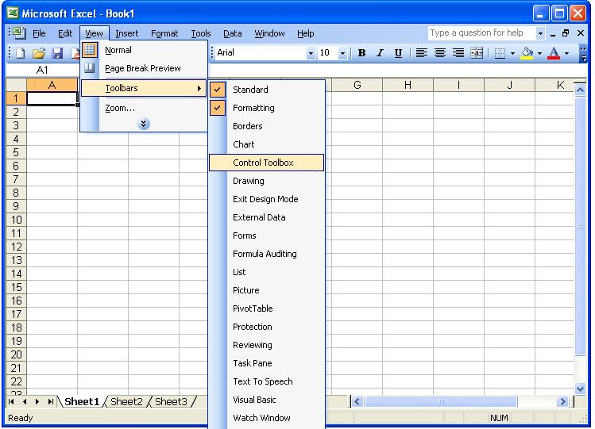
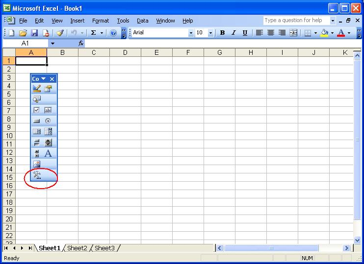
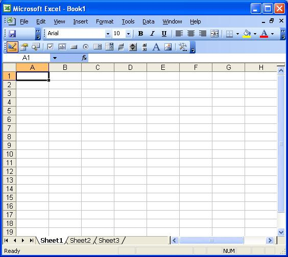
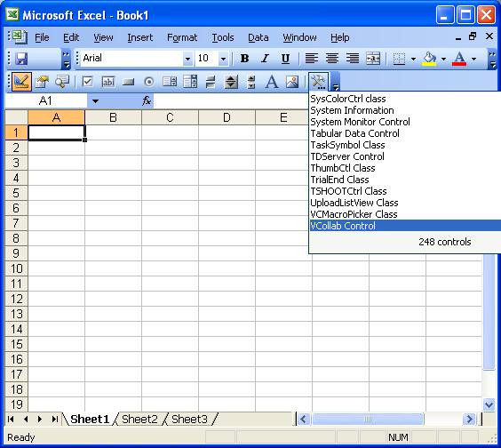
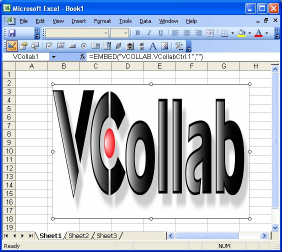
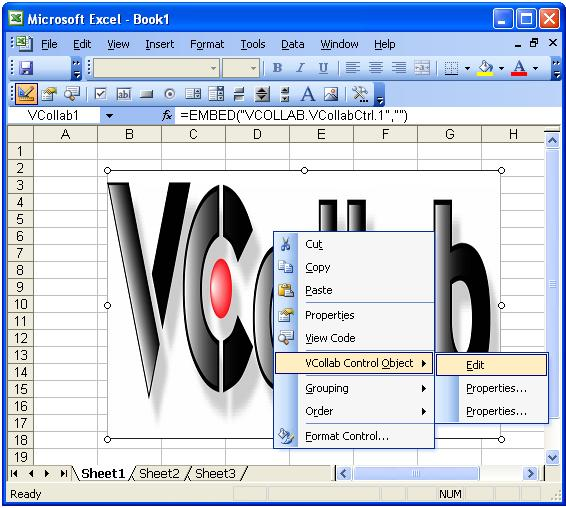
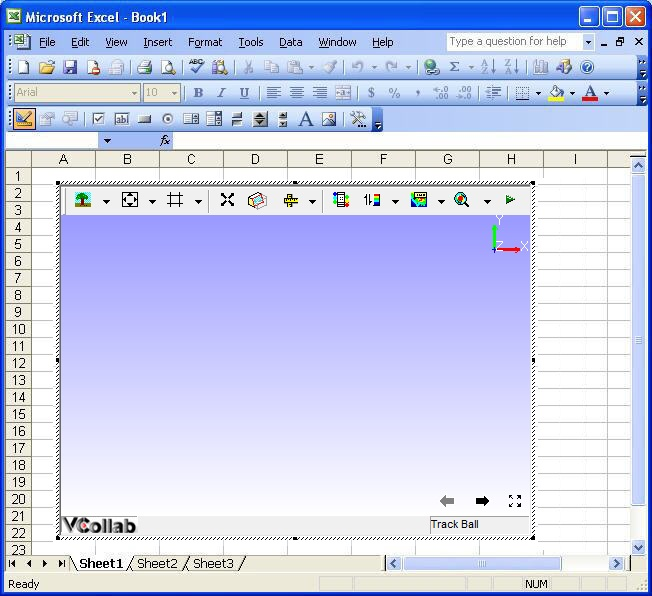

Excel 2003
==========

This section describes how to embed VCollab Presenter into Microsoft Excel 2003.

VCollab Presenter can be embedded into PowerPoint 2003 in two ways

-  Embed through Insert menu items.
-  Embed through Control Tool box.

**How to embed Presenter through Insert Menu?**

-  Click Insert menu.
-  Click menu item VCollab Control. This menu item is available if
   VCollab suite is installed in the system.

    |image0|

-  It pops up open file dialog as below.

    |image1|

-  Select a CAx file.
-  Notice that Presenter is embedded as below.

    |image2|

-  Use right click options to view loaded model.

**How to load Control Toolbox in Excel 2003?**

-  Open Microsoft Excel 2003.
-  Click **View \| Toolbars \| Control Toolbox** as below.

    |image3|

-  Make sure that **More Controls** icon is available in the tool bar as
   shown below in red circle.

    |image4|

**How to embed VCollab Presenter in Excel 2003?**

-  Open Microsoft Excel 2003.

    |image5|

-  Make sure that Toolbox toolbar is available. Load the toolbar if not.
-  Click Tool box icon as shown below.

    |image6|

-  Select VCollab Control.
-  Draw a rectangle in the page and notice that presenter object is
   embedded.

    |image7|

-  Click on the object with Right mouse button which drops down menu
   items.

    |image8|

-  Select **VCollab Control Object \| Edit** and notice that Presenter
   is ready to load model now as below.

    |image9|

.. |image1| image:: Images/PowePoint02.JPG

