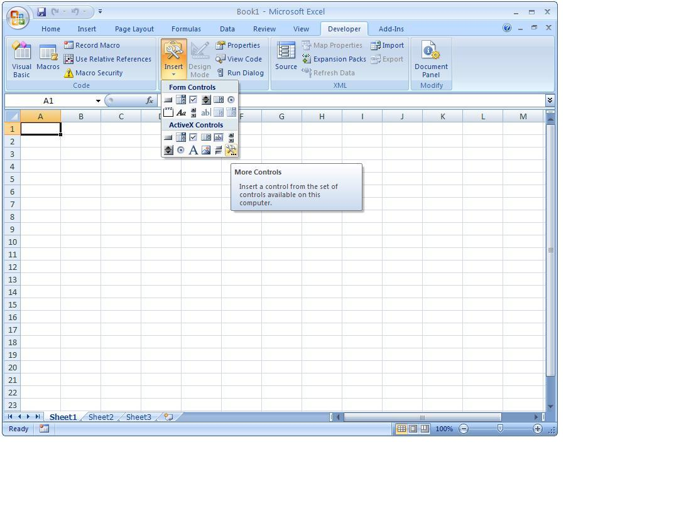
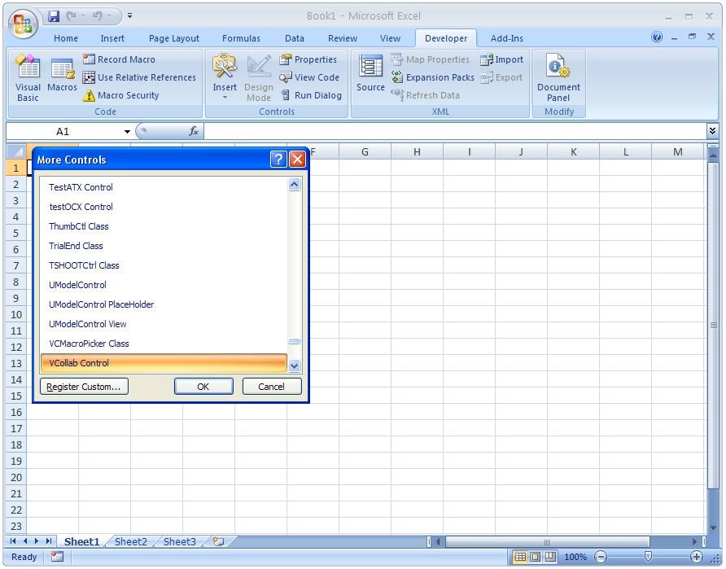
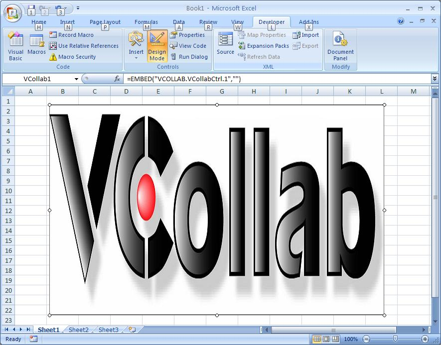
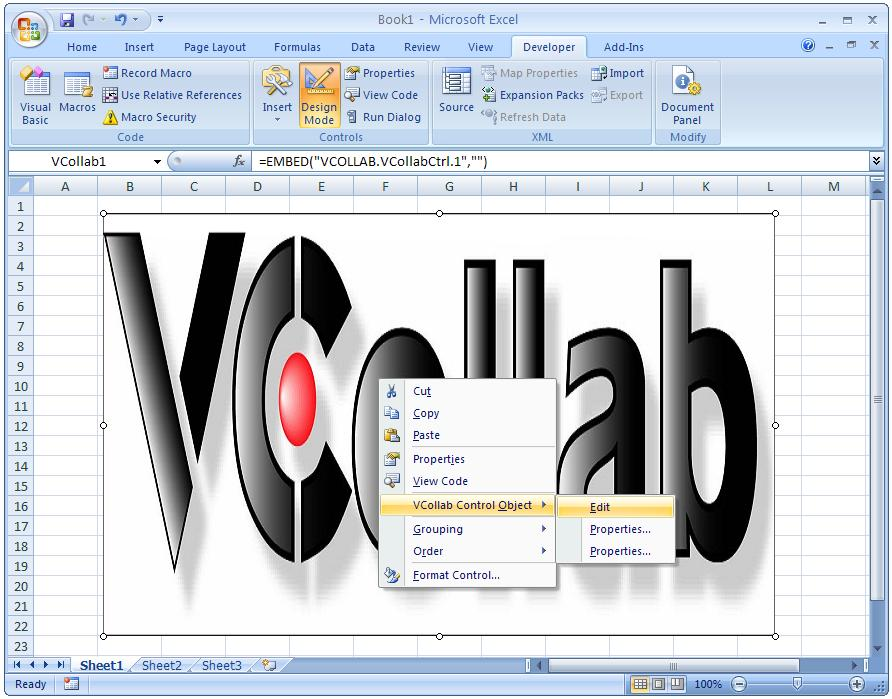
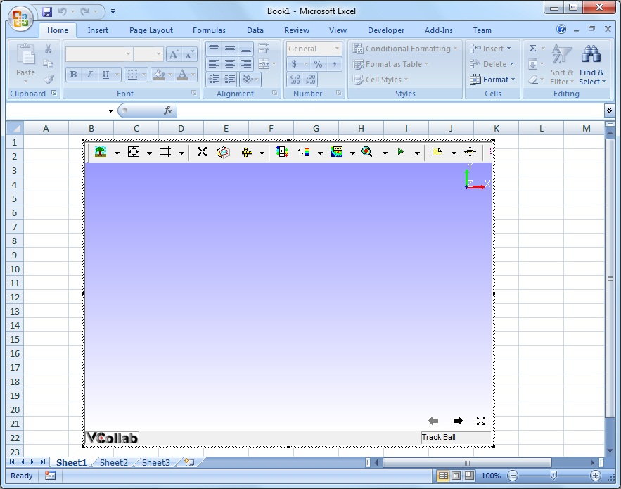
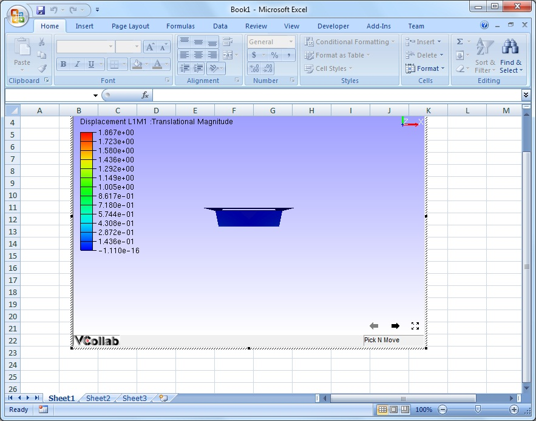

Excel 2007
==========

This section demonstrates how to embed VCollab Presenter into Microsoft
Excel 2007.

VCollab Presenter can be embedded into Excel 2007 in two ways

-  Embed through Add-Ins tab
-  Embed through Developer tab.

**How to embed Presenter through Add-Ins tab?**

-  Open Microsoft Excel 2007
-  Click Add In tab and click VCollab Control (This is available only if
   VCollab suite is installed)

   If there is no Add-Ins tab, `click here <DeveloperNAddInsTab.html>`__
   to enable.

    |image0|

-  It pops up Open file dialog to load a CAx file.

    |image1|

-  Select a file name and click open.
-  Notice that VCollab Control is embedded as below.

    |image2|

-  Use right click options to view loaded model.

**How to embed Presenter through Developer tab?**

-  Open Microsoft Excel 2007.
-  Click Developer tab.
-  Click Insert and More Controls Tool box as below.

   If there is no Developer tab, `click
   here <DeveloperNAddInsTab.html>`__ to enable.

    |image3|

-  Browse and select VCollab Control from the popped up More Controls
   dialog as below.

    |image4|

-  Click Ok and Notice that VCollab presenter is embedded as below.

    |image5|

-  Right Click and Select VCollab Control Object \| Edit in the drop
   down menu items as below.

    |image6|

-  Click Edit and notice that VCollab presenter is ready to load a model
   now.

    |image7|

-  Below one is Loaded Model in VCollab Presenter embedded in Microsoft
   Power Point 2007.
   

    |image8|

.. |image1| image:: Images/PowePoint02.JPG

