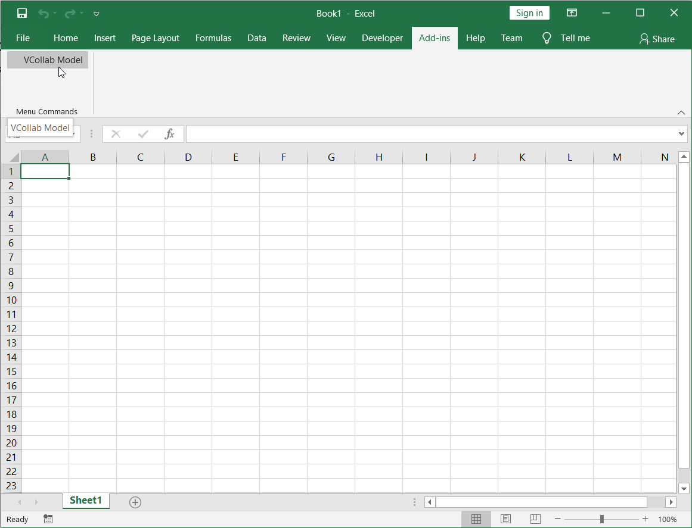
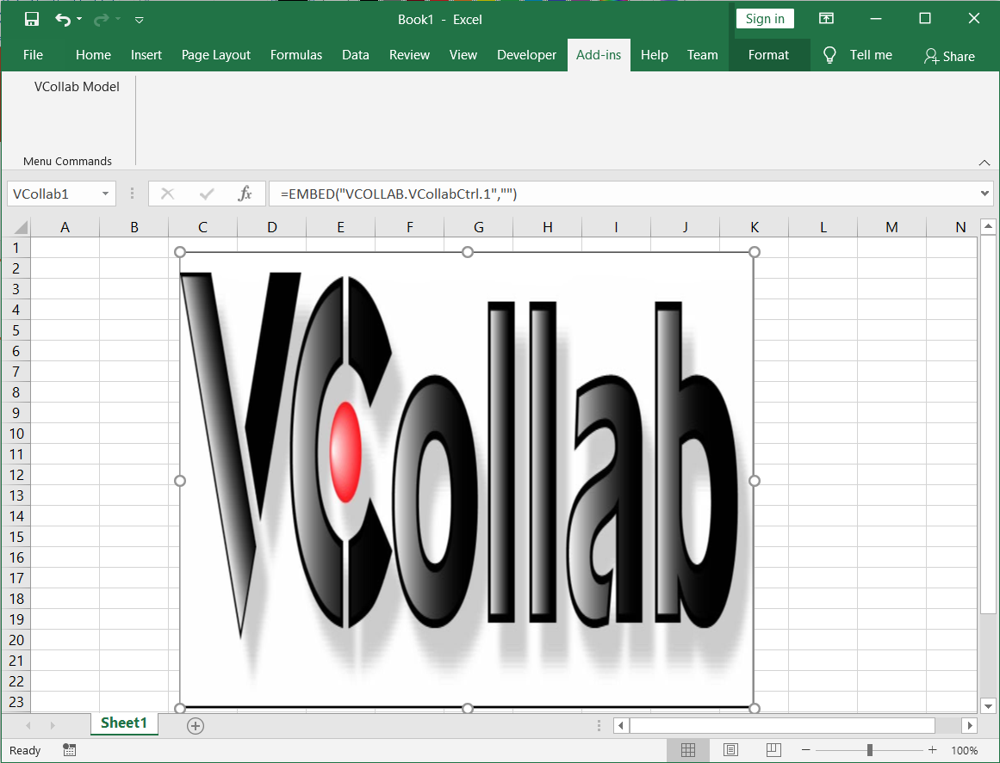
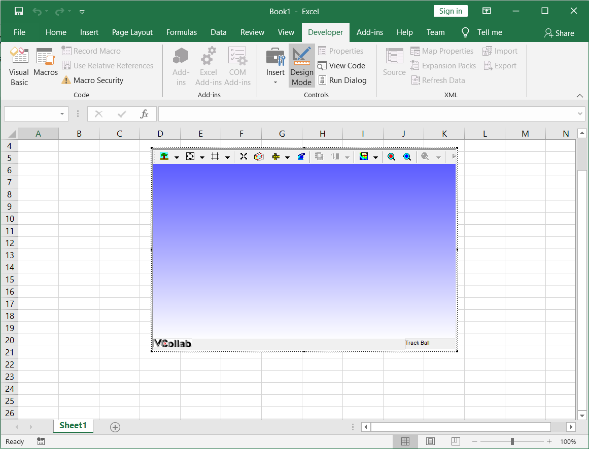

Embedding VCollab Presenter in MS Excel 2016
=============================================

VCollab Presenter control can be embedded into MS Excel 2003 in two ways

-  Using the **Add-ins** menu

-  Using the **Developer** menu.

-  Images can also be set for offline mode.

**Steps to embed Presenter control using the Insert menu**

-  Open Microsoft Excel 2016

-  Click the **Add-ins** menu.

-  Select **VCollab Model**. This option is available if the VCollab
   suite is installed on the system.

|image0|

-  This opens the open file dialog as shown below. Select a CAX file.

|image1|

-  The VCollab control is seen embedded as below.

|image2|

-  Use the right click options to view the loaded model.

**Steps to load Control Toolbox in MS Excel 2016**

-  Open Microsoft Excel 2016

-  Click **Developer \|Insert \|**\ |image3| **More Controls** as shown
   below.

-  The More Controls icons can be seen in the toolbar as highlighted
   below.

|image4|

-  Select **VCollab 2013 Control** from the list of controls.

|image5|

-  Draw a rectangle on the page to embed the presenter object.

    |image6|

-  Right click on the object to open the context menu.

    |image7|

-  Select **VCollab Presenter Control Object \| Edit** to load the model
   as shown below.

    |image8|

.. |image1| image:: Images/Open_cax_dialog.png

.. |image3| image:: Images/More_controls_powerpoint.png

