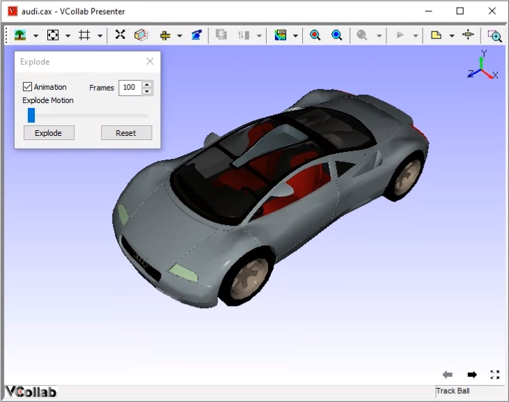
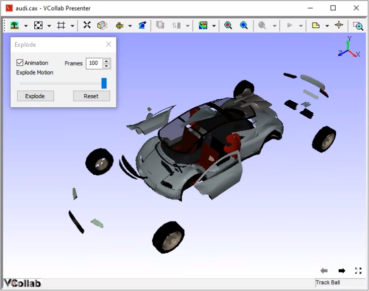

Explode
========
The **Explode** option allows the users of VCollab Presenter to view
model disassembly.

This helps the users to

-  View individual part design.

-  Observe the inner mechanism of a product.

-  Improve their knowledge of the product by observing the assembly
   sequence of the product.

VCollab reassembles all parts of the model in a single click of the
Reset button.

**Steps to explode**

-  Load a model.

|image0|

-  Click **Explode** from the Context menu or click |image1| icon to
   open the Explode dialog boxClick **Explode** to explode the
   product.

|image2|

-  Click **Animate** option, if user want to view explosion with animation.

-  User can control animation speed by entering number of frames in **Frames** textbox.

-  Click **Explode** button if user wants to view further explodes. 

-  Click Reset button to reassemble all parts into product.

