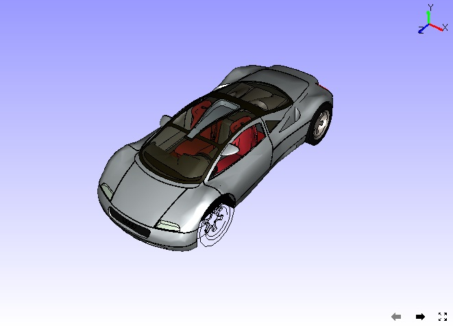

Feature Edges
==============

This Display mode option helps to view Feature Edges with or without a
model.

    |image0|

The various options available under Feature Edges are explained below.

+-----------------------+----------------------------------------+
| **Show**              | Shows/Hides Feature Edges              |
+-----------------------+----------------------------------------+
| **Detach Geometry**   | Detaches Feature Edges from Geometry   |
+-----------------------+----------------------------------------+
| **Line Color...**     | Pops up a color dialog                 |
+-----------------------+----------------------------------------+
| **Line Size**         | Set line width between 1 to 5.         |
+-----------------------+----------------------------------------+
| **Settings...**       | Allows user to change crease angle     |
+-----------------------+----------------------------------------+

**Steps to show feature edges**

-  Click **Display \| Features Edges \| Show** option to see feature
   edges in default color.

|image1|

-  Feature Edges is visible depends upon the visibility of part by
   default

|image2|

-  To view feature edges of a part alone, click **Display \| Feature Edges \| Detach Geometry**.

-  Users can view the feature edges independent of part visibility.

|image3|

-  To change the feature edge color, click **Display \| Feature Edges \| Line Color...** option.

|image4|

-  Select a color and click **OK**

|image5|

-  To increase the line size to 2, click **Display \| Feature Edges \| Line Size \| 2**

   Visibility is improved as shown below

|image6|

-  Feature edges depend on the crease angle between two triangles.
   Number of edges increases as the crease angle decreases.

-  Default crease angle 35 degrees.

-  Change the crease angle using **Display \| Feature Edges \| Settings...**.

    |image7|

Notice that some edges appear or disappear based on the crease angle.

|image8|

.. |image0| image:: Images/Feature_edge_contextmenu.png

.. |image1| image:: Images/Feature_edge_Show.jpg

.. |image4| image:: Images/Feature_edge_color_GUI.png

.. |image5| image:: Images/Feature_edge_line_color.jpg

.. |image7| image:: Images/Feature_edge_settings_GUI.png

.. |image8| image:: Images/Feature_edge_Crease_angle.jpg

