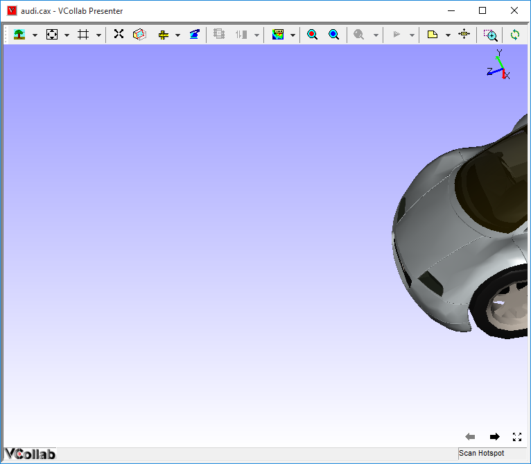
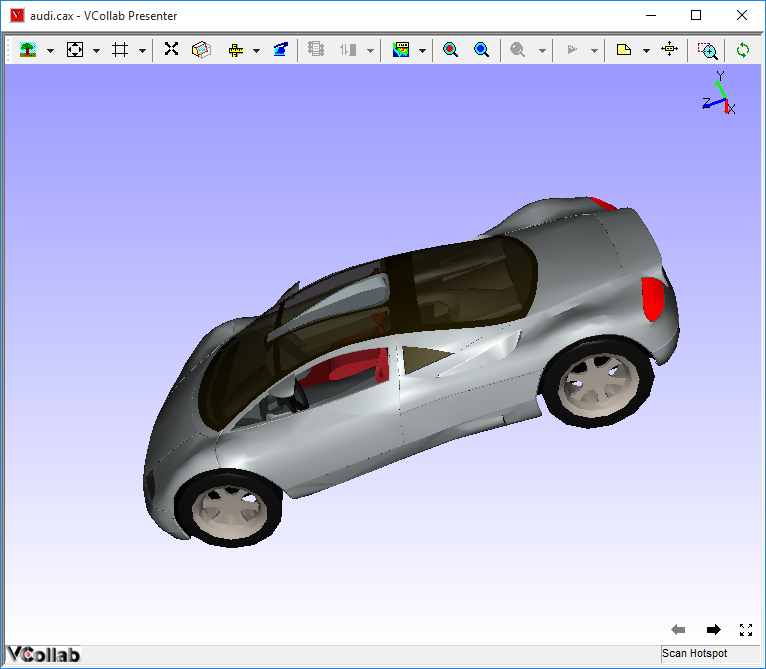
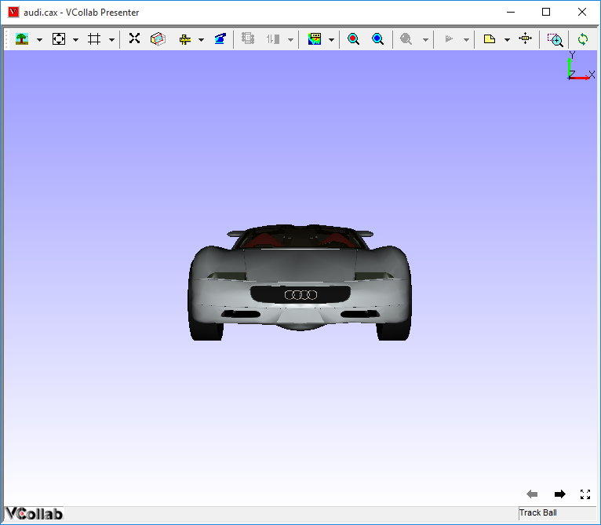

Fit View / Reset View 
====================== 

VCollab Presenter allows the users to use different views to see a model
properly.

+------------------+---------------------------------------------------------+
| **Fit View**     | Pulls the whole model and fits into the user’s scene.   |
+------------------+---------------------------------------------------------+
| **Reset View**   | Loads standard front view.                              |
+------------------+---------------------------------------------------------+

**Steps to Fit view the model**

-  Right click in the Viewer Window to open Viewer Context menu

-  Load a model and do some transformations.

   |image0|

-  Select the **Fit view** option from the Context menu.

-  Fit view fits the model into the user’s view.

   |image1|

**Steps to Reset view**

-  Right click in the Viewer Window to open the Viewer Context menu.

-  Load Model and do some transformations.

   |image2|

-  Select **Reset** option from Context menu.

-  Reset command loads standard front view.

   |image3|

