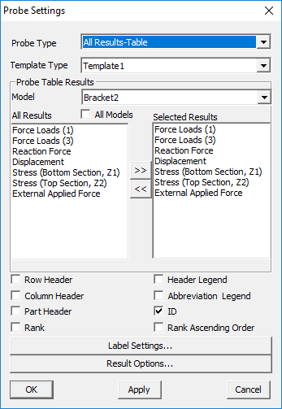
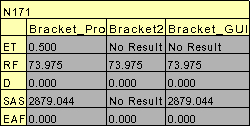

Generate CAE Report
====================

The Hotspot finder tool helps to find the hotspots in a model. A hotspot
can be a node, an element or an area in the computational domain with
extreme values (maximum or minimum) of a result. Local minima, local
maxima or nodes/elements/areas with high gradients can also be
considered as hotspots in certain situations. As the definition of
hotspots can be situational, various mechanisms to identify hotspots are
provided in VCollab Pro. Users can choose the right mechanism based on
their understanding of the problem to identify the hotspots.

**Hot Spot Generation**

VCollab uses the concept of viewpoint to store a display state and
retrieve it and show it to the user. A view point is basically a display
state. A sequence of view points is termed as a view path in VCollab.
The automatic hotspot generator in VCollab generates the hot spots as a
view path. Each viewpoint in this view path can display annotated hot
spots over a zone of the mesh or over the whole geometry. The procedure
to generate hotspots automatically is described in the following steps.

1. Load a model, select the desired result (determines the hot spots) in
   the CAE results

2. Click **CAE \| CAE Settings** in the context menu.

3. Select **Hotspot Finder** tab to open up **Hotspot Settings** dialog.

4. Select **Hotspots** in the **Find** list box.

    |image0|

The various options and fields that are available under Hotspot finder
are explained below.

1. **Find:** Users can choose from any one option from the drop down
   list

-  **Local Extrema :** Under this option, VCollab Pro identifies the
   local maximum or minimum in a node/element within the specified
   zone radius .

-  **Global Extrema:** Under this option, VCollab Pro identifies the
   nodes or elements with global maximum or minimum values as the
   hotspots.

To know more about Local and Global Extrema, click here.

1. **Hotspot Range** (Min & Max): When a range is specified, VCollab Pro
   filters the nodes whose result values lie outside this range.
   They are not considered hot spots. Hot spots are searched among
   nodes whose values satisfy the range limits.

2. **Hotspot Count** (Top and Bottom): This option specifies the number
   of hotspots that need to be generated. Hotspots top and bottom
   labels are differentiated by label border colors, which are red
   and blue respectively. Users can change the default colors if
   needed.

3. **All Top:** If the top value is 100 (as an example) and there are
   multiple IDs with the same value, then hotspot finder considers
   and displays only one of these IDs if All Top is unchecked. If
   this option is checked, hotspot finder displays all IDs with the
   same top values.

4. **All Bottom:** This option is similar to the All Top option, except
   that it considers bottom values.

5. **Mark MinMax:** This option highlights the labels of maximum of top
   labels and minimum of bottom labels. Maximum and Minimum labels
   are highlighted with text colors of Red and Blue respectively.

6. **Zone Radius:** The Zone radius option helps to avoid locating hot
   spots next to each other. Once a hotspot is found, VCollab skips
   all the nodes within the specified radius while searching for the
   next hotspot.

7. **Visible Surface:** Displays the visible labels in the current view.

8. **Probe Label Settings:** Allows users to select probe type and
   template and other result attributes.

    |image1|

-  **Probe Type:**

   -  CurrentResult - Derived : current scalar value

   -  CurrentResult - Full : Displays all components for vector and
      tensor results.

   -  All Results - Table : Displays user selected scalar result values.

   -  All Instances - Table : Displays all instance values in a table.

   -  All Instances - XYPlot :Displays all instance values as a XYPlot
      graph.

-  **Template type:** This option displays values in a predefined
   template (format). Header options are meaningful for template 1
   when at least one dataset is merged with an existing one.

-  **Model:** Selects the model for which results are listed for
   selection.

-  **All Results:** Displays a list of all available results for the
   selected model. To select a result (for probe labels), click on
   it and then press >> button. The selected result will get added
   to the Select Results list.

-  **Selected Results:** Displays a list of all the selected results. To
   deselect a result, click on it and then press << button. The
   result will be removed from this list and appear under the **All
   Results** list. To rearrange the results order in the labels,
   drag the result and drop where you want to place.

-  **Row Header:** To display either dataset name or result/instance
   name in the first column of the label, check the row header box.
   Each row header shows the result/instance that corresponds to the
   CAE result data

-  **Column Header:** To display either dataset name or result/instance
   name in the top of the labels, check the column header box. Each
   column denotes CAE result data and row denotes the corresponding
   result/instance name.

    |image2|

-  **Part Header:** Adds annotated part name into the label.

-  **Header legend:** Displays acronym of the results as a separate
   label.

-  **Abbreviation** **Legend:** Displays the legend or abbreviation and
   its acronym in a table separately. It displays a table for short
   letters for results used in the labels. It can be moved like
   other labels.

-  **ID** : Displays nodal or element ID in the label.

-  **Rank:** Displays rank number based on the hotspot value and number
   of hotspots found.

-  **Rank Ascending Order:** Specifies ranking process to be ascending
   or descending.

-  **Label Settings:** Allows users to format the text and background of
   the label.

-  **Result Options:** Allows users to select and highlight labels based
   on the result values.

-  **Apply** or **OK:** Apply the modifications.

-  **Compare Options :** This option is visible only when at least one
   dataset is merged with existing one. It is used to compare
   results of merged models. Users can select the models to be
   compared with the base model (current model). By default it
   generates hotspots/min max labels for the current model.

    |image3|

-  **Comparison Field:** The following methods are available to users to
   compare results.

    **\*Radius** refers to the default radius and not the user defined
    Zone radius

-  **Position : Nearest -** Compare one hotspot node with a node from
   another model based on position

   a. Get nearest node from the other model with distance < \*Radius

   b. Select this nearest node for comparison.

-  **Position : Min/Max -** Compare one hotspot node with a node from
   another model based on position

   a. Get all nodes in the other model with distance < \*Radius

   b. From this set of nodes select one node for comparison

   c. For top hotspot select the node with Max value

   d. For bottom hotspot select the node with Min value

-  **ID:** Compare the hot spot node with a node from the other model
   having the same id.

-  **ID : Distance -** Compare the hot spot node with a node from the
   other model having the same id

   a. AND distance < \*Radius

-  **Hotspot: Min/Max-** Compare the hotspot node with a hot spot node
   from the other model by:

   a. Get all hotspot nodes in the other model with distance < \*Radius.

   b. From this set of hotspots select one hot spot for comparison

   c. For Top hot spot select the hotspot with Max value

   d. For Bottom hotspot select the hotspot with Min value.

-  **Hotspot: Nearest-**\  Compare the hotspot node with a hotspot node from another model.

   a. Get all hotspot nodes in the other model with distance < \*Radius.

   b. From this set of hotspots select the nearest hotspot (of same
   type) for comparison.

-  **Hotspot: Min/Max UseRange-** \ Compare the hotspot node with a hot spot node from another
   model

   a. Get all hotspot nodes in another model with distance < Zone radius
      (user defined).

   b. From this set of hotspots select one hot spot for comparison.

   c. For Top hotspot select top hotspot with Max value.

   d. For Bottom hotspot select bottom hot spot with Min value.

-  **Hotspot: Nearest UseRange-** \ Compare the hotspot node with another hotspot node from the
   other model

   a. Get all hotspot nodes in another model with distance < Zone radius
      (user defined).

   b. From this set of hotspots select nearest hotspot (of same type)
      for comparison

-  **Compare With**

   -  Same Part - Compare using the comparison options specified above
      in the same part of other model.

   -  Visible Parts - Compare using the compare options specified above
      in all visible parts of the other model.

   -  All Parts - Compare using the compare options specified above in
      all parts.

-  **Within Distance -** Allows users to specify the distance value and
   hotspots are computed within this range.

-  **Hotspots In All Models**: Finds hotspots for each model. Then it
   appends results from merged models as rows or columns based on
   the template selected.

-  **Show All Connections:** Shows all the connecting lines between the
   label and its attached positions.

-  **Mask :** This option in the Hotspot finder panel, allows users to
   mask a set of nodes and elements from the process. Users can mask
   the nodesets from the hotspot finding process using `*Node Set
   manager* <https://training.vcollab.com/CAE_NodeSet_Manager_Pro.html>`__.

**Note:** Masking is not supported for Elemental Result.

    |image4|

    **Inverse** ON will exclude the node sets selected, whereas
    **Inverse** OFF finds hotspots only in the node sets selected.

|image5|

-  **Add View Points:** When enabled, this option generates viewpoints
   according to viewpoint options specified. Viewpoints Options
   button is enabled only when this option is checked.

-  **Export:** This option helps users to export the viewpoints into
   either VPT file or Microsoft PPT file. While adding the view
   path, users will be prompted for a file name and file type.

-  **Viewpoints Options:** This option helps users to select either part
   wise viewpoints or multi view points for a single scene.

    |image6|

The various fields that are seen in the Viewpoint Options panel are
explained below

-  **Each Parts**: Enabling this option creates a viewpoint for every
   part. If the top hotspot count is specified as ten, and if the
   model consists of 5 parts, then the generated view path consists
   of 5 viewpoints (one per each part) with each viewpoint
   consisting of ten hot spots in the corresponding part. There will
   not be any change in view and orientations. In every viewpoint,
   one part is visible and others are hidden.

-  **Visible:** When enabled, this option filters the parts based on its
   visibility and lists the parts in the list.

-  **All Std. Views:** This option will include 6 standard view points
   (X, Y, Z,-X,-Y and -Z) for each part or current scene based on
   **Each Part** option. The viewpoints can be filtered by checking
   or unchecking the corresponding boxes. options. Users can check
   or uncheck the entire column or row as well in one shot.

-  **Add View**: Add view option adds current camera view or user’s view
   as an option with standard views in the GUI. Users can check or
   uncheck if necessary. To update current view, click on the
   |image7|\ icon. It will set the current camera position as the
   viewpoint.

-  **Regions:** The model area can be split into a number of regions and
   each region that is displayed focuses on that region’s hotspots.
   (2,4) means to split the model area into 2 regions horizontally
   and 4 regions vertically, so the total regions are 2x4=8.

    |image8|

-  **Hotspots per page:** Users can specify the number of hotspots per
   page in the viewpoints. If there are 45 hotspots in the model and
   20 are the Hotspots per page specified, then 3 viewpoints will be
   generated. First and second viewpoints will have 20 hotspots in
   each and the remaining 5 hotspots will be shown in the third
   viewpoint.

    Note: By default the number of hotspots per page is 20 (max
    allowed). Users can change this as per requirement.

-  **Auto Views** : When selected, this option helps to orient the
   viewpoint so that the user can view all the hotspots clearly.

    The number of auto views specifies how many auto viewpoints should
    be generated to make all the hotspots visible to the user.

**Steps to edit the generated viewpoint manually**

Users can edit the view points generated by using an automatic hotspot
generator and add hotspots manually as follows.

1.  Create a view path by using automatic hotspot generation as
    explained in the previous section.

2.  Open the hotspot settings and check Previous Labels

3.  Select a view point generated by using automatic hotspot finder, for
    example viewpoint “Object 1”

4.  Select the menu item **Label -> Delete Labels/Notes** in the context
    menu to remove the unwanted annotations and click to move the
    annotations

5.  Uncheck the **Label -> Delete Labels/Notes** when completed

6.  Click the **hotspot finder** tool.

7.  Left click and drag to select an area for creating hotspots.

8.  Right click in the **ViewPoints** tab to open the context menu.

9.  Right click on the viewpoint to be edited.

10. Then select the **Update viewpoint** for updating

**Min / Max Hotspot Generation**

    Instead of generating hotspots automatically, users can also locate
    the hotspots manually. The manual hotspot generation currently
    supports only location of nodes with extreme values
    (minimum/maximum). Local extremes are not supported at present.

**Steps to locate hotspots manually**

1. Click the hotspot finder icon in the toolbar. The mouse mode is now
   changed to hotspot finder mode.

2. Click and drag on the graphics window to select a region as shown in
   the following screen capture.

|image9|

When a region is selected, VCollab locates the nodes with minimum and
maximum values in the selected region and displays as shown in the
following figure.

|image10|

3. The above image shows two hot spots (node 25 and node 96) that are
identified by VCollab. The maximum deformation (displacement) in the
selected rectangular window occurs at node 25 (magnitude of 1.866) and
the minimum occurs at node 96 (magnitude of 0.016).

4. The user can select another region and display the nodes with minimum
and maximum values for the selected region again. The number of hot
spots along with other settings can be changed in the Hot **spot finder
settings** dialog. This dialog can be opened using the following steps.

-  Invoke **CAE settings** dialog from the context menu

-  Click on the **Hotspot finder** tab.

|image11|

-  All default settings except All Top and Bottom, are the same as in
   the Hotspots option.

-  The following list explains different settings and their
   significance.

-  The number of hot spots to be displayed can be controlled by
   changing the values in top and bottom text boxes. In the
   following figure, two top and three bottom hot spots are
   specified.

    |image12|

-  Selecting an area on the screen with the left mouse down with these
   settings, results in the display of five hot spots (two nodes
   with highest values and three nodes with the lowest values).
   Users can uncheck the top/bottom or change its count to zero to
   display only the nodes with the lowest/highest values
   respectively.

-  The Zone radius option that is provided in the hot spot settings
   allows the user to avoid locating hot spots next to each other.

   -  |image13|

-  Once a node with maximum/minimum is found, VCollab skips all the
   nodes within the specified radius of that node during its
   search for the next maximum/minimum. The following two images
   show the identified hotspots without and with the use of
   **zone radius** option.

      |image14|

      |image15|

   Note: When the mouse control is in hotspot mode, users cannot zoom,
   pan or rotate the image. To be able to do so, while continuing in
   hotspot mode, users can turn on the **Navigator** by either turning
   on the Navigator in the product tree or by clicking the menu item
   ***T*\ ools -> Navigator**. The navigator displays additional
   entities on the graphical window which facilitate zoom, rotate or
   pan the scene.

**Steps to Export Viewpoints generated by the user**

1. Select the desired view path in the viewpoints tab from the drop down
   list.

2. Right click to open the context menu.

3. Click on the **Export viewpoints** option.

4. The Save file dialog opens. Enter the **filename** and change the
   Save as type: to MS-PowerPoint Presentation Files (\*.ppt)

5. VCollab prompts the user to use any predefined Microsoft PowerPoint
   template. Select ***Yes*** to use a predefined template.

6. Wait till VCollab exports all the viewpoints and creates a PowerPoint
   file with viewpoints as slides.

.. |image0| image:: Images/Hotspot_extrema.png

.. |image3| image:: Images/Compare_options_GUI.jpg

.. |image4| image:: Images/Hotspot_mask_GUI.png
 
.. |image5| image:: Images/Mask_in_out_viewer.png

.. |image6| image:: Images/Hotspot_viewpoint_option.jpg

.. |image7| image:: Images/HS_AddView_icon.gif

.. |image9| image:: Images/HS_region_find.jpg

.. |image10| image:: Images/HS_region_found.jpg

.. |image11| image:: Images/Hotspot_settings_GUI.jpg

.. |image13| image:: Images/Zone_radius_entry.jpg

.. |image14| image:: Images/HS_count_found.jpg

.. |image15| image:: Images/HS_with_navigator.jpg
