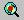
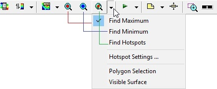
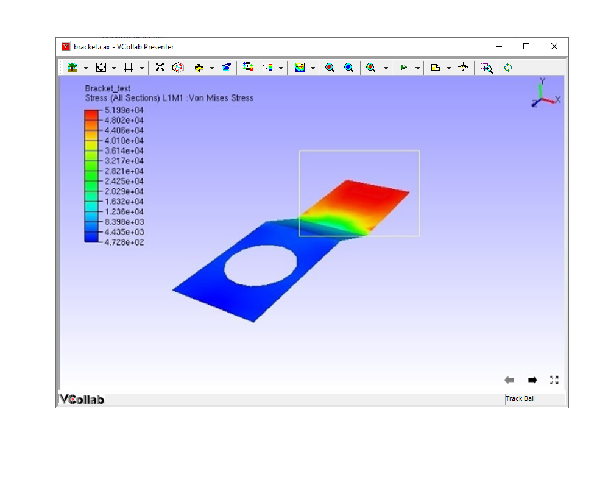
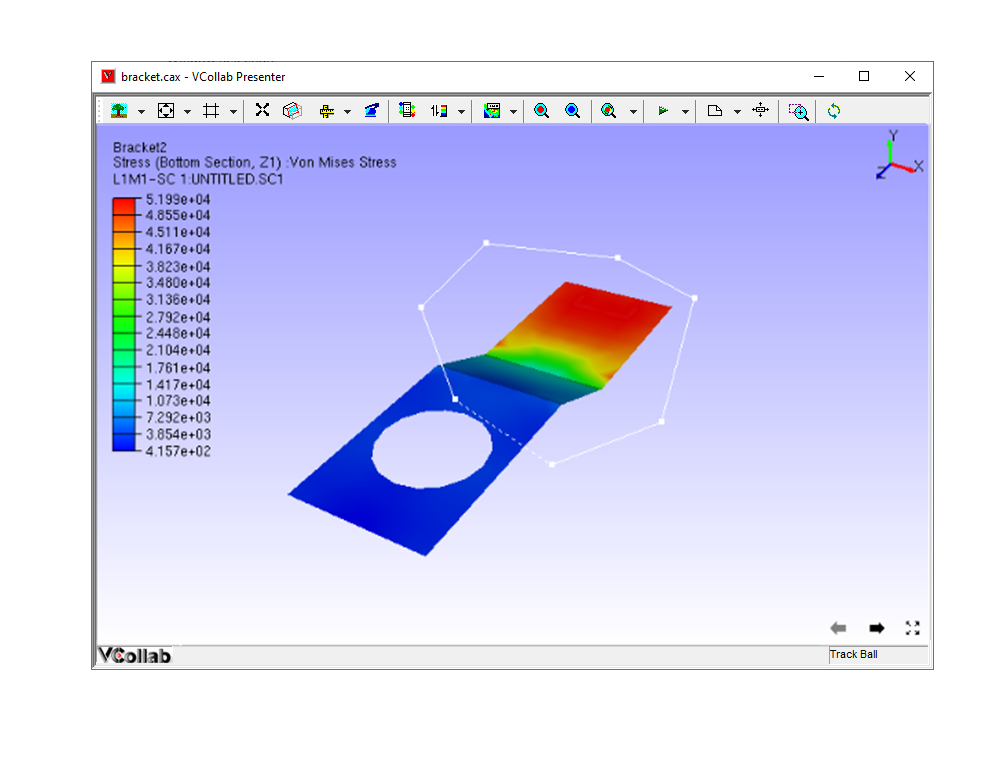
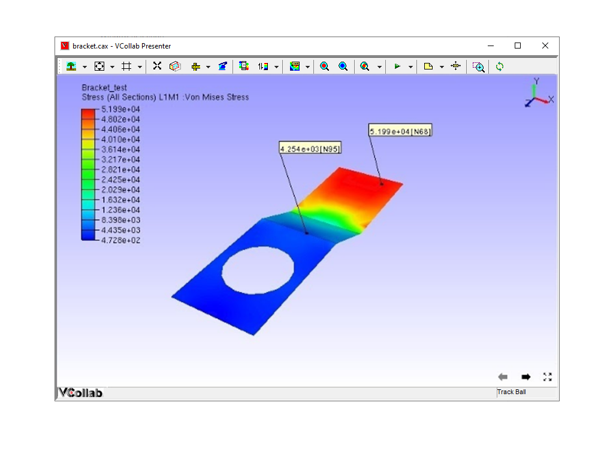
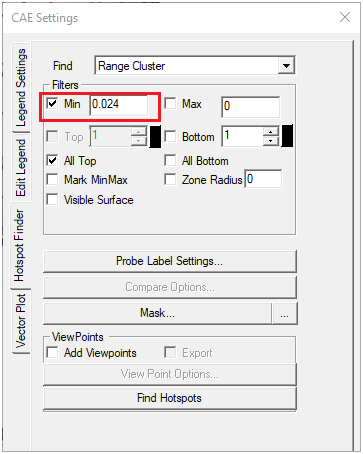
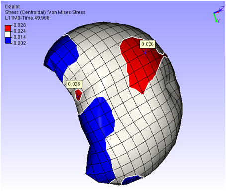
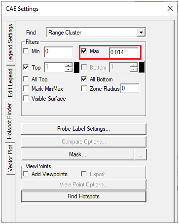

Hotspot Finder
==============

The Hotspot finder tool allows VCollab Presenter users to define
hotspots and find regional hotspots.

**Hotspot Finder Panel**

|image0|

The various options and fields that are available under Hotspot finder
are explained below.

+--------------------------+------------------------------------------------------------------------------------------+
| **Find**                 | Users can choose from any one option from the drop down list                             |
|                          |                                                                                          |
|                          | -  **Local Extrema :** Under this option, VCollab Pro identifies the local maximum       |
|                          |    or minimum in a node/element within the specified zone radius .                       |
|                          | -  **Global Extrema:** Under this option, VCollab Pro identifies the nodes or elements   |
|                          |    with global maximum or minimum values as the hotspots.                                |
|                          | -  **Range Cluster:** Finds hotspots in a given cluster defined based on the range.      |
|                          |    Clusters if min and max are not given, legend's first interval values will be         |
|                          |    taken as the cluster range.                                                           |
|                          |                                                                                          |
|                          | To know more about Local and Global Extrema, click `here <CAE_Hotspots_Extrema.html>`__. |
+--------------------------+------------------------------------------------------------------------------------------+
| **Min**                  | Specify the minimum range.                                                               |
+--------------------------+------------------------------------------------------------------------------------------+
| **Max**                  | Specify the maximum range.                                                               |
+--------------------------+------------------------------------------------------------------------------------------+
| **Top**                  | Used to find the number of top result values. Top labels are highlighted                 |
|                          | by red color border by default. Users can change the color.                              |
+--------------------------+------------------------------------------------------------------------------------------+
| **Bottom**               | Used to find the number of bottom result values. Bottom labels are                       |
|                          | highlighted by blue color border by default. Users can change the color.                 |
+--------------------------+------------------------------------------------------------------------------------------+
| **All Top**              | Includes all same top values and its IDs.                                                |
+--------------------------+------------------------------------------------------------------------------------------+
| **All Bottom**           | Includes all same bottom values and its IDs.                                             |
+--------------------------+------------------------------------------------------------------------------------------+
| **Mark MinMax**          | highlights the labels of max. of top values and min. of bottom labels.                   |
|                          | Max. & Min labels are highlighted with text colors of Red and Blue respectively.         |
+--------------------------+------------------------------------------------------------------------------------------+
| **Zone Radius**          | Used to skip an area around already found hotspots.                                      |
+--------------------------+------------------------------------------------------------------------------------------+
| **Visible Surfaces**     | Considers visible labels only.                                                           |
+--------------------------+------------------------------------------------------------------------------------------+
| **Probe Label Settings** | Used to keep previously found labels in manual hotspots finding.                         |
+--------------------------+------------------------------------------------------------------------------------------+
| **Compare Options**      | This option is visible if at least one file is merged with existing one.                 |
|                          | It displays column wise comparison for merged data.                                      |
+--------------------------+------------------------------------------------------------------------------------------+
| **Add Viewpoints**       | Generates viewpoints according to viewpoint options if enabled.                          |
+--------------------------+------------------------------------------------------------------------------------------+
| **Export**               | Exports the viewpoints into either vpt file or microsoft ppt file.                       |
|                          | While adding view path users will be prompt for file name and file type.                 |
+--------------------------+------------------------------------------------------------------------------------------+
| **View Point Options**   | Provides various options to include or exclude different type of viewpoints              |
+--------------------------+------------------------------------------------------------------------------------------+
| **Find Hotspots**        | Generates viewpoints with hotspots. It is an automatic process.                          |
+--------------------------+------------------------------------------------------------------------------------------+

**Steps to find hotspots?**

-  Define hotspots using **Hotspot Finder** panel options.

-  Click the hotspot finder |image1| icon in the toolbar.

-  Select a region to find hotspots either by drawing a rectangular
   window or by polygon selection.

-  If polygon selection is off, then selection default is by rectangular
   window.

   |image2|

-  Drag mouse to draw a rectangular selection on the model as below.

-  Window Selection

   |image3|

-  Polygon Selection

   |image4|

-  Computed hotspots are displayed as labels.

   |image5|

Hotspot Range Cluster
---------------------
Cluster based on range.

 Example:
 Consider the following airbag model,

 |image6|  |image7|

 For Top hotspot, range is defined by Filter Min value, ( 0.024 ). To visualize the cluster defined by  (> 0.024) , enter the same value in  Legend  as in the image above. 
 User can see two red clusters. This algorithm finds maximum value for each cluster and shows the labels.

 |image8|  |image9|

 Similarly for Bottom hotspot, range is defined by Filter Max value ( 0.014 ). To visualize the cluster defined by (< 0.014), 
 enter the same value in Legend  as in the image   above. User can see three blue clusters. This algorithm finds minimum value for each cluster and shows the labels.

.. |image0| image:: Images/Hotspot_finder_GUI.png

.. |image9| image:: images_extended/hotspot_range_cluster_bottom.png

