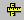

Icons/Context menu items and Descriptions
=========================================
This page contains all tool bar icons and its simple descriptions.

**Toolbar Icons**

    +----------------------+----------------------+----------------------+
    | **Icon**             | **Icon title**       | **Description**      |
    +----------------------+----------------------+----------------------+
    | |image14|            | **Product Explorer** | This contains Scene  |
    |                      |                      | Tree, Part List,     |
    |                      |                      | Viewpoint List and   |
    |                      |                      | Label List panels.   |
    +----------------------+----------------------+----------------------+
    | |image15|            | **Fit View**         | Fits the model into  |
    |                      |                      | user view.           |
    +----------------------+----------------------+----------------------+
    | |image16|            | **Display Mode**     | Changes its display  |
    |                      |                      | mode for each click. |
    |                      |                      | Possible display     |
    |                      |                      | modes are Shaded,    |
    |                      |                      | Shaded Mesh, Wire    |
    |                      |                      | frame, Hidden Line,  |
    |                      |                      | Transparent and      |
    |                      |                      | Points respectively. |
    +----------------------+----------------------+----------------------+
    | |image17|            | **Explode**          | Explodes all parts.  |
    +----------------------+----------------------+----------------------+
    | |image18|            | **Section**          | Allows user to       |
    |                      |                      | define a section     |
    |                      |                      | plane to clip or cut |
    |                      |                      | the model.           |
    +----------------------+----------------------+----------------------+
    | |image19|            | **Measure Distance** | Allows user to       |
    |                      |                      | measure 3D Distance  |
    |                      |                      | between any two      |
    |                      |                      | points on model.     |
    +----------------------+----------------------+----------------------+
    | |image20|            | **CAE Results**      | Lists all results    |
    |                      |                      | and user selected    |
    |                      |                      | result would be      |
    |                      |                      | applied on model.    |
    +----------------------+----------------------+----------------------+
    | |image21|            | **CAE Settings**     | Pops up CAE Settings |
    |                      |                      | dialog, which has    |
    |                      |                      | tabs for Legend      |
    |                      |                      | Settings, Edit       |
    |                      |                      | Legend, Hotspot      |
    |                      |                      | Finder, Vector Plot  |
    |                      |                      | and XYPlot.          |
    +----------------------+----------------------+----------------------+
    | |image22|            | **Probe**            | Enables to probe CAE |
    |                      |                      | results              |
    +----------------------+----------------------+----------------------+
    | |image23|            | **Hotspot Finder**   | Enables CAE hotspots |
    |                      |                      | finder mode.         |
    +----------------------+----------------------+----------------------+
    | |image24|            | **Animate**          | Pops up Animate      |
    |                      |                      | dialog.              |
    +----------------------+----------------------+----------------------+
    | |image25|            | **Add Notes**        | Pops up Add Notes    |
    |                      |                      | dialog for user      |
    |                      |                      | annotation.          |
    +----------------------+----------------------+----------------------+
    | |image26|            | **Move Label**       | Enables mouse mode   |
    |                      |                      | to move label        |
    +----------------------+----------------------+----------------------+
    | |image27|            | **Zoom Region**      | Allows user to zoom  |
    |                      |                      | in a specific area.  |
    +----------------------+----------------------+----------------------+

**Viewer Context Menu**

    |image28|

**Context Menu Item Description**

    +-----------------------------------+-----------------------------------+
    | Reset                             | Resets to default front view.     |
    +-----------------------------------+-----------------------------------+
    | Fit view                          | Brings all parts of model into    |
    |                                   | view port                         |
    +-----------------------------------+-----------------------------------+
    | Show/Hide                         | Shows/hides parts.                |
    +-----------------------------------+-----------------------------------+
    | Open file                         | Allows user to load CAx file      |
    +-----------------------------------+-----------------------------------+
    | Product Explorer                  | Contains scene tree, view points  |
    |                                   | panel, Label List and Part List   |
    +-----------------------------------+-----------------------------------+
    | Explode                           | Explodes all parts.               |
    +-----------------------------------+-----------------------------------+
    | Background                        | Allows user to change background  |
    +-----------------------------------+-----------------------------------+
    | Edit Mouse                        | Allows user to customize mouse    |
    |                                   | operations                        |
    +-----------------------------------+-----------------------------------+
    | Section                           | Allows user to view cut section   |
    |                                   | of model                          |
    +-----------------------------------+-----------------------------------+
    | CAE                               | Allows user to deal with CAE      |
    |                                   | data.                             |
    +-----------------------------------+-----------------------------------+
    | Pick                              | Allows user to pick and drop a    |
    |                                   | part.                             |
    +-----------------------------------+-----------------------------------+
    | Measure                           | Allows user to measure distance   |
    |                                   | and arc/circle                    |
    +-----------------------------------+-----------------------------------+
    | View Point                        | Allows user to add viewpoint      |
    |                                   | states.                           |
    +-----------------------------------+-----------------------------------+
    | Display Mode                      | Displays different display modes. |
    |                                   | Display options for Axis, Full    |
    |                                   | Screen, Properties and Line set   |
    |                                   | size.                             |
    +-----------------------------------+-----------------------------------+
    | Move Model As                     | Helps in increasing performance   |
    |                                   | in user interaction.              |
    +-----------------------------------+-----------------------------------+
    | Label                             | Allows user to modify label       |
    |                                   | visibility.                       |
    +-----------------------------------+-----------------------------------+
    | Refresh Normals                   | Allows user to apply recomputed   |
    |                                   | Normals to the model.             |
    +-----------------------------------+-----------------------------------+
    | Navigator                         | Passive Transformation mode       |
    +-----------------------------------+-----------------------------------+
    | More                              | Expands more options.             |
    +-----------------------------------+-----------------------------------+

.. |image1| image:: icons/FitView.JPG
.. |image2| image:: icons/DisplayMode.JPG

.. |image7| image:: icons/LegendHotspots.JPG
.. |image8| image:: icons/Probe.JPG
.. |image9| image:: icons/HotspotFinder.JPG

.. |image11| image:: icons/AddNote.JPG
.. |image12| image:: icons/MoveLabel.JPG

.. |image15| image:: icons/FitView.JPG
.. |image16| image:: icons/DisplayMode.JPG

.. |image21| image:: icons/LegendHotspots.JPG
.. |image22| image:: icons/Probe.JPG
.. |image23| image:: icons/HotspotFinder.JPG

.. |image25| image:: icons/AddNote.JPG
.. |image26| image:: icons/MoveLabel.JPG

.. |image28| image:: Images/Presenter_ContextMenu.JPG

