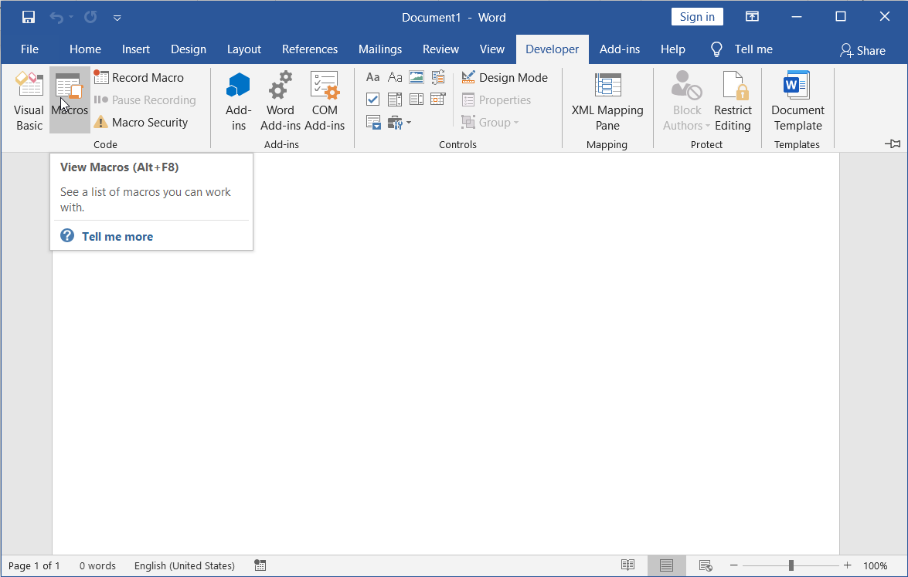
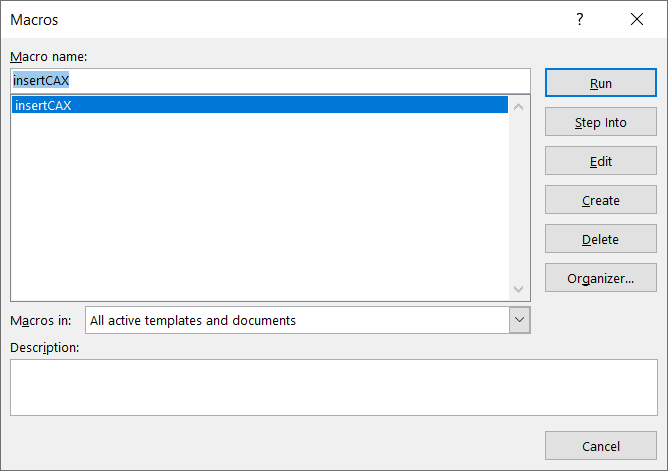
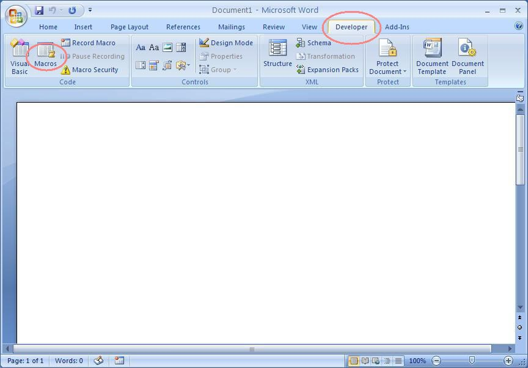
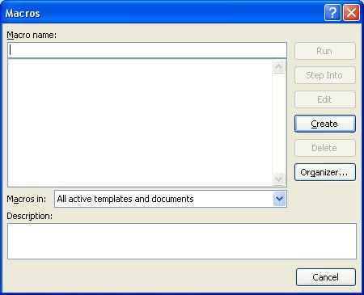
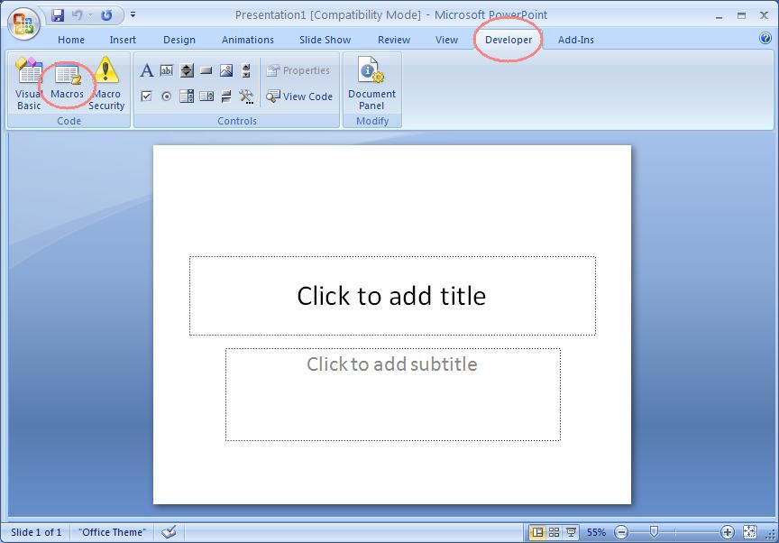

Embedding CAX file using Macros in MS Office 
=============================================                                                                      

 .. rubric:: Macros in MS office are used to automate tasks which are repetitive thereby speeding up the process.   
    :name: macros-in-ms-office-are-used-to-automate-tasks-which-are-repetitive-thereby-speeding-up-the-process.     
                                                                                                                    
 .. rubric:: The CAX files generated by VCollab products can be inserted in MS office files using macros.           
    :name: the-cax-files-generated-by-vcollab-products-can-be-inserted-in-ms-office-files-using-macros.             
                                                                                                                    
 Using Macros in MS Word 2016                                                                                       
                                                                                                                    
 -  Go to **Tools->Macro->Macros Menu**                                                                             

|image0|

|image1|

-  Enter a name for the new macro and click **Create**.

-  A Visual basic editor window opens. Copy and paste the following
   lines for the InsertCAX function.

-  Provide correct file path for the input CAX file in .FilePath line
   instead of C:\\MyCaxFilePath.cax

    Sub InsertCAX()

    '

    ' InsertCAX Macro

    ' Macro recorded 1/8/2010 by vct user

    'ActiveDocument.ToggleFormsDesign

    Set vcollab =
    Selection.InlineShapes.AddOLEControl(ClassType:="VCOLLAB.VCollabCtrl.1")

    With vcollab.OLEFormat.Object

    .FilePath = "C:\\MyCaxFilePath.cax"

    End With

    End Sub

-  Close VC Editor Window.

-  Click **Macros** in the **Developer** tab.

-  Select and Run the macro created.

VCollab Presenter control is thus inserted.

Using Macros in MS Word 2007

-  Go to the **Developer** tab.

-  Click **Macros** to open the Macros panel

|image2|

-  Enter a new name, say "InsertCAX".

|image3|

-  Click **Create**.

-  The Visual Basic editor opens up.Copy and paste the following lines.

-  Provide correct file path for the input CAX file in .FilePath line
   instead of C:\\MyCaxFilePath.cax

    Sub InsertCAX()

    '

    ' InsertCAX Macro

    ' Macro recorded 1/8/2010 by vct user

    'ActiveDocument.ToggleFormsDesign

    Set vcollab =
    Selection.InlineShapes.AddOLEControl(ClassType:="VCOLLAB.VCollabCtrl.1")

    With vcollab.OLEFormat.Object

    .FilePath = "C:\\MyCaxFilePath.cax"

    End With

    End Sub

-  Close VC Editor Window.

-  Click the **Macros** option in the **Developer** tab.

-  Select the macro created.

-  Click **Run** and notice that VCollab Presenter control is inserted.

**Insert CAX file using Macros in MS-PowerPoint**

**MS-PowerPoint 2003**

-  Goto **Tools->Macro->Macros Menu** to open the Macros panel

|image4|

-  Type **InsertCAX** as name for the new macro and click **Create**

-  The visual basic editor opens. Copy and paste the following lines.

-  Provide correct file path for the input CAX file in .FilePath line
   instead of C:\\MyCaxFilePath.cax

    Sub InsertCAX()

    '

    ' InsertCAX Macro

    ' Macro recorded 1/8/2010 by vct user

    'ActiveDocument.ToggleFormsDesign

    Set vcollab =
    Selection.InlineShapes.AddOLEControl(ClassType:="VCOLLAB.VCollabCtrl.1")

    With vcollab.OLEFormat.Object

    .FilePath = "C:\\MyCaxFilePath.cax"

    End With

    End Sub

-  Close VC Editor Window.

-  Click the **Macros** option in the **Developer** tab.

-  Select the macro created.

-  Click Run and notice that VCollab Presenter control is inserted.

**MS-PowerPoint 2007**

-  Go to the Developer tab.

-  Click **Macros** to open the Macros panel

|image5|

-  Provide a new name, say "InsertCAX".

-  Click **Create to** open the Visual Basic editor

-  Copy and paste the following lines.

-  Provide correct file path for the input CAX file in .FilePath line
   instead of C:\\MyCaxFilePath.cax

    Sub InsertCAX()

    '

    ' InsertCAX Macro

    ' Macro recorded 1/8/2010 by vct user

    'ActiveDocument.ToggleFormsDesign

    Set vcollab =
    Selection.InlineShapes.AddOLEControl(ClassType:="VCOLLAB.VCollabCtrl.1")

    With vcollab.OLEFormat.Object

    .FilePath = "C:\\MyCaxFilePath.cax"

    End With

    End Sub

-  Close VC Editor Window.

-  Click the **Macros** option in the **Developer** tab.

-  Select the macro created.

-  Click **Run** and notice that VCollab Presenter control is inserted.

.. |image4| image:: Images/Word_macro_tools.jpg

