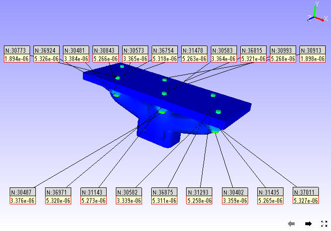
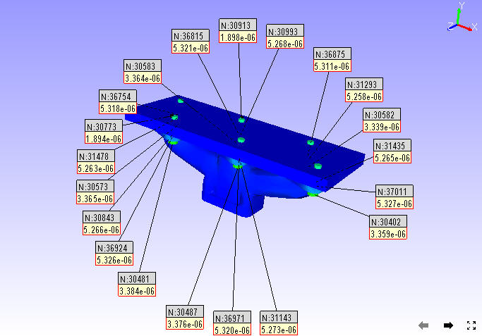
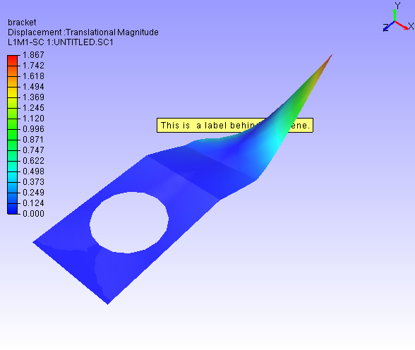

Label
======

Labels are added by users for better understanding of product features
and parts. VCollab Presenter users can add, format, delete, move and fit
a label or annotation to any part using the **Label** option found under
the context menu.

**Label Option in Context Menu**

|image0|

The various options found under Labels/Notes are explained below

+--------------------------------+----------------------------------------------------------------------------------------------------------------------------------------------------------+
| **Delete Labels/Notes**        | Deletes user selected label or note.                                                                                                                     |
+--------------------------------+----------------------------------------------------------------------------------------------------------------------------------------------------------+
| **Show Visible Labels Only**   | Displays visible labels only                                                                                                                             |
+--------------------------------+----------------------------------------------------------------------------------------------------------------------------------------------------------+
| **Auto Visible Labels**        | Shows visible labels only dynamically during user interaction.                                                                                           |
+--------------------------------+----------------------------------------------------------------------------------------------------------------------------------------------------------+
| **Show All Labels**            | Shows all labels independent of attached position visibility                                                                                             |
+--------------------------------+----------------------------------------------------------------------------------------------------------------------------------------------------------+
| **Hide All Labels**            | Hides all labels                                                                                                                                         |
+--------------------------------+----------------------------------------------------------------------------------------------------------------------------------------------------------+
| **Delete All Labels**          | Deletes all existing labels                                                                                                                              |
+--------------------------------+----------------------------------------------------------------------------------------------------------------------------------------------------------+
| **Delete All Hidden Labels**   | Deletes all hidden labels.                                                                                                                               |
+--------------------------------+----------------------------------------------------------------------------------------------------------------------------------------------------------+
| **Invert Show Labels**         | Inverts the labels visibility.                                                                                                                           |
+--------------------------------+----------------------------------------------------------------------------------------------------------------------------------------------------------+
| **Fit Labels**                 | Fits all labels inside view port                                                                                                                         |
+--------------------------------+----------------------------------------------------------------------------------------------------------------------------------------------------------+
| **Autofit Labels**             | Fits all labels inside viewport automatically during motion model                                                                                        |
+--------------------------------+----------------------------------------------------------------------------------------------------------------------------------------------------------+
| **Arrange Labels**             | Arranges all labels in an order. It has three mechanisms, Near to attached position, top-bottom method, Compact, rectangular, Circular and Silhouette.   |
+--------------------------------+----------------------------------------------------------------------------------------------------------------------------------------------------------+
| **Auto Arrange Labels**        | Arranges all labels automatically whenever the user modifies the label or table dimensions.                                                              |
+--------------------------------+----------------------------------------------------------------------------------------------------------------------------------------------------------+
| **Show Probed Parts**          | Hides all parts except the probed parts.                                                                                                                 |
+--------------------------------+----------------------------------------------------------------------------------------------------------------------------------------------------------+

**Label Settings Panel**

|image1|

The various tabs and fields available in the Label settings panel are
explained below.

+-------------------+---------------------------------------------------------------------------------------------------+
| **Values tab**    | Applicable for CAE Probe label value cells.                                                       |
+-------------------+---------------------------------------------------------------------------------------------------+
| **Headers tab**   | Applicable for CAE Probe label header cells (Row header, Column header and Header Legend table)   |
+-------------------+---------------------------------------------------------------------------------------------------+
| **Others tab**    | Applicable for measurement labels.                                                                |
+-------------------+---------------------------------------------------------------------------------------------------+

+----------------------------+-------------------------------------------------------------------------+
| **Font**                   | Lists font face names for user selection.                               |
+----------------------------+-------------------------------------------------------------------------+
| **Font Size**              | Lists font size values from user selection.                             |
+----------------------------+-------------------------------------------------------------------------+
| **Text Color**             | Allows to change text color.                                            |
+----------------------------+-------------------------------------------------------------------------+
| **Background**             | Allows to set and modify background color.                              |
+----------------------------+-------------------------------------------------------------------------+
| **Line width**             | Allows the user to edit the width of the line between label and part.   |
+----------------------------+-------------------------------------------------------------------------+
| **Border**                 | Allows to set and modify border color.                                  |
+----------------------------+-------------------------------------------------------------------------+
| **Line Color**             | Allows to pick color for extended line between part and label.          |
+----------------------------+-------------------------------------------------------------------------+
| **Transparent**            | Allows users to set and modify transparency and its value.              |
+----------------------------+-------------------------------------------------------------------------+
| **Keep Previous Labels**   | Keeps old labels.                                                       |
+----------------------------+-------------------------------------------------------------------------+
| **Show ID**                | Displays node or element IDs in the label.                              |
+----------------------------+-------------------------------------------------------------------------+
| **Header Field**           | Applies the user modifications to header cells of probe labels.         |
+----------------------------+-------------------------------------------------------------------------+

**Steps to create a label or note for a specific part**

-  Click T\ **ools \| Add Notes..**

-  The **Add Notes** dialog box opens up. Check the option **Attach Geometry**.

-  Enter your note in the edit text box provided

   |image2|

-  Select the font, size and color for the text.

-  Check or uncheck Background and Border options if necessary. Select
   the color for **Background**, **Border** and **Text** from the
   corresponding color window.
   
-  Click **Behind Scene** to send the label behind models. This option is ignored for labels with attach geometry.

-  Click **OK**.

-  Click in the viewer window to place the label as required.

-  A connecting line is visible between label position and mouse
   pointer.

-  Click a point on the specific part. The label will be seen attached.

   |image3|

-  Below is an example of a label behind the model.

   |image_behind_scene|
   
   .. note:: **Behind Scene** option is applicable only for 2D labels and tables. 

**Steps to edit labels or notes**

-  Double click on a label to open **Edit Notes** dialog box

|image4|

-  Edit the contents and formats.

|image5|

-  Click **OK**

    |image6|

**Steps to move an existing label**

-  Click **Move Labels/Notes** icon |image7| available in the toolbar to
   enable it.

-  Drag the concerned label or annotation in the viewer.

-  Release the mouse after the label position is shifted.

    |image8|

    |image9|

-  Click the **Move Labels/Notes** icon |image10| again to disable it.

**Steps to Fit Labels inside the viewer**

-  Click **Label \| Fit Labels** option to fit the labels inside the
   viewer.

    Before

    |image11|

    After Fit Labels

    |image12|

**Steps to avoid label overlapping**

There is a possibility of overlapping of multiple labels in hotspot
finder. It can be avoided using the option **Label \| Arrange Labels**.

-  Load a CAX model.

-  Select **CAE \| CAE Settings** option from context menu to open the
   CAE Settings dialog.

-  Click the **Hotspot Finder** tab.

-  Set top and bottom count to 10 each.

-  Close the CAE Settings dialog.

-  Click the Hotspot Finder icon in the toolbar.

-  Select an area in the viewer.

-  Notice that multiple labels are overlapping each other.

-  Click **Label \| Arrange Labels**.

   The labels are arranged in an order and none overlaps each other.

**Steps to delete a label**

-  From the context menu, click **Label \| Delete Labels/Notes**

-  Click on a label to be deleted

-  Click **Label \|Delete All labels** to delete all labels at one go.

**Steps to Show/Hide a label**

|image13|

-  Click **Tools \| Labels/Notes \| Hide Labels/Notes**.

-  Click on a Label.

-  Clicked label is hidden.

-  Use the Label list panel to show it again.

-  Select the label in the label list.

-  Click the visibility check box in the panel to show the label again.

**Difference between 'Show Visible Labels Only' and *'*\ Auto Visible
Labels'**

These options are applicable only for probed labels and annotated notes.
These labels contain two positions, one is label position and the other
is attached position in the geometry. Based on these attached positions'
visibility in the current view, labels can be classified as
**Observable** and **Non-Observable** labels.

-  The attached positions of **Observable Labels** are visible in the
   view.

-  The attached positions of **Non-Observable Labels** are hidden behind
   geometry surfaces in the view.

-  Users can hide the Non-Observable labels if necessary using the
   options **'Show Visible Labels Only'** and **'Auto Visible
   Labels'**.

-  **'Show Visible Labels Only'** hides the Non-Observable labels for
   the current view. This is a one time event.

-  **'Auto Visible Labels'** hides Non-Observable Labels and shows
   Observable Labels dynamically according to the view.

**Methods of Arranging Labels**

    **Near:** This method repositions all labels and tables very close
    to the actual label attached positions.

    |image14|

    **Top-Bottom:** This method splits the labels into top and bottom labels
    and places them based on attached positions.

    |image15|

    **Compact**: This method searches for a possible zone around the
    label attached position and allocates them without label
    overlapping.

    |image16|

    **Circular**
    \ This method searches for a possible zone around the label
    attached position and arranges them in a circular manner without
    overlapping.

    |image17|

    **Silhouette:** This method searches for a possible zone around the
    label attached position and arranges them along the model outline
    without overlapping.

    |image18|

    **Rectangular:** This method searches for a possible zone around the
    label attached position and arranges them in a rectangular manner
    without overlapping.

    |image19|

**Ranking Probe Labels**

    Probe labels are ranked based on current contour scalar results in
    descending order by default. Users can reverse the ranking process
    and make it ascending, i.e., Lowest value will be ranked first.
    Labels having equal values are given the same rank.

    Note: Ranking is applicable only for current derived probe type
    labels.

       -  Select probe type as **Current Result - Derived type.**

       -  Probe a few values.

       -  Click **Tools \| Labels / Notes \| Rank Probe** **Labels**.

    |image20|

All labels are ranked and displayed with rank number.

    |image21|

-  Click **CAE \| Probe Settings ...**

-  Uncheck or check the **Rank Ascending Order** option to reverse the
   ranking process.

    |image22|

Rank numbers will be reversed.

    |image23|

**Adding Tables**

-  Click the dropdown menu next to the Add **Notes** icon in the
   toolbar.

-  Click the **Add Table** option to open up **Add Table** dialog box.

    |image24|

-  Define the number of rows and columns.

-  Double click the cell to edit the contents. For example,

    |image25|

-  Enter the texts and click **OK**.

-  Click on the viewport to see the table as below.

    |image26|

-  **Relative Position** and **Attach Geometry** options function the
   same way as in the Add Notes annotations.

-  Enabling **Attach Geometry** option displays Use Node ID options. It
   helps the user to enter model, part and node ID to be attached
   with.

    |image27|

-  To edit a table, double click on the specific table to open the Table
   context menu

    |image28|

   -  **Edit Font..** allows the user to edit font name, size, background
      etc. same like in probe table, except the Update All Viewpoints
      option.

   -  **Edit Table...** opens up Edit 2D Table or Edit 3D Table dialog box
      based on Attach Geometry option.

   -  **Display** allows the user to transpose the table and to highlight
      the table.

   -  **Modify** allows the user to add, delete and insert columns or rows.

   -  Context menu for 3D Table is slightly different from the 2D Table
      context menu.

    |image29|

   -  **Modify \| Field Text...** allows me to edit current cell text.

    |image30|

   -  **Focus Node** focuses on the attached location of the label. 

.. |image0| image:: Images/Label_contextmenu.png

.. |image2| image:: Images/Add_notes_GUI.png

.. |image4| image:: Images/Edit_notes_GUI.png

.. |image5| image:: Images/Edit_notes_GUI1.png

.. |image6| image:: Images/Updated_2D_note.png

.. |image7| image:: Images/Move_label_icon.jpg

.. |image8| image:: Images/Edited_2D_note.png

.. |image10| image:: Images/Move_label_icon1.jpg

.. |image11| image:: Images/Fit_label_in_viewer.png

.. |image12| image:: Images/After_autofit_labels.png

.. |image13| image:: Images/Label_show_hide.png

.. |image14| image:: Images/Before_arrange_labels.png

.. |image16| image:: Images/Arrange_labels_compact.png

.. |image18| image:: Images/Arrange_labels_silhouette.png

.. |image19| image:: Images/Arrange_labels_rectangular.png

.. |image20| image:: Images/Label_rank_contextmenu.png

.. |image22| image:: Images/Probe_rank_GUI.png

.. |image23| image:: Images/Label_reverse_rank.png

.. |image25| image:: Images/Table_rows_coloumns.png

.. |image27| image:: Images/Add_table_part_node.png

.. |image28| image:: Images/Edit_table_contextmenu.png

.. |image29| image:: Images/Edit_table_modify_contectmenu.png

.. |image30| image:: Images/Edit_label_text_GUI.png 

