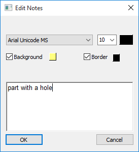
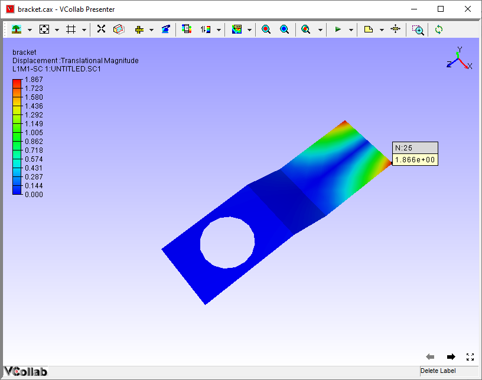

Label List
===========

The **Label List** tab found in Product Explorer lists all types of
labels for the user to view and add notes.

**Label List Panel**

|image0|

The various fields seen in the Label list panel are explained below.

+------------------+--------------------------------------------------------+
| **Visible**      | Hides / shows selected labels                          |
+------------------+--------------------------------------------------------+
| **Probe**        | Probes the result of the node id entered by the user   |
+------------------+--------------------------------------------------------+
| **Probe List**   | Lists all Probed label list.                           |
+------------------+--------------------------------------------------------+
| **Notes List**   | Lists all Notes label list.                            |
+------------------+--------------------------------------------------------+

**Context Menu**

Right clicking in the Label list panel opens up the context menu. The
various options available in the context menu are explained below.

|image1|

+------------------------------+--------------------------------------------------+
| **Invert Show**              | Toggles to show/hide labels.                     |
+------------------------------+--------------------------------------------------+
| **Delete Selected Labels**   | Deletes selected labels in the list.             |
+------------------------------+--------------------------------------------------+
| **Delete All Labels**        | Deletes all labels.                              |
+------------------------------+--------------------------------------------------+
| **Keep Previous Labels**     | Keeps previous labels if user probe CAE result   |
+------------------------------+--------------------------------------------------+

**Steps to view the Label List**

-  Right click in the Viewer window, to open up the viewer context menu.

-  Select **Product Explorer** or click on |image2|.

-  Go to **Label List** tab

-  Select **Probe List** to view all probed labels.

-  Click **Notes** to view all types of notes that are available.

**Steps to edit a note**

-  Go to **Product Explorer\| Label List**

-  Select **Notes** to view the list of available notes.\ |image3|

-  Double Click a note that you need to edit.

-  **Edit Notes** dialog opens up. Enter or edit the content of the
   note.

    |image4|

    |image5|

-  Click **OK**.

-  Notice that note content is changed in notes list as well as in
   viewer label.

    |image6|

**Steps to probe the result for a known ID**

-  Go to **Product Explorer\| Label List**

-  Enter a known ID in the ID edit box.

    |image7|

-  Select on of the following **Probe types** : Current Result -
   Derived, Current Result- Full, All Results- Table, All
   Instances-Table and All Instances-XY Plot, Multi or XY Plot
   probe.

    |image8|

-  Click **Probe** to probe results.

-  A message box will appear for an incorrect node ID.

    |image9|

-  For the correct node id, the probed result is displayed as a label in
   the viewer.

    |image10|

.. |image0| image:: Images/Label_list.png

.. |image2| image:: Images/Product_explorer.jpg

.. |image3| image:: Images/Presenter_label_list.png
 
.. |image4| image:: Images/Edit_notes.png

.. |image7| image:: Images/Label_list_edit.png

.. |image8| image:: Images/Presenter_probe_type.png

.. |image9| image:: Images/Presenter_label_list_errorbox.png

