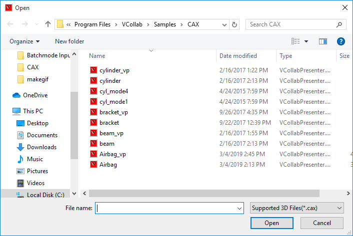
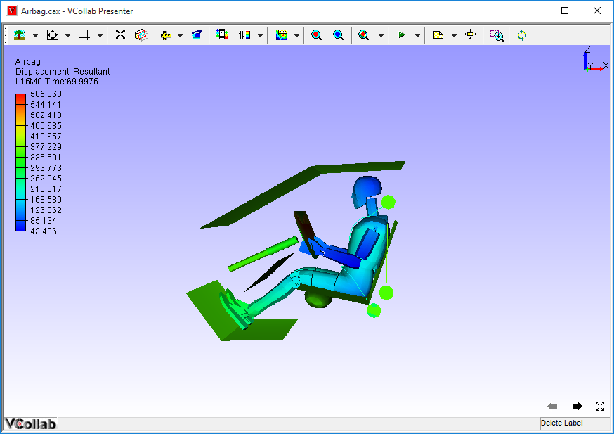

Open File                                                                                                                                                               
===========
 The **Open File** menu allows users to load a CAX file in VCollab Presenter.                                                                                            
                                                                                                                                                                         
 The CAX file is loaded with following defaults                                                                                                                          
                                                                                                                                                                         
 -  Standard front view or first user defined view point state.                                                                                                          
                                                                                                                                                                         
 -  First CAE result if CAE information exists for the model.                                                                                                            
                                                                                                                                                                         
 -  Legend with default CAE information.                                                                                                                                 
                                                                                                                                                                         
**Note:**                                                                                                                                                               
                                                                                                                                                                         
 1. If an environment variable VCT\_COLORPLOT\_OFF is set with value 1, then the model will be loaded faster without color plot. (How to set an environment variable?)   
                                                                                                                                                                         
 2. Users can store current session information and make it available for subsequent sessions using **Profile**.                                                         
                                                                                                                                                                         
**Steps to load a CAX file**                                                                                                                                            
                                                                                                                                                                         
 -  Right click in the Viewer Window, to open the Viewer Context menu .                                                                                                  
                                                                                                                                                                         
 -  Select the **Open File** option from the viewer context menu, which opens the File browser dialog as shown below.                                                    

|image0|

-  Select a **CAX** file and click **Open**.

-  The selected file will be loaded in Presenter.

-  By default, Presenter loads first CAE result in the Result list if
   CAE information exists.

|image1|

