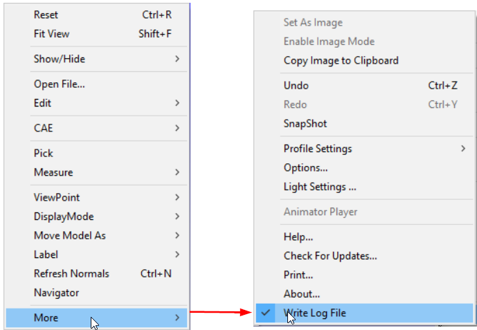
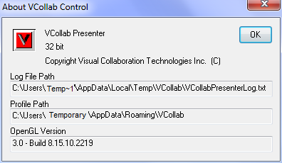
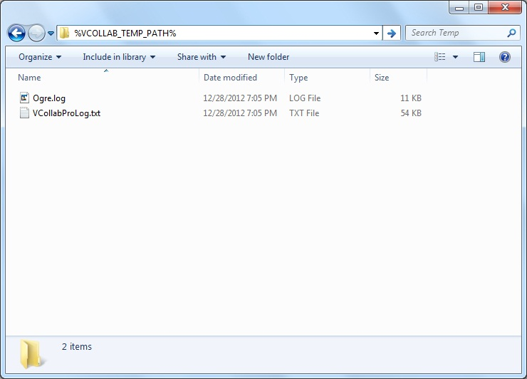
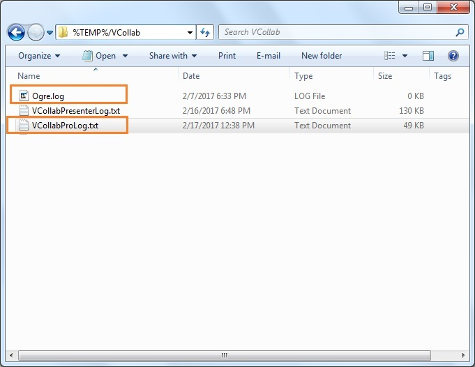

Log Files
============

VCollab Pro creates the following two log files.

-  VCollabProLog.txt

-  Ogre.log (Rendering log)

**Note:**

-  By default, VCollab Pro writes log files into **%TEMP%\\VCollab**
   folder\ **.**

-  Users can change the location by setting the **VCOLLAB\_TEMP\_PATH**
   environment variable. File path should not contain Unicode
   characters.

-  Users can control whether to write log files or not, using the
   context **More \| Write Log File**.

|image0|

**Log File Path Display**

Log file path will be displayed in **More \| About...\| VCollab
Control** dialog for user convenience.

|image1|

The log files are written into a folder represented by the
VCOLLAB\_TEMP\_PATH environment variable, if VCOLLAB\_TEMP\_PATH is
defined. Users can go to this folder by just entering
%VCOLLAB\_TEMP\_PATH% in the windows explorer address bar as shown in
the following figure.

|image2|

The files VCollabProLog.txt and Ogre.log can be found in the folder. If
the VCOLLAB\_TEMP\_PATH environment variable is not defined, the user
will get an error message similar to the one shown in the following
figure.

|image3|

In such a case, VCollab Pro writes the log files into **%TEMP%/VCollab**
directory. This folder can be opened by typing **%TEMP%/VCollab** into
the address bar of windows explorer as shown below.

|image4|

A new VCollab Pro session replaces the previous log files. Therefore
these log files should be saved with another name for troubleshooting
and in cases where users need to share them with the VCollab support
team (`*support@vcollab.com* <mailto:support@vcollab.com>`__).

.. |image3| image:: Images/Log_file_path_not_found.jpg

