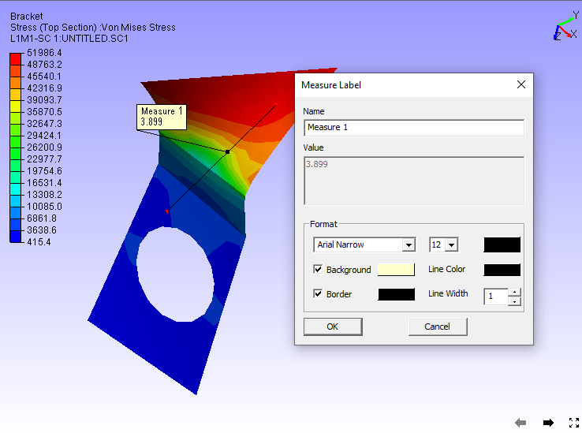
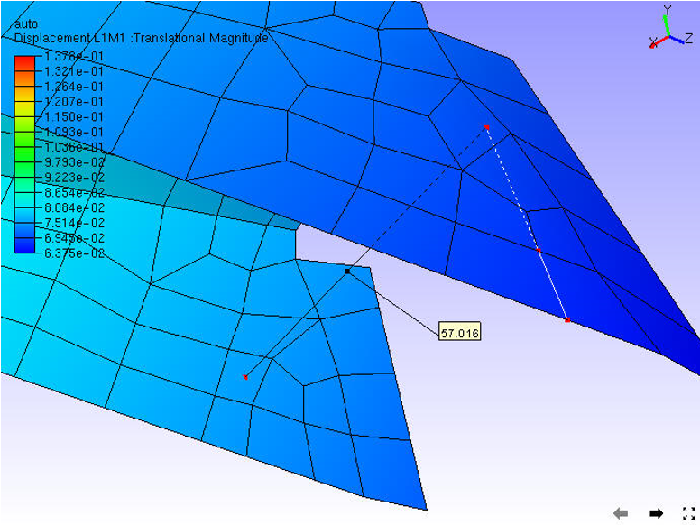

Measure
========

The Measure option found in the context menu lets users measure the
following:

-  Linear Measurement

   -  Point to Point

   -  Point to Edge

   -  Point to Face

-  Arc Measurement

-  Snap Vertex

-  Vertex Info  

-  Export to CSV

**Linear Measurement**

1. **Point to Point :** Measures distance between two points picked by
   the user.

2. **Point to Edge:** Measures shortest distance between point and the
   edge picked by the user.

|image0|

**Point to Face:** Measures shortest distance between a point and a
triangle picked by the user.

|image1|

**Measure**

|image2|

The various options available in the Measure sub menu are explained
below

+---------------------+-------------------------------------------------------------------------------------+
| **Distance**        | Allows users to measure the shortest distance between two points in the model.      |
+---------------------+-------------------------------------------------------------------------------------+
| **Arc**             | Allows users to measure circular arc with its length, including angle and radius.   |
+---------------------+-------------------------------------------------------------------------------------+
| **Point To Edge**   | Allows users to measure the shortest distance between a point and an edge.          |
+---------------------+-------------------------------------------------------------------------------------+
| **Point To Face**   | Allows users to measure the shortest distance between a point and a polygon.        |
+---------------------+-------------------------------------------------------------------------------------+
| **Snap Vertex**     | Allows users to pick model vertices for measurement.                                |
+---------------------+-------------------------------------------------------------------------------------+
| **Vertex Info**     | Displays mouse cursor hit point coordinates in a label.                             |
+---------------------+-------------------------------------------------------------------------------------+
| **Export to CSV**   | Exports 3D Distance data into a CSV (Comma Seperated File)                          |
+---------------------+-------------------------------------------------------------------------------------+
| **Compare Mesh**    | This module helps users to compare two meshes and its deviation as a CAE result.    |
+---------------------+-------------------------------------------------------------------------------------+

**Linear Measurement**

**Point to Point**

-  Select **Measure \| Distance** option from the Viewer context Menu or
   click |image3|\ from the toolbar.

-  Click 2 points of interest on the model to measure the distance.

-  The points clicked are highlighted in red and a line is drawn between
   the endpoints.

-  An annotated label with distance value is attached to the middle
   point of the line drawn.

|image4|                       
       
-  Double clicking on the measure allows to format the label data and renaming the measure name.

**Point to Edge**

-  Click **Measure \| Point to Edge** option from the context menu.

-  Click a point on a model and click on the closest triangle edge.

-  The point and the closest edge will be highlighted in red. Edge is
   extended if the foot of perpendicular does not lie in the edge
   segment.

-  An annotated label with distance value is attached to the middle
   point of the line drawn.

|image5|

- Double clicking on the label pops up a measure label dialog box.

- User can edit the measure name and label attributes.

**Point to Face**

-  Click **Measure \| Point to Fac**\ e option from the context menu

-  Click a point and a triangle on the model

-  The point and triangle points will be highlighted in red.

-  An annotated label with distance value is attached to the middle
   point of line drawn.

|image6|

**Arc Measurement**

-  Click **Measure \| Arc** option from the context menu.

-  Click on 3 points of interest to create Arc

-  An arc is drawn from start point to end point passing through the
   second point.

-  All three points are highlighted in red.

-  An arrow is drawn from the center of the arc to the curve to denote
   the radius.

-  An annotated label with arc information is attached to the center of
   the arc.

-  The part of the curve that is hidden behind the model is drawn with
   dashed lines.

|image7|

**Snap Vertex**

-  This enables the user to select the nearest vertex of the model by
   clicking while measuring distance or an arc.

-  Users can use the Snap Vertex option to assure that the arc computed
   and drawn is passing through actual arc points of the model.

**Vertex Info**

When this option is selected, users can see a label with the X, Y, Z
coordinates of an existing vertex, while moving the mouse on the model.

|image8|

Export to CSV
-------------
This function helps user to export all visible measurement data into a csv file.

User can achieve this either through "Tools | Measurement | Export to CSV" in menu bar or "Measure | Export to CSV" in context menu.

**Sample CSV file**

+-------------------------------------------------------------------------------------------------------------------+
| | # Application Name: VCollab Pro X                                                                               |
| | # Application Version: 4.12.121.605                                                                             |
| | # Date & Time : 21-10-2021, 18:43:30                                                                            |
| | # Current User : karuna                                                                                         |
|                                                                                                                   |
| | # Measure Name, Measure Value, Model Name 1, Model Name 2, Node ID 1,X1,Y1,Z1, Node ID 2,X2,Y2,Z2               |
| | Measure 1,43.046,body1,Fadjuster,NA,-13.8797,-19.9479,41.2141,NA,-0.179211,3.7484,7.99158                       |
| | Measure 2,31.718,body2,Fbody,NA,22.7075,-18.5456,32.922,NA,4.77808,-33.8141,11.6751                             |
+-------------------------------------------------------------------------------------------------------------------+

.. |image0| image:: Images/Linear_measurement.gif

.. |image1| image:: Images/Point_to_face_measurement.gif

.. |image2| image:: Images/Measure_contextmenu.png

.. |image3| image:: Images/Measurement_icon.jpg

.. |image7| image:: Images/Arc_measurement_viewer.png

.. |image8| image:: Images/Vertex_info_viewer.jpg

