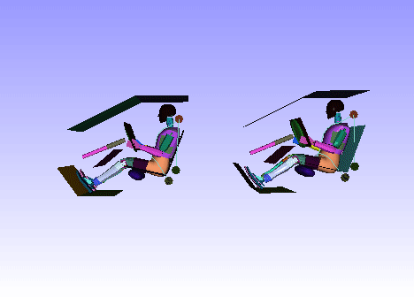

Edit Motion Models Using Mouse
================================

In VCollab Presenter, motion model functions can be implemented in the
viewer using a mouse.

Basic motion models are,

-  Rotation

-  Panning

-  Zooming

These basic motion models are implemented with mouse buttons as seen in
most 3D viewers.

VCollab supports generic 3D Mouse (3 Rotation + 3 Translation). For
controlled passive transformation, refer to Navigator.

**Rotation**

Left Mouse button rotates the model with respect to the Model local
center.

-  Left click anywhere in the viewer

-  Drag the mouse in any direction.

-  Notice that model is rotating in the same direction with respect to
   its local center.

**Panning**

Right Mouse button pans the model around.

-  Right click anywhere in the viewer

-  Drag the mouse in any direction.

-  Notice that the model is translated proportionally in the same
   direction.

**Zooming**

The Middle Mouse button zooms the model in or out.

The zoom in or out proportionality depends upon the mouse movement from
top to bottom.

To zoom in,

-  Click the Middle Mouse button in the top half of the viewer.

-  Drag down to the bottom half of the viewer

-  Notice that the model zooms in.

To zoom out,

-  Click the Middle Mouse button in the bottom half of the viewer.

-  Drag the mouse up to the top half of the viewer.

-  Notice that the model zooms out.

**Mouse Customization Panel**

-  Right click on the viewer window to open up the context menu.

-  Select **Edit Mouse** to open the **Mouse** **Customization** panel.

|image0|

-  Users can customize mouse buttons for motion models using the mouse
   customization panel.

**Rotations of Merged Models**

Users can observe the scene using mouse operations. Each part can be
picked and rotated about its own bounding center. Similarly, users can
turn on the sync rotation (independent model rotation) button, and
rotate all the models about each individual model bounding center. This
helps in comparing contour of same spots of similar models.

This independent model rotation button will be enabled only, when two or
more models are merged.

|image1|\ |image2|

.. |image0| image:: Images/Mouse_customization.png

.. |image1| image:: Images/Independent_model_rotation0.gif

