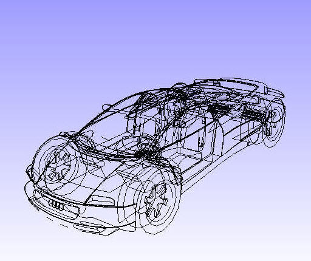

Move Model As
================
VCollab Presenter users can set different performance modes of rendering
while interacting with a scene through a motion model using **Move Model
As**. The options found under this tool increase performance during the
motion model.

|image0|

**Options**

-  **As Is:** This is the default option and lets a user to change from
   any other performance mode to current display mode.

-  **Single Bound box:** A single bounding box which contains all parts
   of the model displayed in the motion model.

-  **Part Bound boxes:** Individual bounding boxes are displayed for
   each part in the motion model.

-  **Detail cull Settings...:** This helps users to view parts based on
   the model volume. Users can view parts which are equal or above
   volumetrically with model volume. The default detail cull
   percentage is 30%.

    |image1|

-  **Feature Edges:** Shows model feature edges during motion model.

-   **Set Rotation Center**
    This option displays a model rotation center and allows the
    user to pick a point in the model and set it as a model
    rotation center.
    Short Cut **:** **Alt + Mouse Left Button Down**

    As Is Single Bounding Box

    |image2|\ |image3|

    Part Bounding Boxes 30% Detailed Cull

    |image4|\ |image5|

    Feature Edges

    |image6|

**Steps to set rotation center**

-  Click **MoveModelAs \| Set Rotation Center** from the context menu.

-  Use the shortcut **Alt + Left click**.

-  It displays the current rotation center of the model.

-  Click on any point on the model.

    |image7|

-  The point will be set as rotation center.

-  Now rotate the model and notice the changes.

    |image8|

-  Click **Reset** from the context menu to set the model centre as
   rotation center.

-  **Reset** will reset not only the rotation center, but also all
   viewing functionality parameters to defaults.

.. |image0| image:: Images/Move_model_as_contextmenu.png

.. |image1| image:: Images/Detail_cull_settings.png

.. |image2| image:: Images/Move_modelas_asis.jpg

.. |image3| image:: Images/Move_modelas_Boundbox.jpg

.. |image4| image:: Images/Move_modelas_partBoundboxes.jpg

.. |image5| image:: Images/Move_modelas_30_detailcull.jpg

.. |image8| image:: Images/Roatation_center_reset.gif
 
