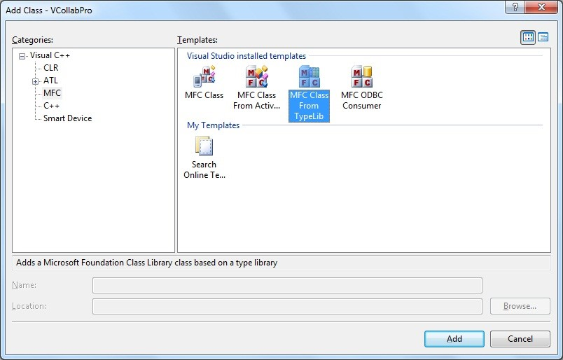
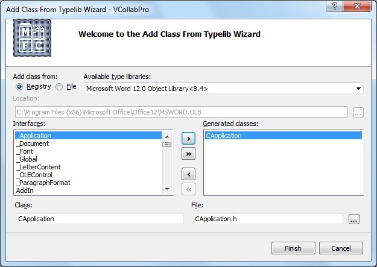
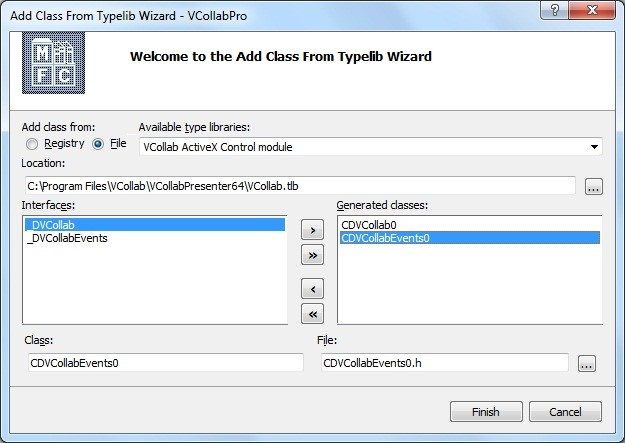

MS Office Automation Using VCollab Presenter
==============================================

Users can create and run VBA scripts in MS office products to make one
program to command another program to do something. This is MS office
automation. VCollab Presenter provides a VCollab Type library that can
be used in these VBA scripts for automation.

In this module we will show how Cax2Doc and Cax2PPT applications can be
created using MS office automation.

**Prerequisites:** Visual Basic/ Visual C++ / COM / C# programming
knowledge.

For Microsoft Office Automation basics read,

`Automating Microsoft Office 97 and Microsoft Office 2000 <http://msdn.microsoft.com/en-us/library/aa155776(office.10).aspx>`__

`Microsoft Office Development with Visual Studio <http://msdn.microsoft.com/en-us/library/aa188489(office.10).aspx>`__.

Download the Type Library for VCollab Presenter `VCollab.tlb <http://downloads.vcollab.com/CAX2MSOFFICE/VCollab.zip>`__.

**Case Study 1: Cax2Doc Application Creation**

Requirements: VC++ 2005, MS Word 2003, VCollab Presenter

1. Open VC++ 2005 IDE.

2. Create a new MFC Application, using **File->New->Project** menu.

3. Click **Project->Add Class** in VC++ 2005 IDE.

4. Select **MFC Class From TypeLib** and click the **Add** button.

|image0|

5. Select MS-Word 11 libraries and click the ‘\ **>>**\ ’ button before
**Finish**.

|image1|

6. This will add all required MS-Word wrapper classes into your project.

7. Repeat steps 3 and 4 to add class for VCollab Presenter. (Ensure `VCollab.tlb <http://downloads.vcollab.com/CAX2MSOFFICE/VCollab.zip>`__
is present in your system else download it)

8.Select **File** option and locate the **VCollab.tlb** file from your
local disk. Use **>>** and click **Finish** when the classes have been
added. This will add all required VCollab Presenter wrapper classes into
your project.

|image2|

9. Include the required headers into your .cpp file and use the
following function to generate a .doc file that is embedded with CAX.

+-------------------------------------------------------------------------------------------------------+
| #include "MSword.h"                                                                                   |
|                                                                                                       |
| #include "vcollab.h"                                                                                  |
|                                                                                                       |
| void CreateDoc(CString sCaxFilePath,CString sDocFilePath)                                             |
|                                                                                                       |
| {                                                                                                     |
|                                                                                                       |
| COleVariant vOpt(DISP\_E\_PARAMNOTFOUND, VT\_ERROR);                                                  |
|                                                                                                       |
| \_Application oApplication;                                                                           |
|                                                                                                       |
| // Create IDispatch connection to MS-Word.                                                            |
|                                                                                                       |
| oApplication.CreateDispatch(\_T("Word.Application"));                                                 |
|                                                                                                       |
| long iWndState=oApplication.GetWindowState();                                                         |
|                                                                                                       |
| oApplication.SetWindowState((long) 2);//minimize                                                      |
|                                                                                                       |
|     // Make sure there is a dispatch pointer for word.                                                |
|                                                                                                       |
|     if(oApplication.m\_lpDispatch == NULL)                                                            |
|                                                                                                       |
| {                                                                                                     |
|                                                                                                       |
| // Display a message indicating that PowerPoint is not running.                                       |
|                                                                                                       |
| AfxMessageBox(\_T("MS-Word 2003 with SP3 (11.8313.8221) and above needed."));                         |
|                                                                                                       |
| return;                                                                                               |
|                                                                                                       |
| }                                                                                                     |
|                                                                                                       |
| Documents oDocuments;                                                                                 |
|                                                                                                       |
| // Attach the presentations collection to the PresCollection variable.                                |
|                                                                                                       |
| oDocuments.AttachDispatch(oApplication.GetDocuments());                                               |
|                                                                                                       |
| // Create a new document.                                                                             |
|                                                                                                       |
| oDocuments.Add(vOpt,vOpt,vOpt,vOpt);                                                                  |
|                                                                                                       |
| \_Document oDocument=oApplication.GetActiveDocument();                                                |
|                                                                                                       |
| Selection oSel = oApplication.GetSelection();                                                         |
|                                                                                                       |
| InlineShapes oShapes=oSel.GetInlineShapes();                                                          |
|                                                                                                       |
| try                                                                                                   |
|                                                                                                       |
| {                                                                                                     |
|                                                                                                       |
| //Add Vcollab Presenter ActtiveX control to the document                                              |
|                                                                                                       |
| InlineShape vcollabShape = oShapes.AddOLEControl( COleVariant(\_T("VCOLLAB.VCollabCtrl.1")) ,vOpt);   |
|                                                                                                       |
| //Set Width and height of the Active X Control                                                        |
|                                                                                                       |
| vcollabShape.SetWidth(450);th(450);                                                                   |
|                                                                                                       |
| vcollabShape.SetHeight(300);                                                                          |
|                                                                                                       |
| //get ActiveX Object                                                                                  |
|                                                                                                       |
| OLEFormat vcollabOle=vcollabShape.GetOLEFormat();                                                     |
|                                                                                                       |
| IDispatch\* pDispObject= vcollabOle.GetObject();                                                      |
|                                                                                                       |
| if(pDispObject)                                                                                       |
|                                                                                                       |
| {                                                                                                     |
|                                                                                                       |
| CVCollab vcollabObj=vcollabOle.GetObject();                                                           |
|                                                                                                       |
| //Set file path of the cax file that need to be linked with VCollab Presenter                         |
|                                                                                                       |
| vcollabObj.SetFilePath(sCaxFilePath);                                                                 |
|                                                                                                       |
| }                                                                                                     |
|                                                                                                       |
| else                                                                                                  |
|                                                                                                       |
| {                                                                                                     |
|                                                                                                       |
| AfxMessageBox(\_T("VCollab Presenter is not installed properly"));                                    |
|                                                                                                       |
| }                                                                                                     |
|                                                                                                       |
| }                                                                                                     |
|                                                                                                       |
| catch(...)                                                                                            |
|                                                                                                       |
| {                                                                                                     |
|                                                                                                       |
| AfxMessageBox(\_T("VCollab Presenter is not installed properly"));                                    |
|                                                                                                       |
| }                                                                                                     |
|                                                                                                       |
| //Save the document file.                                                                             |
|                                                                                                       |
|     oDocument.SaveAs(COleVariant(sDocFilePath,VT\_BSTR),vOpt,vOpt,vOpt,vOpt,vOpt,                     |
|                                                                                                       |
| vOpt,vOpt,vOpt,vOpt,vOpt,                                                                             |
|                                                                                                       |
| vOpt,vOpt,vOpt,vOpt,vOpt);                                                                            |
|                                                                                                       |
| oApplication.Quit(vOpt,vOpt,vOpt);                                                                    |
|                                                                                                       |
| // Free the dispatch. This sets m\_lpDispatch to NULL.                                                |
|                                                                                                       |
| oApplication.ReleaseDispatch();                                                                       |
|                                                                                                       |
| return ;                                                                                              |
|                                                                                                       |
| }                                                                                                     |
+=======================================================================================================+
+-------------------------------------------------------------------------------------------------------+

**Case Study 2: Cax2PPT Application Creation.**

Requirements: VC++ 2005, MS PowerPoint 2003, VCollab Presenter

1. Open VC++ 2005 IDE.

2. Create a new MFC Application using **File->New->Project** menu.

3. Click **Project->Add Class** menu in VC++ 2005 IDE.

4. In the following window select **MFC Class From TypeLib** and click
   the Add button.

|image3|

5. Select MS-PowerPoint11 libraries like in the following window and
click **>>** before **Finish**.

|image4|

6. This will add all required MS-PowerPoint wrapper classes into your
project.

7. Do step 3 and 4 to add again class for VCollab Presenter. (Before
that copy the VCollab.tlb in case, it is not found in VCollab Presenter
installed folder)

8. In the following dialog select **File** option and locate the
VCollab.tlb file from your local disk and press **>>** before
**Finish**. This will add all required VCollab Presenter wrapper classes
into your project.

|image5|

9. Include the required headers into your .cpp file and use the
following function to generate a .doc file that is embedded with CAX.

+------------------------------------------------------------------------------------------------+
| #include "MSPPT.h"                                                                             |
|                                                                                                |
| #include "VCollab.h"                                                                           |
|                                                                                                |
| void CreatePPT(CString sCaxFilePath,CString sPPTPathName,CString sTemplatePath)                |
|                                                                                                |
| {                                                                                              |
|                                                                                                |
| \_Application oApplication;                                                                    |
|                                                                                                |
| // Create IDispatch connection to PowerPoint.                                                  |
|                                                                                                |
| oApplication.CreateDispatch(\_T("PowerPoint.Application"));                                    |
|                                                                                                |
| // Bring the PowerPoint application to the front.                                              |
|                                                                                                |
| oApplication.Activate();                                                                       |
|                                                                                                |
| long iPPtWndState=oApplication.GetWindowState();                                               |
|                                                                                                |
| oApplication.SetWindowState((long) 2);//minimize                                               |
|                                                                                                |
| Presentations presentations;                                                                   |
|                                                                                                |
| // Make sure there is a dispatch pointer for PowerPoint.                                       |
|                                                                                                |
| if(oApplication.m\_lpDispatch == NULL)                                                         |
|                                                                                                |
| {                                                                                              |
|                                                                                                |
| // Display a message indicating that PowerPoint is not running.                                |
|                                                                                                |
| AfxMessageBox(\_T("MS-PowerPoint 2003 and above needed."));                                    |
|                                                                                                |
| return;                                                                                        |
|                                                                                                |
| }                                                                                              |
|                                                                                                |
| // Attach the presentations collection to the PresCollection variable.                         |
|                                                                                                |
| presentations.AttachDispatch(oApplication.GetPresentations());                                 |
|                                                                                                |
| // Connect to the active presentation. There is no error trapping.                             |
|                                                                                                |
| // If the active presentation the framework traps                                              |
|                                                                                                |
| // the error and displays a message box.                                                       |
|                                                                                                |
| \_Presentation ActivePresentation;                                                             |
|                                                                                                |
| if(sTemplatePath.GetLength())                                                                  |
|                                                                                                |
| {                                                                                              |
|                                                                                                |
| //Open Template                                                                                |
|                                                                                                |
| ActivePresentation = presentations.Open(                                                       |
|                                                                                                |
| LPCTSTR(sTemplatePath), //File name                                                            |
|                                                                                                |
| (long)0, //Read-only                                                                           |
|                                                                                                |
| (long)-1, //Untitled                                                                           |
|                                                                                                |
| (long)-1 //WithWindow                                                                          |
|                                                                                                |
| );                                                                                             |
|                                                                                                |
| }                                                                                              |
|                                                                                                |
| else                                                                                           |
|                                                                                                |
| {                                                                                              |
|                                                                                                |
| // Create a new presentation.                                                                  |
|                                                                                                |
| presentations.Add(1);                                                                          |
|                                                                                                |
| ActivePresentation=oApplication.GetActivePresentation();                                       |
|                                                                                                |
| }                                                                                              |
|                                                                                                |
| // Connect to the slides collection.                                                           |
|                                                                                                |
| Slides oSlides(ActivePresentation.GetSlides());                                                |
|                                                                                                |
| const int ppLayoutTitleOnly = 11;                                                              |
|                                                                                                |
| // Add a new slide to the presentation. This code adds the new                                 |
|                                                                                                |
| // slide to the end of the presentation.                                                       |
|                                                                                                |
| CRect ctrlRect;                                                                                |
|                                                                                                |
| ctrlRect.top=0;                                                                                |
|                                                                                                |
| ctrlRect.left=0;                                                                               |
|                                                                                                |
| ctrlRect.right=600;                                                                            |
|                                                                                                |
| ctrlRect.bottom=400;                                                                           |
|                                                                                                |
| //set the Presenter control to the slide center                                                |
|                                                                                                |
| \_Master slideMaster=ActivePresentation.GetSlideMaster();                                      |
|                                                                                                |
| float slideWidth=slideMaster.GetWidth();                                                       |
|                                                                                                |
| float fImageLeft=(slideWidth\*0.5f)-(ctrlRect.right\*0.5f);                                    |
|                                                                                                |
| int iSlideCount=oSlides.GetCount();                                                            |
|                                                                                                |
| oSlides.Add( iSlideCount+1, ppLayoutTitleOnly);                                                |
|                                                                                                |
| //Connect to the first slide in the presentation.                                              |
|                                                                                                |
| long lIndex = iSlideCount+1;                                                                   |
|                                                                                                |
| COleVariant SlideNumber(lIndex);                                                               |
|                                                                                                |
| \_Slide oSlide(oSlides.Item(SlideNumber));                                                     |
|                                                                                                |
| // Connect to the Shapes collection.                                                           |
|                                                                                                |
| Shapes oShapes(oSlide.GetShapes());                                                            |
|                                                                                                |
| float fImageTop=70;                                                                            |
|                                                                                                |
| CString sWndText=sCaxFilePath;                                                                 |
|                                                                                                |
| if(oShapes.GetHasTitle())                                                                      |
|                                                                                                |
| {                                                                                              |
|                                                                                                |
| Shape title(oShapes.GetTitle());                                                               |
|                                                                                                |
| TextFrame textFrame =title.GetTextFrame();                                                     |
|                                                                                                |
| TextRange textRange =textFrame.GetTextRange();                                                 |
|                                                                                                |
| textRange.SetText(sWndText);                                                                   |
|                                                                                                |
| fImageTop=title.GetTop()+title.GetHeight()+2;                                                  |
|                                                                                                |
| }                                                                                              |
|                                                                                                |
| else                                                                                           |
|                                                                                                |
| {                                                                                              |
|                                                                                                |
| Shape title(oShapes.AddTitle());                                                               |
|                                                                                                |
| TextFrame textFrame =title.GetTextFrame();                                                     |
|                                                                                                |
| TextRange textRange =textFrame.GetTextRange();                                                 |
|                                                                                                |
| textRange.SetText(sWndText);                                                                   |
|                                                                                                |
| fImageTop=title.GetTop()+title.GetHeight()+2;                                                  |
|                                                                                                |
| }                                                                                              |
|                                                                                                |
| try                                                                                            |
|                                                                                                |
| {                                                                                              |
|                                                                                                |
| Shape vcollabShape=oShapes.AddOLEObject(fImageLeft,fImageTop,ctrlRect.right,ctrlRect.bottom,   |
|                                                                                                |
| \_T("VCOLLAB.VCollabCtrl.1"),                                                                  |
|                                                                                                |
| \_T(""), 0, \_T(""), 0, \_T(""), 0);                                                           |
|                                                                                                |
| OLEFormat vcollabOle=vcollabShape.GetOLEFormat();                                              |
|                                                                                                |
| IDispatch\* pDispObject= vcollabOle.GetObject();                                               |
|                                                                                                |
| if(pDispObject)                                                                                |
|                                                                                                |
| {                                                                                              |
|                                                                                                |
| CVCollab vcollabObj=vcollabOle.GetObject();                                                    |
|                                                                                                |
| //Set the cax file that to be linked with presenter in PPT                                     |
|                                                                                                |
| vcollabObj.SetFilePath(sCaxFilePath);                                                          |
|                                                                                                |
| }                                                                                              |
|                                                                                                |
| else                                                                                           |
|                                                                                                |
| {                                                                                              |
|                                                                                                |
| AfxMessageBox(\_T("VCollab Presenter or above is not installed properly"));                    |
|                                                                                                |
| }                                                                                              |
|                                                                                                |
| }                                                                                              |
|                                                                                                |
| catch(...)                                                                                     |
|                                                                                                |
| {                                                                                              |
|                                                                                                |
| AfxMessageBox(\_T("VCollab Presenter or above is not installed properly"));                    |
|                                                                                                |
| }                                                                                              |
|                                                                                                |
| //vcollabObj                                                                                   |
|                                                                                                |
| ActivePresentation.SaveAs(sPPTPathName,1,1);                                                   |
|                                                                                                |
| oApplication.SetWindowState(iPPtWndState);                                                     |
|                                                                                                |
| // Quit PowerPoint. Note, the Quit command exits                                               |
|                                                                                                |
| // PowerPoint without displaying any dialog boxes. So,                                         |
|                                                                                                |
| // any unsaved data is lost.                                                                   |
|                                                                                                |
| oApplication.Quit();                                                                           |
|                                                                                                |
| // Free the dispatch. This sets m\_lpDispatch to NULL.                                         |
|                                                                                                |
| oApplication.ReleaseDispatch();                                                                |
|                                                                                                |
| return ;                                                                                       |
|                                                                                                |
| }                                                                                              |
+================================================================================================+
+------------------------------------------------------------------------------------------------+

The above method is just a sample code and only to show how VCollab
Presenter can be used in Office Automation.

To create customized MS word documents on Powerpoint files you need to
do more programming. Refer to the following links to understand what
else can be done.

`Microsoft Office Development with Visual Studio <http://msdn.microsoft.com/en-us/library/aa188489(office.10).aspx>`__.

`Effectively Using ActiveX Form Controls in Microsoft Word <http://msdn.microsoft.com/en-us/library/aa140269(office.10).aspx>`__.

.. |image3| image:: Images/word_addclass_cax2ppt.jpg

.. |image4| image:: Images/word_addclass_typelib_wizard.jpg

