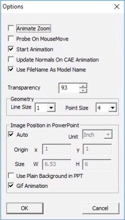

Options
=======

The Options panel allows users of VCollab Presenter to modify several
parameters.

|image0|

+-------------------------------------+---------------------------------------------------------------------------------------------------------------------------------------------------------------------+
| **Animate Zoom**                    | Used to do smooth transformation while doing Rubber band zoom.                                                                                                      |
+-------------------------------------+---------------------------------------------------------------------------------------------------------------------------------------------------------------------+
| **Probe on Mouse Move**             | Used to probe values on mouse over geometry instead of mouse click.                                                                                                 |
+-------------------------------------+---------------------------------------------------------------------------------------------------------------------------------------------------------------------+
| **Update Normals On CAE Animation** | Updates Normals of model during CAE Animation.                                                                                                                      |
+-------------------------------------+---------------------------------------------------------------------------------------------------------------------------------------------------------------------+
| **Start Animation**                 | Starts animation on launching the CAE Animation Control if True.                                                                                                    |
+-------------------------------------+---------------------------------------------------------------------------------------------------------------------------------------------------------------------+
| **Use File Name as Model Name**     | CAX file name can be used as root model node name.                                                                                                                  |
|                                     |                                                                                                                                                                     |
|                                     | **Note**: This option will be ignored if the CAX file name is of Unicode characters. Instead of ASCII characters.                                                   |
+-------------------------------------+---------------------------------------------------------------------------------------------------------------------------------------------------------------------+
| **Transparency**                    | Allows users to edit Display Mode transparency value percentage. Default Value is 93%. 0% refers to No-transparency. 100% refers to Full transparency (Invisible)   |
+-------------------------------------+---------------------------------------------------------------------------------------------------------------------------------------------------------------------+
| **Line Size**                       | Allows users to change the geometry line set size.                                                                                                                  |
+-------------------------------------+---------------------------------------------------------------------------------------------------------------------------------------------------------------------+
| **Point Size**                      | Allows users to change the geometry point set size.                                                                                                                 |
+-------------------------------------+---------------------------------------------------------------------------------------------------------------------------------------------------------------------+
| **Image Position in Power Point**   | Allows users to position the image and change the size in the powerpoint slide.                                                                                     |
+-------------------------------------+---------------------------------------------------------------------------------------------------------------------------------------------------------------------+
| **Auto**                            | Image will be positioned with default options.                                                                                                                      |
+-------------------------------------+---------------------------------------------------------------------------------------------------------------------------------------------------------------------+
| **Unit**                            | Allows the user to select position and size in either inch or pixel.                                                                                                |
+-------------------------------------+---------------------------------------------------------------------------------------------------------------------------------------------------------------------+
| **Origin**                          | Allows users to modify the position of the image.                                                                                                                   |
+-------------------------------------+---------------------------------------------------------------------------------------------------------------------------------------------------------------------+
| **Size**                            | Allows the user to modify the image width and height.                                                                                                               |
+-------------------------------------+---------------------------------------------------------------------------------------------------------------------------------------------------------------------+
| **Use Plain Background in PPT**     | Allows the user to set a plain background before generating images for ppt.                                                                                         |
+-------------------------------------+---------------------------------------------------------------------------------------------------------------------------------------------------------------------+

