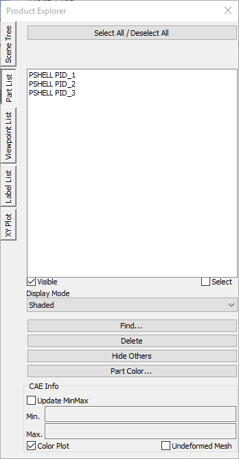
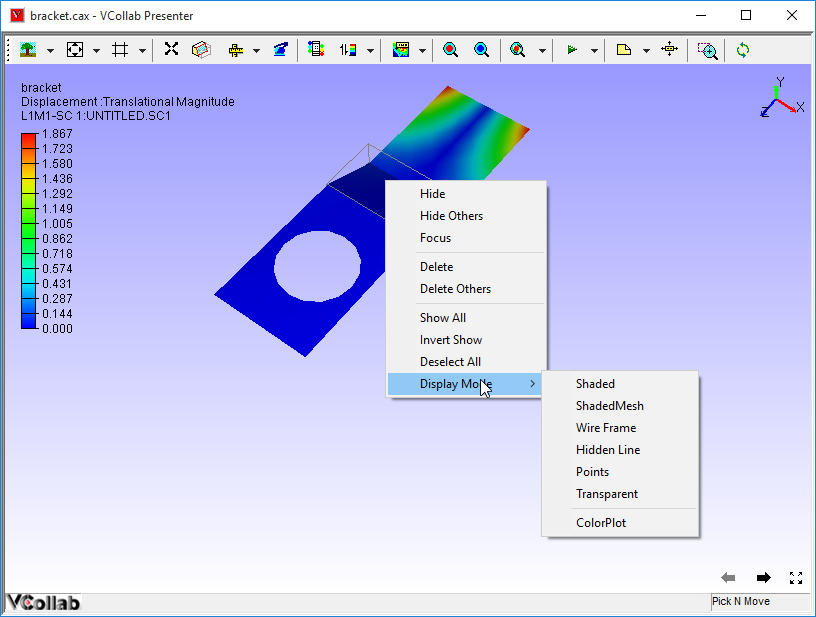
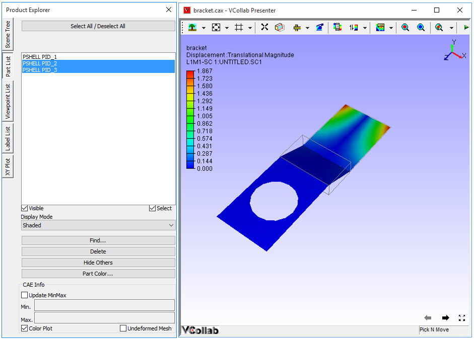
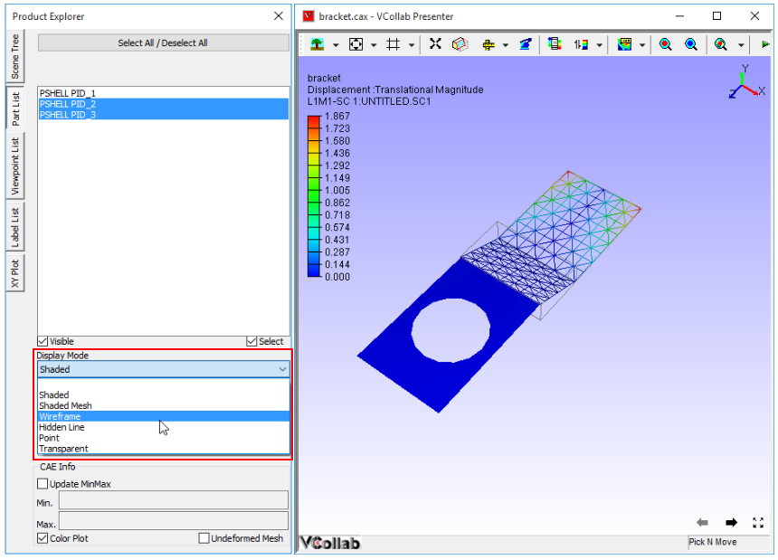
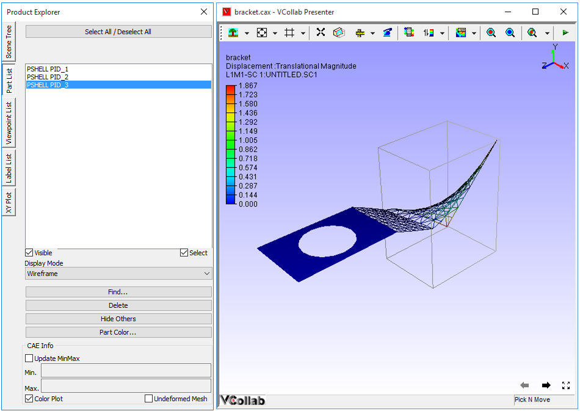

Part List
===========

The **Part List** panel under Product Explorer allows users to view all
parts and change each individual part's properties.

**Part List Panel**

|image0|

The various fields and options available in the Part List panel are
explained below.

+---------------------------------+-----------------------------------------------------------------------------+
| **Select All / Deselect All**   | Selects all parts or Deselects all parts.                                   |
+---------------------------------+-----------------------------------------------------------------------------+
| **List Box**                    | Lists all part names                                                        |
+---------------------------------+-----------------------------------------------------------------------------+
| **Visible**                     | Toggles visibility for selected parts                                       |
+---------------------------------+-----------------------------------------------------------------------------+
| **Select**                      | Adds the selected parts in the list box for highlighting in the viewer.     |
+---------------------------------+-----------------------------------------------------------------------------+
| **Display Mode**                | Lists all display mode options that can be applied to the selected parts.   |
+---------------------------------+-----------------------------------------------------------------------------+
| **Find...**                     | Opens Find Parts panel                                                      |
+---------------------------------+-----------------------------------------------------------------------------+
| **Delete**                      | Deletes parts highlighted/selected in viewer.                               |
+---------------------------------+-----------------------------------------------------------------------------+
| **Hide Others**                 | Hides all parts except the parts highlighted in the viewer.                 |
+---------------------------------+-----------------------------------------------------------------------------+
| **Part Color**                  | Opens Part Color panel                                                      |
+---------------------------------+-----------------------------------------------------------------------------+
| **Update Min Max**              | Displays and Updates min and max values for selected parts in the list.     |
+---------------------------------+-----------------------------------------------------------------------------+
| **Color Plot**                  | Applies or removes contour color for the selected parts in the list.        |
+---------------------------------+-----------------------------------------------------------------------------+
| **Undeformed mesh**             | Shows undeformed mesh for selected parts.                                   |
+---------------------------------+-----------------------------------------------------------------------------+

**Steps to access and modify part level properties in the viewer**

-  Double click on a part inside the viewer. To open the context menu as
   shown below.

|image1|

-  Users can do the following operations.

   -  Hide the part

   -  Hide all parts except this one.

   -  Focus on the part.

   -  Delete the part.

   -  Delete all parts except this one.

   -  Show all parts

   -  Inver the parts visibility.

   -  Deselect all parts.

   -  Change display mode.

   -  Show / Hide color plot.

**How do changes in the part list panel show in the viewer**

**Changes Made in Panel Effect of Panel Changes in the Viewer**

**Display mode: Shaded**

|image2|

**Changes Made in Panel Effect of Panel Changes in the Viewer**

|image3|

**Changes Made in Panel Effect of Panel Changes in the Viewer**

|image4|

**Note:**

 If part names are the same for more than one part, successive names of
 parts are indexed with numbers.
 For example, if there are 3 parts with same name **Cylinder**, then

-  the first part in the product tree is named as **Cylinder**

-  second part is named as **Cylinder (1)**

-  third part is named as **Cylinder (2)**

Renaming of part names does not affect the part list module. Part list
panel displays old names only. To avoid this issue, rename the parts and
save them into a new CAX file. Open the saved file and notice that the
part list panel displays the parts with new names.

