Part Color
=============

The Part Color option allows users to edit appearance properties of a
part.

Users can modify the following properties in the Part Color Panel.

-  Ambient

-  Diffuse

-  Emissive

-  Specular

-  Shininess and

-  Material Color

All property values vary in the range of 0 to 1

Part Color Panel
----------------

To bring up the Part Color panel, 

- Go to Product Explorer using *Edit | Product Explorer* in context menu.
- Select *Part List* tab
- Click *Part Color* button

|image0|

The various fields and options found in the Material Editor panel for
Part color are explained below

+----------------------+---------------------------------------------------------------------------------------------------------------------------+
| **Ambient**          | Specifies the amount of light a surface should reflect.                                                                   |
+----------------------+---------------------------------------------------------------------------------------------------------------------------+
| **Diffuse**          | Specifies the amount of light the surface reflects. It depends on the angle of the surface with the source light.         |
+----------------------+---------------------------------------------------------------------------------------------------------------------------+
| **Emissive**         | Specifies the amount of light produced by a glowing object.                                                               |
+----------------------+---------------------------------------------------------------------------------------------------------------------------+
| **Specular**         | Specifies the highlight color for an object.                                                                              |
+----------------------+---------------------------------------------------------------------------------------------------------------------------+
| **Shininess**        | Specifies the degree of surface shine. Value '0' refers to a rough surface and '1' refers to the most polished surface.   |
+----------------------+---------------------------------------------------------------------------------------------------------------------------+
| **Material Color**   | Check this material color box to apply default material color on the selected parts.                                      |
+----------------------+---------------------------------------------------------------------------------------------------------------------------+

..
   _| **Transparency**     | Specifies the transparency of the object. Value '0' refers to 'No Transparency' and '1' refers to 'Full Transparency'.    |
   _+----------------------+---------------------------------------------------------------------------------------------------------------------------+
   
**Steps to apply or remove material color**

-  Double click on a part of a model to open the context menu.

   |image1|

-  Click **Display Mode \| Color Plot**.

-  It applies or removes material color.

   |image2|

**Steps to change a part’s material color**

-  Load a **CAX** model.

-  Select a part by double clicking on it. This highlights the part with
   its bounding box.

-  Go to Product Explorer\| Part List

-  Click **Part Color**

-  Check the **Material Color** checkbox to apply material color.

   |image3|\ |image4|

-  Change the Ambient color using slider controls and notice the change
   in part concurrently.

   |image5|\ |image6|

-  Change the Diffuse color.

   |image7|\ |image8|

-  Change the Emissive color.

   |image10|\ |image9|

-  Change the Specular color.

   |image12|\ |image11|

-  Change the Shininess.

   |image13|\ |image14|

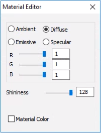

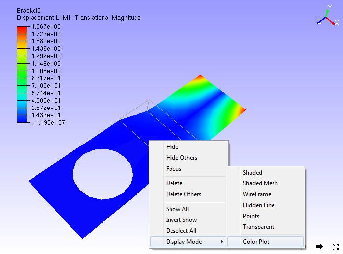

.. |image2| image:: Images/Presenter_removed_material_color.png

.. |image3| image:: Images/Material_editor_diffuse_material_coloarGUI.png

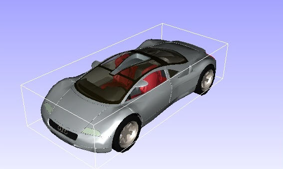

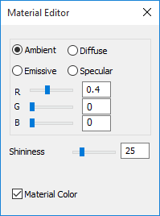

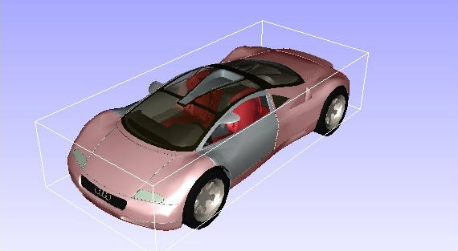

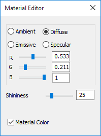

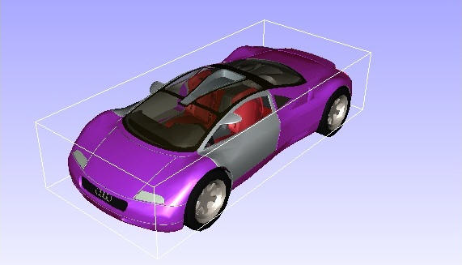

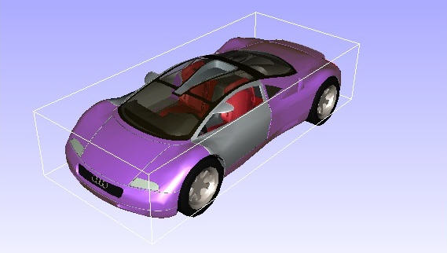

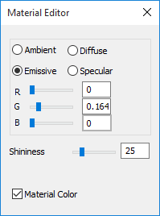

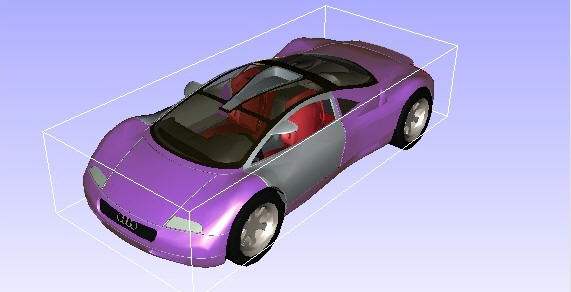

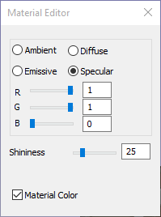

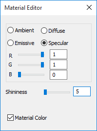

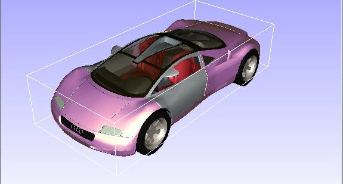

