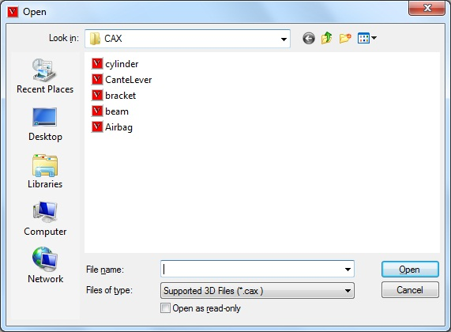
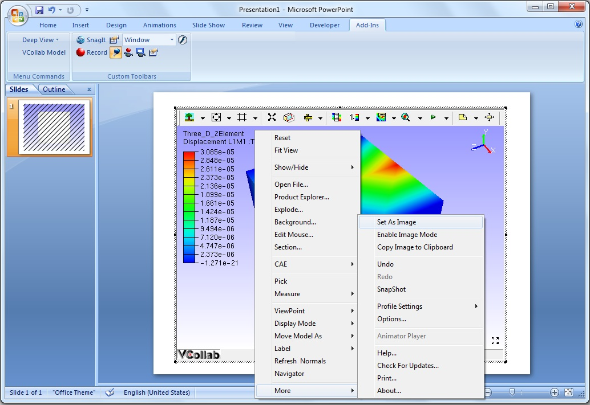

Power Point 2003
================

This section demonstrates how to embed VCollab Presenter into Microsoft
Power Point 2003.

VCollab Presenter can be embedded into PowerPoint 2003 in two ways

-  Embed through "Insert" menu items.
-  Embed through Control Tool box.

This section explains in further about

-  How to set images for offline mode? 

**How to embed Presenter through Insert Menu?**

-  Click Insert menu.
-  Click menu item VCollab Control. This menu item is available if VCollab suite is installed in the system.

 |image0|

-  This pops up open file dialog as below,

 |image1|

-  Notice that VCollab control is embedded as below.

 |image2|

-  Use right click options to view loaded model.

**How to load Control Toolbox in Power Point 2003?**

-  Open Microsoft Power Point 2003

-  Click **View \| Toolbars \| Control Tool box** as below.

 |image3|

-  Make sure that More Controls icon is available in the toolbar as shown below in red circle.

 |image4|

**How to embed VCollab Presenter in Microsoft Power Point 2003?**

-  Open Microsoft Power Point 2003.

 |image5|

-  Make sure that Control Tool box tool bar is available. Load the tool bar if not.
-  Click More Controls icon Tool box tool bar as shown below.

 |image6|

-  Select VCollab Control.
-  Draw a rectangle in the page and notice that presenter object is embedded.

 |image7|

-  Click on the object with Right mouse button which drops down menu items.

 |image8|

-  Select **VCollab Control Object \| Edit** and notice that Presenter is ready to load model now as below.

 |image9|

**How to set current view as object image?**

-  Embed VCollab control into PowerPoint.

-  Using context, load a cax model.

-  Click outside the presenter control.

-  Control becomes an object which displays the standard front view of  the model.

 |image10|

-  Click 'VCollab Control Object \| Edit' to get into the viewer.

-  Transform the model. (either a rotation or translation or both)

-  Click outside the control window.

-  Still the control displays standard front view of the model in offline mode as above.

-  Click 'VCollab Control Object \| Edit' to get into the viewer again.

-  Transform the model so that user can get a view which is to be set as object image.

-  Right click the mouse which drops down the context menu.

-  Select 'Set as object or active image' option.

 |image11|

-  Click outside the control window and notice the change.

 |image12|

-  User defined view was set as image to the object or control.

-  Save the presentation.

.. |image4| image:: Images/PowerPoint_ControlToolBox_toolBar02.JPG
.. |image5| image:: Images/Embed_PPT01.JPG

.. |image10| image:: Images/Embed_PPT_ObjectImage01.jpg

.. |image12| image:: Images/embed_ppt_objectimage02.jpg

