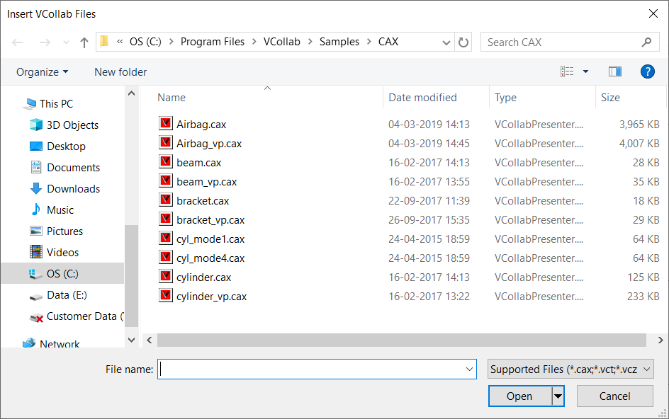

Embedding Presenter in Microsoft Powerpoint 2007
======================================================

VCollab Presenter can be embedded into PowerPoint 2007 in two ways

-  Using the **Add-Ins** tab

-  Using the **Developer** tab.

**Steps to embed Presenter using the Add-Ins tab**

-  Open Microsoft Powerpoint 2007

-  Go to Add-Ins tab and click VCollab Model (This is available only if
   VCollab suite is installed)

   If there is no Add-Ins tab, click here to know how to enable it.

|image0|

-  Select the CAX file to load from the file open dialog box that opens
   up.

|image1|

-  VCollab Control is thus embedded as below.

|image2|

**Steps to embed Presenter using Developer tab**

-  Open Microsoft Powerpoint 2007

-  Go to the Developer tab and Click Control Toolbox as highlighted
   below.
   If there is no Developer tab, click here to know how to enable
   it.

|image3|

-  Browse and select **VCollab Control** from the **More Controls** list
   as shown below.

|image4|

-  Click Ok and observe that the VCollab presenter is embedded as shown
   below.

|image5|

**Loading CAX file in Powerpoint 2007 WIth Embedded VCollab Presenter**

-  Right click and select **VCollab Control Object \| Edit** in the drop
   down menu items as below.

|image6|

-  A model loaded in VCollab Presenter embedded in Microsoft PowerPoint
   2007 is shown below.

|image7|

.. |image0| image:: Images/Embed_presenter_addins.png

.. |image6| image:: Images/Vcollab_control_obj.png

