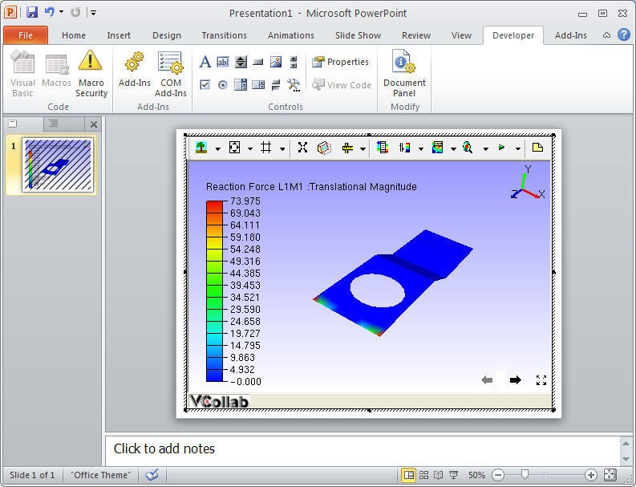

Power Point 2010
================

This section describes how to embed VCollab Presenter into Microsoft Power Point 2010.

VCollab Presenter can be embedded into PowerPoint in two ways

-  Embed through Add-Ins tab 
-  Embed through Developer tab

**How to embed Presenter through Add-Ins tab?**

-  Open Microsoft PowerPoint 2010
-  Click Add In tab and click VCollab Control (This is available only if VCollab suite is installed)

 If there is no Add-Ins tab, `click here <DeveloperNAddInsTab_2010.html>`__ to enable.

 |image0|    

-  It pops up Open file dialog to load a CAx file.

 |image1|

-  Select a file name and click open.
-  Notice that VCollab Control is embedded as below.

 |image2|

-  Use right click options to view loaded model.

**How to embed Presenter through Developer tab**

-  Open Microsoft Power Point 2010
-  Click Developer tab and Click Control Tool box (shown in red circle) as below.

 If there is no Developer tab, `click here <DeveloperNAddInsTab_2010.html>`__ to enable.

 |image3|

-  Browse and select VCollab Control from the popped up dialog as below.

 |image4|

-  Click Ok and Notice that VCollab presenter is embedded as below.

 |image5|

-  Right Click and Select VCollab Control Object \| Edit in the drop down menu items as below.

 |image6|

-  Notice that VCollab presenter is ready to load a model now.
-  Below one is Loaded Model in VCollab Presenter embedded in Microsoft Power Point 2010.

 |image7|

.. |image1| image:: Images/PowePoint02.JPG

.. |image3| image:: Images/PPT2010_Dev_01.JPG
.. |image4| image:: Images/PPT2010_Dev_02.JPG

