Embedding Presenter in Microsoft Powerpoint 2016  
==================================================                                                       
 VCollab Presenter can be embedded into PowerPoint 2016 in two ways                                       
                                                                                                          
 -  Using the **Add-ins** menu                                                                            
                                                                                                          
 -  Using the **Developer menu**.                                                                         
                                                                                                          
 -  Images can also be set for offline mode.                                                              
                                                                                                          
 **Steps to embed Presenter using the Insert menu**                                                       
                                                                                                          
 -  Open Microsoft Powerpoint 2016                                                                        
                                                                                                          
 -  Click the **Add-ins** menu.                                                                           
                                                                                                          
 -  Select **VCollab Model**. This option is available if the VCollab suite is installed on the 
    system.   

|image0|

-  This opens the open file dialog as shown below. Select a CAX file.

|image1|

-  The VCollab control is seen embedded as below.

|image2|

-  Use the right click options to view the loaded model.

**Steps to load Control Toolbox in PowerPoint 2016**

-  Open Microsoft Powerpoint 2003

-  Click the **More Controls** icon |image3| available in the
   **Developer** tab as shown below.

|image4|

-  Make sure that the Control Toolbox is available in the toolbar. Load
   the toolbar if it is not present.

|image5|

-  Select **VCollab 2013 Control** from the list of controls.

-  Draw a rectangle on the page to embed the presenter object.

|image6|

-  Right click on the object to open the context menu.

|image7|

-  Select **VCollab Presenter Control Object \| Edit** to load the model
   as shown below.

|image8|

**Steps to set the current view as object image**

-  Embed **VCollab control** into PowerPoint.

-  Using the context menu, load a CAX model.

-  Click outside the Presenter control.

-  Control becomes an object which displays the standard front view of
   the model.

|image9|

-  Click **VCollab Control Object \| Edit** to get into the viewer.

-  Transform the model. (either a rotation or translation or both)

-  Click outside the control window.

-  Still the control displays standard front view of the model in
   offline mode.

-  Click **VCollab Control Object \| Edit** to get into the viewer
   again.

-  Transform the model so that the user can get a view which is to be
   set as an object image.

-  Right click to open the context menu.

-  Select **Set as Image** option.

|image10|

-  Click outside the control window and notice the change.

|image11|

-  User defined view is set as an image to the object or control.

-  Save the presentation.

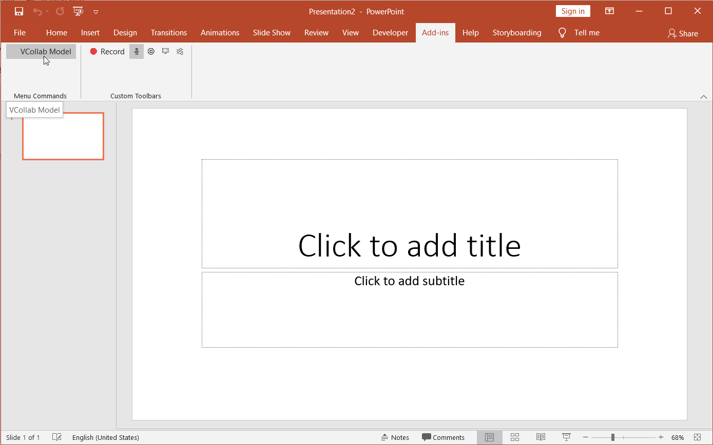

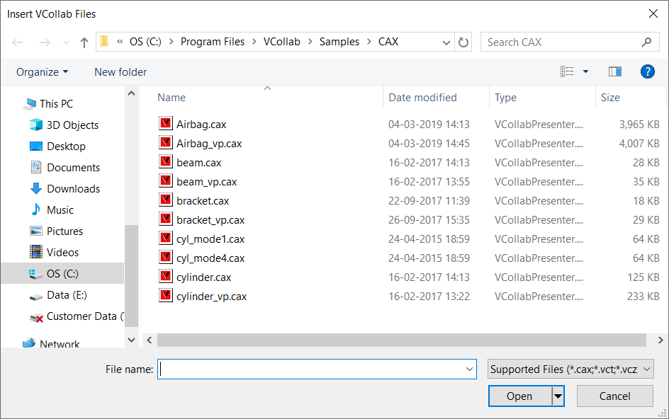

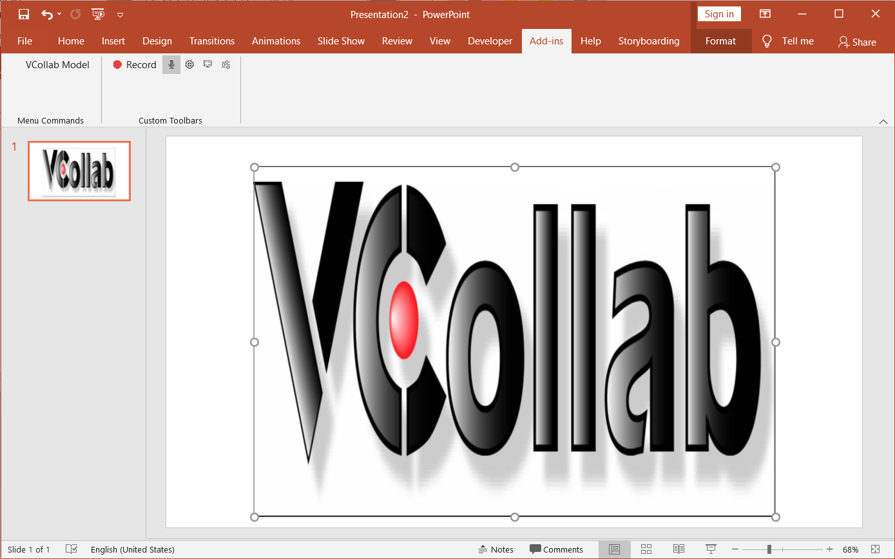

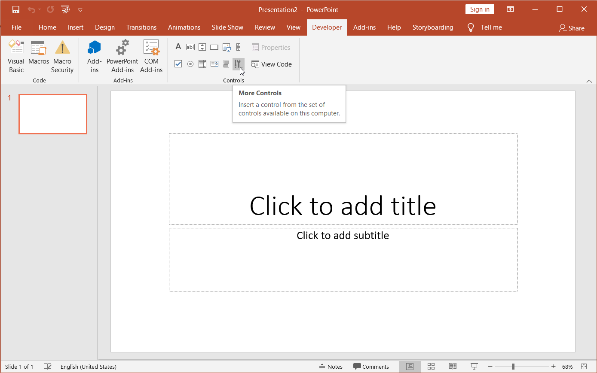

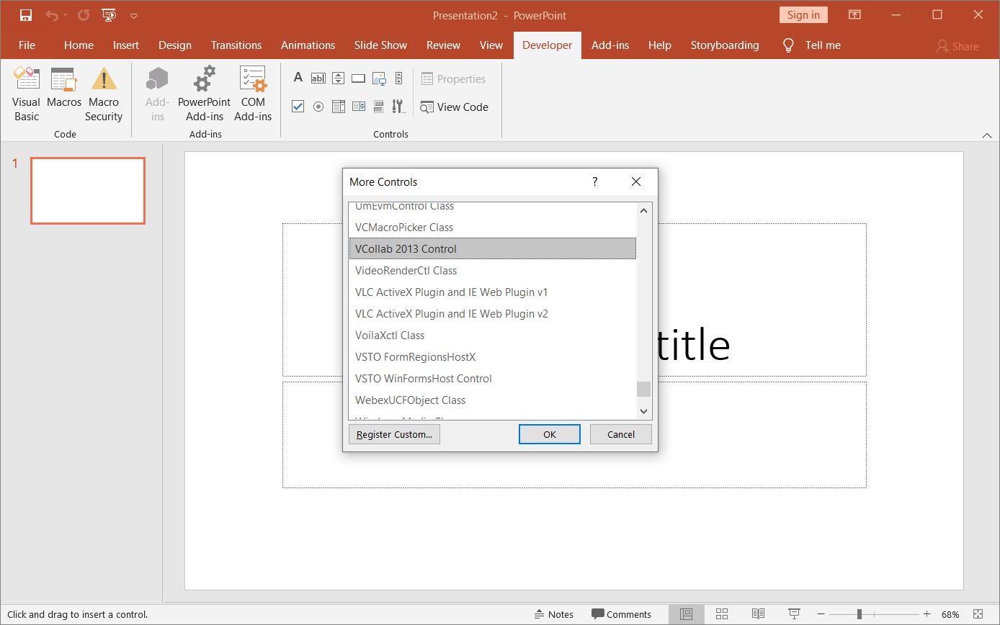

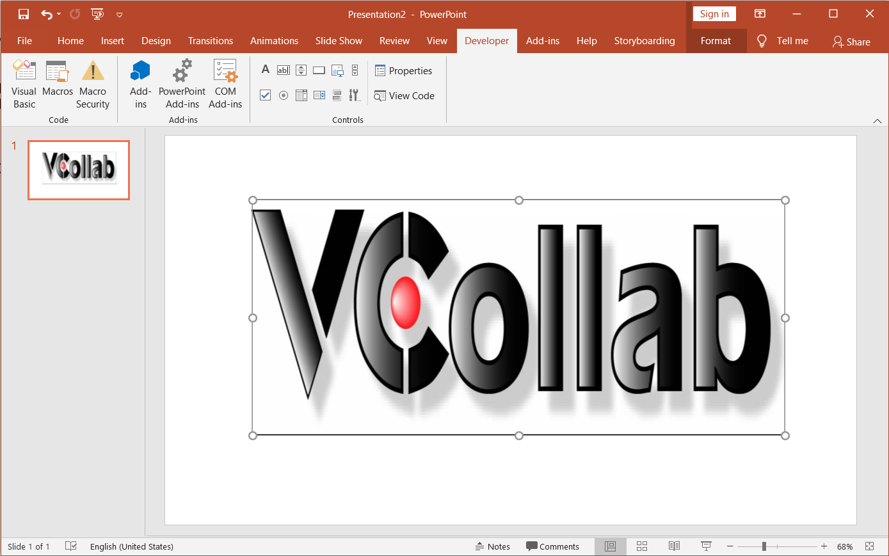

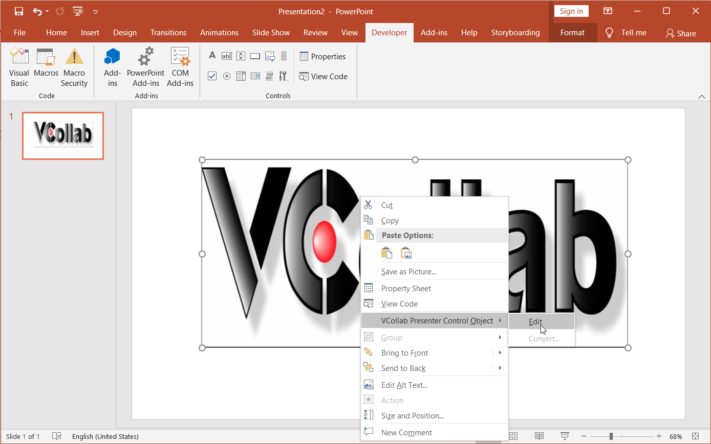

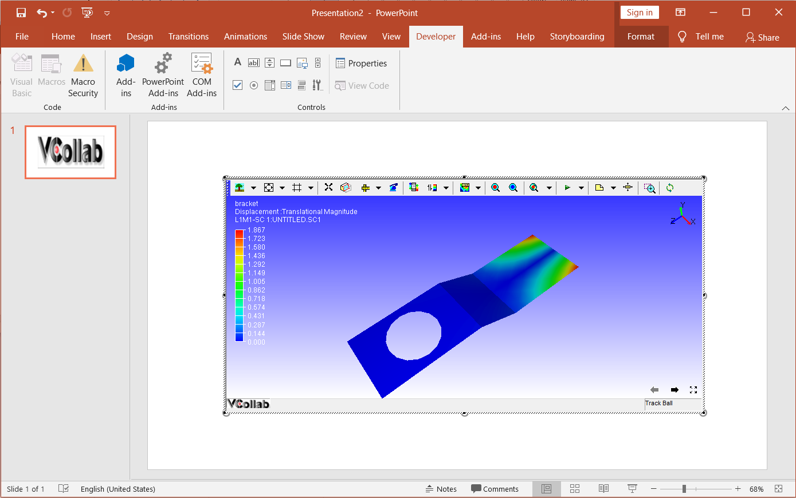

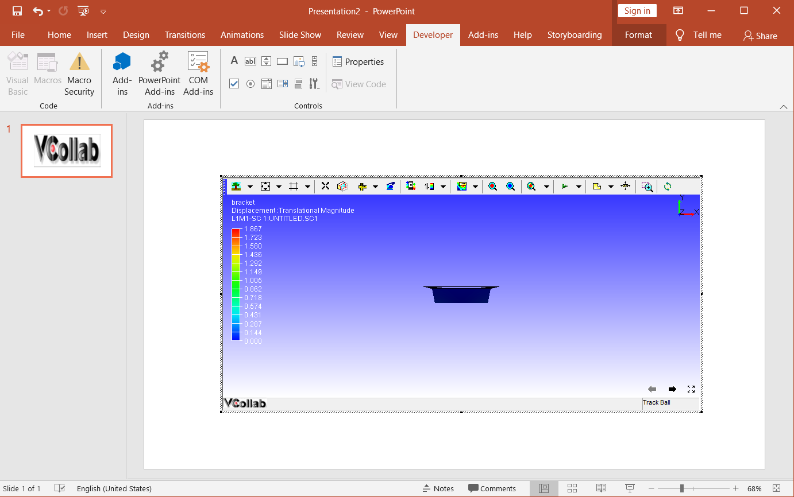

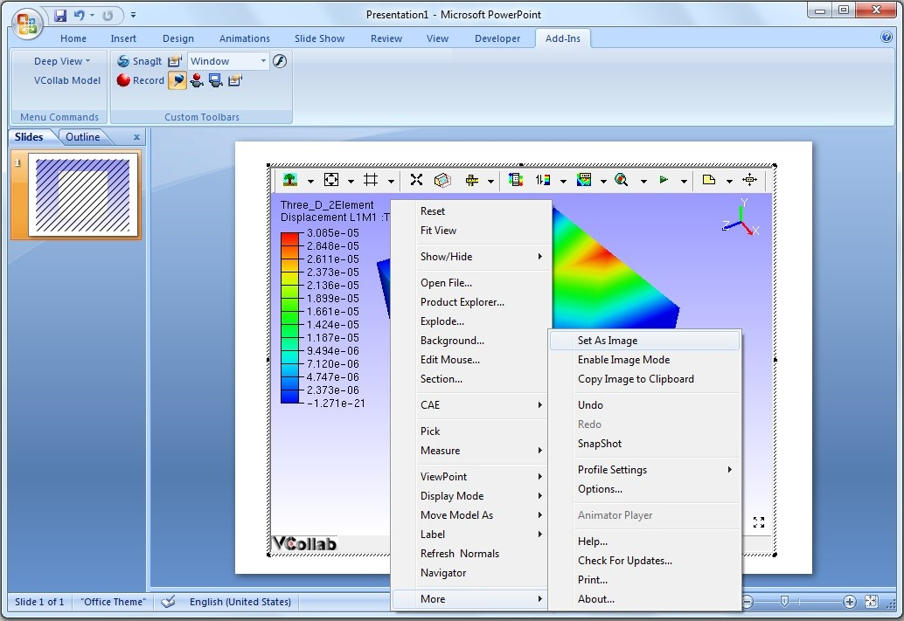

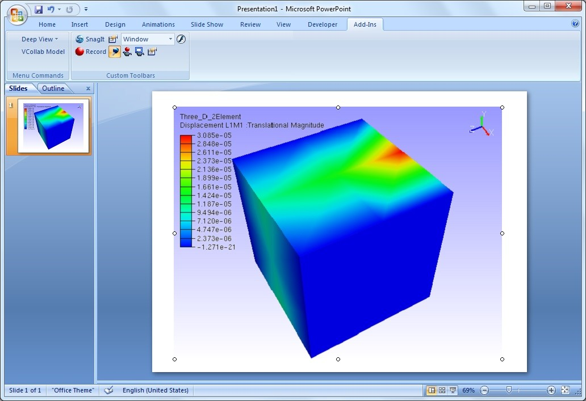

