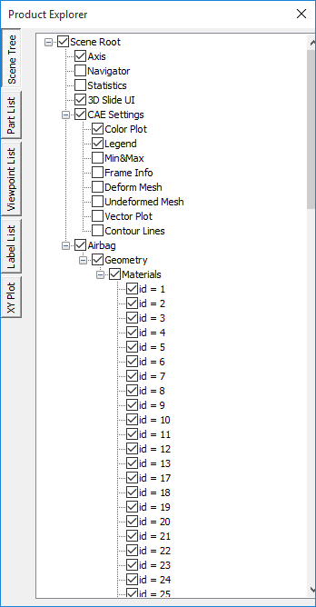

Product Explorer
=================

**Product Explorer** is an explorer window which contains the following
tabs.

.. toctree::
   :maxdepth: 3
   :caption: Contents
   
   Scene_Tree
   PartList
   ViewPointList
   LabelList
   xyplot

**Steps to open Product Explorer window**

-  Right click in the Viewer Window, to open the Viewer Context menu.

-  Select **Product Explore**\ r option.

-  The Product explorer window opens. The Scene Tree panel is visible by
   default.

|image0|

