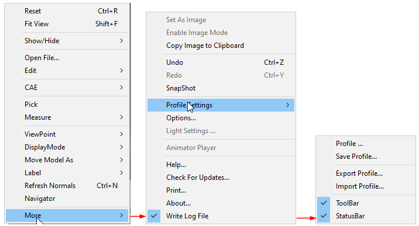
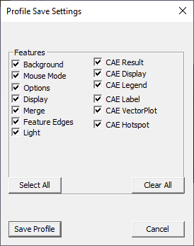
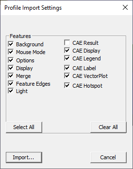

Profile Settings
==================

Using the Profile Settings option, users can set, export and import
current configurations. They can also store and retrieve specific
features.

|image0|

The various options available under Profile Settings sub menu are
explained below

+----------------------+-------------------------------------------------------------------------------------------------------------------------------------+
| **Profile**          | Opens the **Profile Load Settings**' dialog and is used to select features to be applied while loading. through the .               |
+----------------------+-------------------------------------------------------------------------------------------------------------------------------------+
| **Save Profile**     | Opens the **Profile Save Settings** dialog and is used to save settings into a profile.                                             |
+----------------------+-------------------------------------------------------------------------------------------------------------------------------------+
| **Export Profile**   | Saves and exports current configuration into a profile file. This file can later be imported into some other session or computer.   |
+----------------------+-------------------------------------------------------------------------------------------------------------------------------------+
| **Import Profile**   | Imports and loads a profile from an external profile file.                                                                          |
+----------------------+-------------------------------------------------------------------------------------------------------------------------------------+
| **Toolbar**          | Shows/Hides toolbar                                                                                                                 |
+----------------------+-------------------------------------------------------------------------------------------------------------------------------------+
| **Status bar**       | Shows /Hides application status bar.                                                                                                |
+----------------------+-------------------------------------------------------------------------------------------------------------------------------------+

**Profile files location**

Profile path will be displayed in **More \| About...\| VCollab Control**
dialog for user convenience.

|image1|

**Profile Features**

|image2|

+---------------------+----------------------------------------------------+-----------------------+--------------------------------------------------------------+
| **Feature**         | **Fields Profiled**                                | **Feature**           | **Fields Profiled**                                          |
+---------------------+----------------------------------------------------+-----------------------+--------------------------------------------------------------+
| **Background**      | Background Mode, Background, Colors                | **CAE Result**        | Result Name                                                  |
|                     |                                                    |                       |                                                              |
|                     | Background Texture Path, Background Texture Mode   |                       | Instance Name                                                |
|                     |                                                    |                       |                                                              |
|                     |                                                    |                       | Derived Type Name                                            |
+---------------------+----------------------------------------------------+-----------------------+--------------------------------------------------------------+
| **Mouse Mode**      | Mouse Click                                        | **CAE Display**       | Color Plot                                                   |
|                     |                                                    |                       |                                                              |
|                     | Mouse Double Click                                 |                       | Legend                                                       |
|                     |                                                    |                       |                                                              |
|                     | Mouse Shift + Click                                |                       | Deform Mesh                                                  |
|                     |                                                    |                       |                                                              |
|                     | Mouse Ctrl + Click                                 |                       | Undeformed Mesh                                              |
|                     |                                                    |                       |                                                              |
|                     | Mouse Shift + Ctrl + Clicks                        |                       | Min and Max                                                  |
|                     |                                                    |                       |                                                              |
|                     |                                                    |                       | Contour Lines                                                |
+---------------------+----------------------------------------------------+-----------------------+--------------------------------------------------------------+
| **Options**         | Animate Zoom                                       | **CAE Legend**        | Reverse Legend                                               |
|                     |                                                    |                       |                                                              |
|                     | PPT Auto                                           |                       | Scientific                                                   |
|                     |                                                    |                       |                                                              |
|                     | PPT Origin                                         |                       | Precession                                                   |
|                     |                                                    |                       |                                                              |
|                     | PPT Size                                           |                       | Discrete                                                     |
|                     |                                                    |                       |                                                              |
|                     | Use Plain Background In PPT                        |                       | Legend Colors                                                |
|                     |                                                    |                       |                                                              |
|                     | Probe On MouseMove                                 |                       | No Result Color                                              |
|                     |                                                    |                       |                                                              |
|                     | Start On CAE Animation Control Launch              |                       | Display of Frame Info                                        |
|                     |                                                    |                       |                                                              |
|                     | Update Normal On Animation                         |                       | Legend Placement                                             |
|                     |                                                    |                       |                                                              |
|                     |                                                    |                       | Contour Line User Color                                      |
|                     |                                                    |                       |                                                              |
|                     |                                                    |                       | Contour Line Mode                                            |
+---------------------+----------------------------------------------------+-----------------------+--------------------------------------------------------------+
| **Display**         | Origin Show                                        | **CAE Label**         | Auto Arrange Labels                                          |
|                     |                                                    |                       |                                                              |
|                     | Origin Percentage                                  |                       | Arrange Label Mode                                           |
|                     |                                                    |                       |                                                              |
|                     | Move Model As Mode                                 |                       | Label Font Name                                              |
|                     |                                                    |                       |                                                              |
|                     | Detail Cull Percentage                             |                       | Label Background Color                                       |
|                     |                                                    |                       |                                                              |
|                     | Line Thickness                                     |                       | Label Text Color                                             |
|                     |                                                    |                       |                                                              |
|                     | Perspective Mode                                   |                       | Label Border Color                                           |
|                     |                                                    |                       |                                                              |
|                     | Coordinate System                                  |                       | Label Background                                             |
|                     |                                                    |                       |                                                              |
|                     | Axis                                               |                       | Label Border                                                 |
|                     |                                                    |                       |                                                              |
|                     | Statistics                                         |                       | Label Font Size                                              |
|                     |                                                    |                       |                                                              |
|                     | Navigator                                          |                       | Label Size                                                   |
|                     |                                                    |                       |                                                              |
|                     | View Point GUI                                     |                       | Label Line Color                                             |
|                     |                                                    |                       |                                                              |
|                     | Geometry Line Size                                 |                       | Label Line Width                                             |
|                     |                                                    |                       |                                                              |
|                     | Geometry Point Size                                |                       | Keep Previous Probe                                          |
|                     |                                                    |                       |                                                              |
|                     |                                                    |                       | Auto Update                                                  |
|                     |                                                    |                       |                                                              |
|                     |                                                    |                       | Label Info                                                   |
|                     |                                                    |                       |                                                              |
|                     |                                                    |                       | ID Display                                                   |
+---------------------+----------------------------------------------------+-----------------------+--------------------------------------------------------------+
| **Merge**           | Merge Position                                     | **CAE Vector Plot**   | Vector Plot Arrow Size                                       |
|                     |                                                    |                       |                                                              |
|                     | Apply Current Settings                             |                       | Vector Plot Arrow Style                                      |
|                     |                                                    |                       |                                                              |
|                     | Merge Custom Translation                           |                       | Vector Plot Deform                                           |
|                     |                                                    |                       |                                                              |
|                     | Merge Custom Rotation                              |                       | Vector Plot Detach Geometry                                  |
|                     |                                                    |                       |                                                              |
|                     | Merge Custom Scale                                 |                       | Vector Plot User Color Mode Vector Plot User Vector Colors   |
|                     |                                                    |                       |                                                              |
|                     | Show Data Set Labels                               |                       | Vector Plot Node Position As                                 |
|                     |                                                    |                       |                                                              |
|                     | Combined Palette                                   |                       | Vector Direction                                             |
|                     |                                                    |                       |                                                              |
|                     | Multi Palette                                      |                       | Vector Plot Auto Scale                                       |
|                     |                                                    |                       |                                                              |
|                     | Hide Other Dataset                                 |                       | Vector Plot Scale Factor                                     |
+---------------------+----------------------------------------------------+-----------------------+--------------------------------------------------------------+
| **Feature Edges**   | Show Feature Edges                                 | **CAE Hotspot**       | Hotspots Count                                               |
|                     |                                                    |                       |                                                              |
|                     | Detach Geometry and Edges                          |                       | Visible Surface                                              |
|                     |                                                    |                       |                                                              |
|                     | Feature Edge Color                                 |                       | Keep Previous Label                                          |
|                     |                                                    |                       |                                                              |
|                     | Feature Edge Size                                  |                       | Hotspot Zones                                                |
|                     |                                                    |                       |                                                              |
|                     |                                                    |                       | Top & Bottom hotspots Border Colors                          |
|                     |                                                    |                       |                                                              |
|                     |                                                    |                       | Mark Min Max                                                 |
|                     |                                                    |                       |                                                              |
|                     |                                                    |                       | Probe Type                                                   |
|                     |                                                    |                       |                                                              |
|                     |                                                    |                       | Template                                                     |
|                     |                                                    |                       |                                                              |
|                     |                                                    |                       | Hotspot Viewpoints All Std. Views                            |
|                     |                                                    |                       |                                                              |
|                     |                                                    |                       | Hotspot Viewpoints Hotspot Per Page                          |
|                     |                                                    |                       |                                                              |
|                     |                                                    |                       | Hotspot Viewpoints Part Regions                              |
|                     |                                                    |                       |                                                              |
|                     |                                                    |                       | Hotspot Compare                                              |
|                     |                                                    |                       |                                                              |
|                     |                                                    |                       | Hotspot Compare Mode                                         |
|                     |                                                    |                       |                                                              |
|                     |                                                    |                       | Hotspot Show All Connections                                 |
|                     |                                                    |                       |                                                              |
|                     |                                                    |                       | Hotspot Compare With                                         |
|                     |                                                    |                       |                                                              |
|                     |                                                    |                       | Hotspot All Model Reference                                  |
+---------------------+----------------------------------------------------+-----------------------+--------------------------------------------------------------+
| **Light**           | Switch On/Off flags                                |                       |                                                              |
|                     |                                                    |                       |                                                              |
|                     | Light Intensity                                    |                       |                                                              |
|                     |                                                    |                       |                                                              |
|                     | Relative to Camera flags                           |                       |                                                              |
|                     |                                                    |                       |                                                              |
|                     | Direction                                          |                       |                                                              |
+---------------------+----------------------------------------------------+-----------------------+--------------------------------------------------------------+

**Viewpoints Vs Profile Settings**

Some profile settings are saved in application session profile as well
as in CAX file as viewpoints. In that case, viewpoint settings are
preferred to profile settings.

**Steps to Save Profile Settings in Viewpoints**

1.  Load a CAX file in VCollab Pro.

2.  Create a viewpoint with **Vector Plot** OFF.

3.  Switch ON the **Vector Plot**.

4.  Enable profile option using **Edit \| Profile Settings \| Profile**.

5.  Close the application.

6.  Now **Vector Plot** - OFF - is stored in the CAX file as a
    viewpoint.

7.  Vector plot - ON is stored in Application Profile settings.

8.  Open VCollab Pro again.

9.  Load the saved CAX file.

10. Pro loads the CAX file with the user defined viewpoint.

11. Even though vector plot is ON in profile settings, vector plot is
    OFF because of user defined viewpoint.

If the user profile directory is of Unicode characters, profile settings
cannot be saved. This can be avoided by setting environment variable
**VCOLLAB\_PROFILE\_PATH** with ascii character path.

Warning message pops up if the path is of Unicode characters as shown
below.

|image3|

**Steps to set and revoke session profiles**

-  Click **Edit \| Profile Settings \| Profile** to open Profile Load
   Settings panel

|image4|

-  Check and uncheck the required options.

-  Click **OK**.

-  Click **Edit \| Profile Settings \| Save Profile** to open Profile
   Save Settings dialog.

|image5|

-  Select the options as required.

-  Click **Save** to save the settings.

-  As per profile load settings, the model will be loaded.

-  Click **Edit \| Profile Settings \| Apply Profile** to retrieve saved
   profile settings.

**Steps to export and import profile settings files**

-  Click **Edit \| Profile Settings \| Export Profile** to openProfile
   Export Settings dialog.

|image6|

-  Select the features and click **Export**.

-  A file browser dialog opens.

    |image7|

-  Select the file type either as .ini or .json.

-  To import, click **Export \| Profile Settings \| Import Profile** to
   open Profile Import Settings dialog.

|image8|

-  Select the features as required.

-  Click **Import**.

-  Select the profile file using the file browser button.

-  Settings from imported file are applied.

.. |image1| image:: Images/Profile_location_GUI.png

.. |image3| image:: Images/Profile_Save_falied_dialog.jpg

.. |image4| image:: Images/Use_Profile_dialog_GUI.png

.. |image6| image:: Images/Export_Profile_dialog_GUI.png

.. |image7| image:: Images/Profile_saveas_browse_dialog.png

