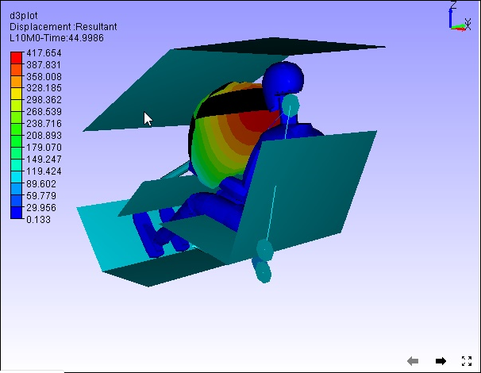
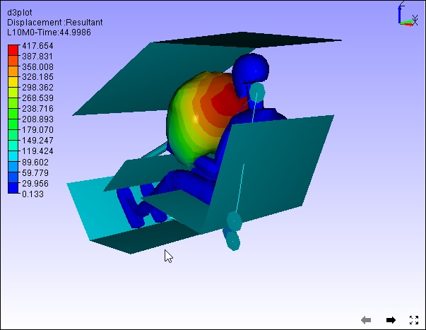

Refresh Normals
================

The **Refresh Normal** option in the context menu re-computes vertex
normals and sets proper lighting for the model.

**Steps**

Click **Refresh Normal** from the viewer context menu

Before Refresh Normals

|image0|

After Refresh Normals

|image1|

