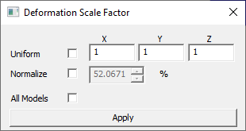

Scale Factor
============

Users can scale deformation of a model in each coordinate axis using the
**Scale Factor** option provided under CAE menu

**Context Menu**

|image0|

**Scale Factor Panel**

|image1|

The fields and options present in the Deformation Scale Factor dialog
are explained below.

+------------------+---------------------------------------------------------------------------------------------------------+
| **Uniform**      | By checking this option, the values entered by the user will be applied to all X, Y and Z directions.   |
+------------------+---------------------------------------------------------------------------------------------------------+
| **Normalize**    | Users can scale up/down with respect to model bounding percentage. The actual scale factor is           |
|                  | accordingly updated.By default, deformation is scaled to 10% of model bounding radius.                  |
+------------------+---------------------------------------------------------------------------------------------------------+
| **All Models**   | Applies scale factor to all merged models.                                                              |
+------------------+---------------------------------------------------------------------------------------------------------+
| **Apply**        | The modified scale factors will be applied on the model and visible in the viewer.                      |
+------------------+---------------------------------------------------------------------------------------------------------+

**Note:**

Deformation is normalized (max - normalization) and mapped with model
bounding sphere radius. By default normalized deformation is scaled to
10 percent of bounding sphere radius.

To apply **True scale** uncheck Normalize option and set scale factor in
'Uniform' option as 1. Uniform means, constant scaling in X,Y and Z
directions.

If the **Uniform** option is unchecked, the dialog shows its X, Y and Za
factors as below. here scaling will vary in each direction. If the model
is planar or linear, check the Uniform option for better visualization
of deformation.

|image2|

**Steps to scale a model**

-  Right click in the viewer window to open the context menu

-  Click **CAE \| Scale Factor** to open the **Deformation Scale Factor** dialog

-  Check **Uniform option** to scale model uniformly.

-  Change the value.

-  Click **Apply** and view changes.

|image3|

-  Uncheck **Uniform** option to scale model in each axis with different
   values.

-  Change scale values for each axis.

-  Click **Apply** and view changes.

|image4|

**Steps to scale deformation for Mode case animation data**

-  Load a mode case CAX file.

-  Select **CAE \| Animate.**

-  Select **CAE \| Scale Factor**

-  **Normalize** option will be checked.

-  The default value for mode case data is 10 % and for complex eigen
   data is 1 %,

|image5|

-  Change the value to 20 % and click apply.

|image6|

-  Notice the change.

-  Uncheck **Normalize** option.

|image7|

Usual scale factor option will be enabled. Enter 1 and click apply for
true scale.

.. |image4| image:: Images/Scalefactor_unif.png

.. |image6| image:: Images/Scale_factor_normalize_percent.png

